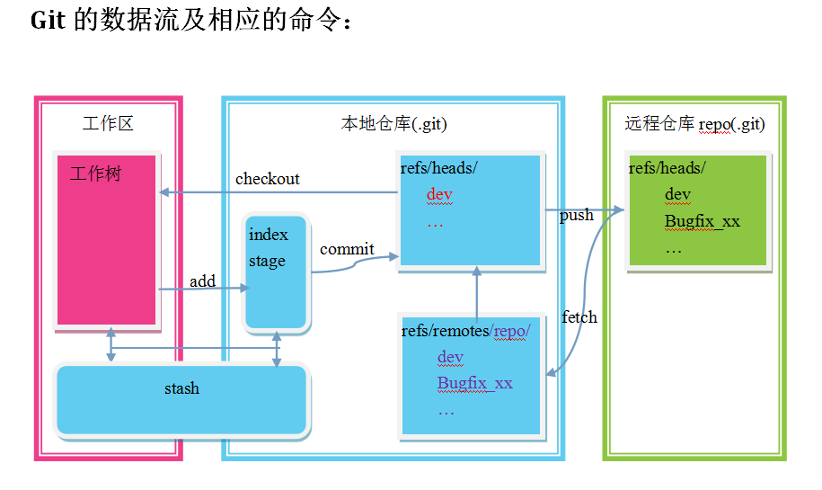

# GIT基础知识2

## 重要的概念

日常操作涉及的流程如下图所示


- 工作区(workspace或worktree)：就是你当前能看到的目录。

- 暂存区(stage或index)：一般存放在 ".git目录下" 下的index文件（.git/index）中，所以暂存区有时也叫作索引（index）。

- 版本库(repositroy)：工作区里有一个隐藏目录.git，这个不算工作区，而是Git的版本库。

- 远程库(remote)：如果项目是从其他地方clone出来的，则有远程库。

```
# 版本库的目录
[root@db3 .git]# ll -a
total 44
drwxr-xr-x 7 root root 4096 Apr 12 17:01 .
drwxr-xr-x 3 root root 4096 Apr 12 16:49 ..
drwxr-xr-x 2 root root 4096 Apr 12 16:21 branches    #branch信息
-rw-r--r-- 1 root root   92 Apr 12 16:21 config      #本库配置
-rw-r--r-- 1 root root   73 Apr 12 16:21 description
-rw-r--r-- 1 root root   23 Apr 12 16:21 HEAD        #head指向
drwxr-xr-x 2 root root 4096 Apr 12 16:21 hooks
-rw-r--r-- 1 root root  104 Apr 12 16:54 index       #暂存区
drwxr-xr-x 2 root root 4096 Apr 12 16:21 info
drwxr-xr-x 5 root root 4096 Apr 12 16:54 objects
drwxr-xr-x 4 root root 4096 Apr 12 16:21 refs        #引用
[root@db3 .git]#
```



HEAD的概念

## diff

diff命令用来显示提交间的差异或工作目录/暂存区与版本之间的差异内容

```
git diff [filepath]  显示工作区和暂存区的差异[可以指定路径]

git diff HEAD 显示工作区和当前版本的差异(同上)

git diff --cached 显示暂存区和当前版本的差异

git diff commit1 显示工作区和某个版本的差异

git diff --cached commit1 显示暂存区和某个版本之间的差异

git diff commit1 commit2 显示两个版本之间的差异

git diff branchname file 显示当前分支和指定分支某个文件路径的差异

# 示例
[root@zxdb205 test]# git log --oneline
2ee45c0 b.txt add c
435eec9 b.txt add b
7ce7175 a.txt add 2
f52c948 first add
[root@zxdb205 test]# git diff f52c b.txt #2ee4还没提交时和最初始版本的比较
diff --git a/b.txt b/b.txt
index 7898192..8baef1b 100644
--- a/b.txt
+++ b/b.txt
@@ -1 +1 @@
-a
+abc
[root@zxdb205 test]# git diff 2ee4 435e #最近两次修改了b，diff出差异
diff --git a/b.txt b/b.txt
index 8baef1b..81bf396 100644
--- a/b.txt
+++ b/b.txt
@@ -1 +1 @@
-abc
+ab
[root@zxdb205 test]# git add c.txt  # 切换到dev分支,新增c文件并跟踪
[root@zxdb205 test]# git diff       # 已加入到暂存区, 所以没差别
[root@zxdb205 test]# git diff HEAD  # 工作区和当前版本的差异
diff --git a/c.txt b/c.txt
new file mode 100644
index 0000000..ce01362
--- /dev/null
+++ b/c.txt
@@ -0,0 +1 @@
+hello
[root@zxdb205 test]# git diff --cached # 暂存区和版本的差异
diff --git a/c.txt b/c.txt
new file mode 100644
index 0000000..ce01362
--- /dev/null
+++ b/c.txt
@@ -0,0 +1 @@
+hello
[root@zxdb205 test]# git diff master  # 工作区和master分支最后版本的差别
diff --git a/c.txt b/c.txt
new file mode 100644
index 0000000..ce01362
--- /dev/null
+++ b/c.txt
@@ -0,0 +1 @@
+hello
```

## show

显示一个或多个git中的对象(blobs, trees, tags and commits)

```
git show [commit] 显示某次提交的元数据和内容变化，没参数则显示最后一次提交

git show --name-only [commit] 显示某次提交的文件

git show commit filename 显示某次提交某个文件的元数据及内容变化
```

## reset

重置HEAD到特定状态。这个命令同时会对工作区，暂存区产生影响。

```
git reset [<mode>] [<commit>] #将HEAD指向某个版本，一共5种模式

git reset –-mixed 此为默认方式，不带任何参数时即这种方式，将分支和暂存区复位到指定位置，不动工作区

git reset --soft 将分支复位到指定版本位置，不动暂存区和工作区

git reset --hard 将分支,工作区,暂存区全部复位到指定版本

git reset --merged 同--hard,保留工作区与暂存区的差异——合并到新的工作区，冲突时操作失败。

git reset --keep 同--hard,保留工作区与HEAD的差异——合并到新的工作区，冲突时操作失败。

#开发过程中执行reset通常用来撤销或回顾某批次修改

git reset HEAD [file] 当add错文件到暂存区，复位最后版本的对应文件覆盖暂存区，不影响工作区

git reset HEAD^ [file] 恢复上一次提交到暂存区，此时HEAD不变,暂存区变化,工作区的文件无变化

git reset commitid  回退到某个版本，默认使用--mixed模式

git reset --soft HEAD~3 恢复到n次之前，此时index包含了最近n次提交的差异，

git reset --hard  commitid 全部回退到某版本，本地也被覆盖

git reset –-hard origin/master 全部回退到对应远程分支的版本

# 一般不建议reset到某个版本，这样后续提交历史都会丢失而且存在下面的问题
# 已经push到远程仓库的commit不允许reset
# 最常用的作用是将当前的临时修改回退到最后一个版本
# 或回退某个版本的某个文件到临时区，对比修改后再提交
```

## reflog

reflog可以查看所有分支的所有操作记录，通常用来作为错误的reset操作后的恢复

```
# 通过参数-n可以显示最近的n次操作
[root@zxdb205 test]# git reflog
2ee45c0 HEAD@{0}: checkout: moving from dev to master
7ce7175 HEAD@{1}: checkout: moving from master to dev
2ee45c0 HEAD@{2}: checkout: moving from dev to master
7ce7175 HEAD@{3}: checkout: moving from dev to dev
7ce7175 HEAD@{4}: reset: moving to 7ce7
24c2da4 HEAD@{5}: commit: add c.txt
2ee45c0 HEAD@{6}: reset: moving to 2ee45c0
7ce7175 HEAD@{7}: reset: moving to HEAD^^
2ee45c0 HEAD@{8}: reset: moving to 2ee45c0
435eec9 HEAD@{9}: reset: moving to HEAD^
2ee45c0 HEAD@{10}: checkout: moving from master to dev
2ee45c0 HEAD@{11}: commit: b.txt add c
435eec9 HEAD@{12}: commit: b.txt add b
7ce7175 HEAD@{13}: commit: a.txt add 2
f52c948 HEAD@{14}: commit (initial): first add
# 显示指定分支上的操作历史
[root@zxdb205 test]# git reflog show master
2ee45c0 master@{0}: commit: b.txt add c
435eec9 master@{1}: commit: b.txt add b
7ce7175 master@{2}: commit: a.txt add 2
f52c948 master@{3}: commit (initial): first add
# 可以看到dev是从2ee4拉出来的
[root@zxdb205 test]# git reflog show dev
7ce7175 dev@{0}: reset: moving to 7ce7
24c2da4 dev@{1}: commit: add c.txt
2ee45c0 dev@{2}: reset: moving to 2ee45c0
7ce7175 dev@{3}: reset: moving to HEAD^^
2ee45c0 dev@{4}: reset: moving to 2ee45c0
435eec9 dev@{5}: reset: moving to HEAD^
2ee45c0 dev@{6}: branch: Created from HEAD
# 通过相对位置回到c的这次提交
[root@zxdb205 test]# git reset --hard dev@{1}
HEAD is now at 24c2da4 add c.txt
[root@zxdb205 test]#
```

## revert

revert和reset类似用来回退提交。差别在于revert是通过新的提交覆盖某次一次。

## stash

临时存储区，可以将工作区和暂存区的临时存放到stash里。

```
git stash save "message" 将工作区和暂存区内容存储并打上标题

git stash list 列出已保存的清单，以类似堆栈的方式保存，所以可以Pop

git stash drop 删除某个保存的内容

git stash pop 恢复内容并在stash中删除

git stash apply 恢复内容并不删除

git stash clear 清除所有保存的内容

# 示例
[root@zxdb205 test]# git stash list
stash@{0}: On dev: b.txt add d
stash@{1}: On dev: c.txt add world
[root@zxdb205 test]# git stash apply stash@{1}
# On branch dev
# Changes not staged for commit:
#   (use "git add <file>..." to update what will be committed)
#   (use "git checkout -- <file>..." to discard changes in working directory)
#
#       modified:   c.txt
#
no changes added to commit (use "git add" and/or "git commit -a")
```

## config

config命令用来获取和配置git

配置的级别分三级(全系统，用户级，项目级)，依次覆盖。

1./etc/gitconfig 文件：包含了适用于系统所有用户和所有库的值。使用参数--system

2.~/.gitconfig 文件 ：配置文件保存到对应的用户目录。使用参数--global

3.位于git目录的config文件 (也就是 .git/config) ：使用参数--local

```
# 显示已有配置
git config --list

# 设置配置
git config --global configName configValue

# 获取单条配置值
git config --global configName

# 删除某条配置
git config --global --unset configName

# 配置UI
git config --local color.ui true 设置命令行ui显示颜色

# 配置用户信息
git config --local user.name liuyixin
git config --local user.email liu1xin@outlook.com

# 配置命令别名
git config --local alias.logl "log --oneline" log命令的一个别名

# 客户端长期存储用户名和密码
git config --global credential.helper store

```

## 其他

本段主要介绍两个隐藏文件，用来更好的管理和使用git命令

### configfile

这里只关注项目级别的配置文件，该文件存放在.git/config。文件内格式符合常见的配置文件形式
[section]
key1 = value1
key2 = value2

可以通过调用git config [–local|–global|–system] -e命令打开编辑

### .gitignore

这个文件存放在工作区的根目录下，用来标记某些不需要计入版本库的文件。

忽略文件的原则是：

- 忽略操作系统自动生成的文件，比如缩略图等；

- 忽略编译生成的中间文件、可执行文件等，也就是如果一个文件是通过另一个文件自动生成的，那自动生成的文件就没必要放进版本库，比如Java编译产生的.class文件；

- 忽略你自己的带有敏感信息的配置文件，比如存放口令的配置文件。

github提供了一套模板https://github.com/github/gitignore