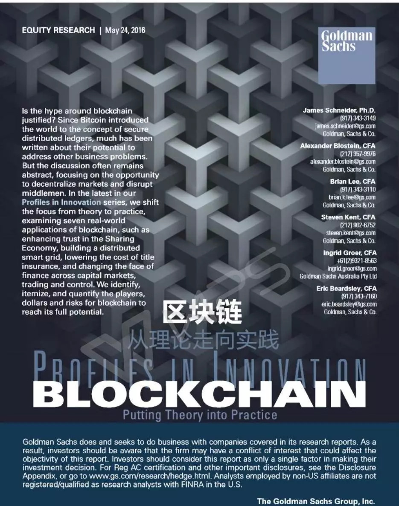

# 高盛报告深度解读: 区块链在未来的5大应用

区块链真的有这么高的价值吗？我们也许应该冷静下来仔细思考一下区块链在各领域如何应用？有何作用？

高盛对于区块链的研究较早，2016年，高盛就为自己的客户提供了一份有关于区块链的深度研究报告——区块链：把理论付诸实践（Blockchain: Putting Theory into Practice）。

让人看过之后，深受启发。

在报告开头就提到：目前对区块链潜在作用讨论的焦点在于使用分布式账本建立去中心化市场，并削弱现有中间商的控制权，但区块链的潜力比这种单薄的说法来得更加细致也更加深远。

值得注意的是，在这些应用中，区块链不仅仅在于去中间商化。某些情况下，区块链会对现有市场和参与者造成破坏作用，而其他情况下，它有望能通过减少劳动密集型流程、消除重复劳动而减少成本。某些情况下，它可以触及之前未开发的资源供应而创造新的市场。相同的思路是，赋能一个本质上全新的、可以被多个组织采用的数据库技术，区块链可以构筑解决问题基础、或是能抓住那些现有体系无力实现的机会。

区块链独特的性质使得它不仅有潜力优化现有市场，也有能力重构市场和创造新市场。如下，高盛报告总结了5个例子，特别展示了精选的正在现实世界中探索和赋能区块链的私有和上市企业。

- 创造新市场

共享经济：住宿至2020年，30-90亿美元的美国市场订房费用增量区块链能做什么？

简化身份和声誉管理。区块链可以安全地储存和整合用户的在线交易信息，并检查身份验证和支付认证的历史记录——使得各方建立信任更容易。这样的信息可以优化交易流程，增强历史记录质量。

精选赋能者：Airbnb, HomeAway, FlipKey, OneFineStay

受到威胁者：酒店业

- “创造性破坏”重构市场：

智能电网：新的、价值25-70亿美元的美国分布式能源市场

区块链能做什么？

为去中心化能源市场赋能交易能力。区块链可以连接本地的能源生产者（比如有太阳能板的邻居）与该地区的消费者，使得分布式的实时能源交易市场成为可能。一个区块链驱动的市场也能增强电网安全性、刺激智能电网科技的应用。

精选赋能者：TransActive Grid, Grid Singularity

受到威胁者：公用事业公司

- 优化现有市场

房地产产权保险：美国每年20-40亿美元的成本节约

区块链能做什么？

增加效率、减少风险。用区块链记录房产信息，产权保险业者可以更轻松地获得清算一项产权所需的信息。而账本的抗干扰性可以帮助减少新兴市场的房地产欺诈问题。

精选赋能者：BitFury, Factom/Epigraph

受到威胁者：产权保险人

- 现金证券（股权、再回购协议、杠杆贷款）

每年全球110-120亿美元的成本节约

区块链能做什么？

缩短结算时间，节约对账成本。使用基于区块链的系统可以显著缩短交易的结算时间，甚至是从几天缩减到数小时。这也可以帮助减少全流程的资本需求、运营成本和托管费用。

精选赋能者：Digital Asset Holdings, R3CEV, Chain.com, Australian Securities Exchange, itBit, Axoni, Ripple

受到威胁者：托管银行和清算所

- 反洗钱合规性

每年全球30-50亿美元的成本节约

区块链能做什么？

增加透明度和效率。用区块链储存账户和支付信息可以增强数据质量，减少被错误划归“可疑”交易的数量。

精选赋能者：SWIFT与其它

受到威胁者：特殊合规性软件商

## 区块链何时能成气候？高盛报告指出：

我们预计在接下来的2年中见到早期技术原型，2-5年后见到有限度的市场应用，而5-10年内会有更大范围的市场接受度。我们相信聚焦客户的共享经济和社交媒体企业会在更短的时间内开始实施基于区块链的身份与声誉管理系统。

在资本市场上，我们预计在接下来2年内见到早期的原型产品，但范围有限、参与者数量也有限。更广泛的市场接受度可能需要10年时间，这是基于所需的监管和诸如美国现金证券市场这样的大规模市场上众多的参与者数量。

高盛报告还列举了七大案例：声誉管理助益共享经济、用区块链构筑分布式智能电网、减少房地产产权保险交易成本、资本市场——美国现金股票市场、资本市场——再回购协议、资本市场——杠杆贷款交易案例分析、反洗钱和“知晓客户”合规性等，深入浅出地阐述了区块链在这些领域中的应用：机会如何？痛点何在？区块链如何派上用场？谁会被颠覆？面临的挑战?

真的可以说，这是一份十分有价值的区块域研究报告。尤其对那些想在区块链领域有所作为的企业，更具价值。

