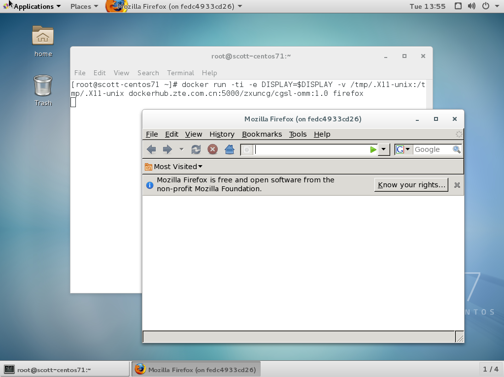

# docker 最佳实践

## docker容器绑核

1.查看本机的核隔离
```
[root@zxdb97 ~]# cat /etc/grubtool.cfg | grep cpu
#isolcpus=cpu_number [, cpu_number ,...]
#isolcpus="2,3"
#default: isolcpus=""
isolcpus=""
#nohz_full value is eaquel to isolcpus.
```

2.查看本机docker核绑定
```
# 表明容器可以跑在0-31任意核上
[root@zxdb97 ~]# cat /sys/fs/cgroup/cpuset/cpuset.cpus 
0-31
```

3.重新设定绑核

a,关闭掉启动的docker容器

b,停止docker服务，systemctl stop docker

c,修改配置文件echo '0,1,14,28,29,42' > /sys/fs/cgroup/cpuset/docker/cpuset.cpus

d,确定修改结果

e,启动docker服务，systemctl start docker

f,重新启动容器

## Docker运行GUI软件的方法

Docker通过namespace将容器与主机上的网络和运行环境进行了隔离，比较常用的场景是“运行无界面的后台服务”或者“运行基于Web的服务”。

默认情况下，在容器中运行带界面的软件在外部是看不到的，不过有时出于个人的喜好或特定的需求，我们会希望在Docker中运行带图形界面的应用程序。

本方法通过共享X11套接字让外部主机显示容器中运行的GUI程序界面。

目前Unix/Linux比较主流的图形界面服务是X11，而X11服务的图形显示方式实际上是一种Client/Server模式，在服务端和客户端之间，X11通过“DISPLAY”环境变量来指定将图形显示到何处。

如下面的流程所示：

[应用程序]->[X11客户端]->[X11服务端]->[显示屏幕]

DISPLAY的格式是“unix:端口”或“主机名:端口”，前一种格式表示使用本地的unix套接字，后一种表示使用tcp套接字。

默认情况下，X11的服务端会监听本地的“unix:0”端口，而DISPLAY的默认值为“:0”，这实际上是“unix:0”的简写。

因此如果在Linux的控制台启动一个图形程序，它就会出现在当前主机的显示屏幕中。

基于这个原理，将Docker中的GUI程序显示到外面，就是通过某种方式把X11的客户端的内容从容器里面传递出来。基本的思路无非有两种：

1）通过SSH连接或远程控制软件，最终通过tcp套接字将数据发送出来

2）让容器和主机共享X11的unix套接字，直接将数据发送出来

从应用场景上划分，又可以分成两类情况：

1）“运行本地的GUI程序”

2）“运行远程服务器上的GUI程序”

这两类情况在操作上很相似，但前者可以使用unix套接字，而后者必然要使用tcp套接字转发，原理上有很大差别。

本文只讨论本地运行GUI程序的情况，以运行一个firefox浏览器程序为例：

在创建容器时，以下述方式运行：

```
[root@scott-centos7 ~]#docker run -ti -e DISPLAY=$DISPLAY -v /tmp/.X11-unix:/tmp/.X11-unix dockerhub.xxx.com.cn:5000/cgapp:1.0 /usr/bin/firefox
```

其中的“-v /tmp/.X11-unix:/tmp/.X11-unix”参数就是将主机上X11的unix套接字共享到了容器里面。

因为每个unix套接字实际上就是系统/tmp/.X11-unix目录下面依据套接字编号命名的一个特殊文件。

命令执行完，firefox并没有启动，这是由于X11服务默认只允许“来自本地的用户”启动的图形程序将图形显示在当前屏幕上。

解决的办法很简单，允许所有用户访问X11服务即可，用xhost命令完成。

```
[root@scott-centos7 ~]# xhost +
access control disabled, clients can connect from any host
[root@scott-centos7 ~]#
```

参数“+”表示允许任意来源的用户。再次运行前面的docker run命令，就会看到firefox启动起来了，速度相当快。由于是直接共享了X11的unix套接字，在效率上与运行安装在主机上的程序基本没有差异。

