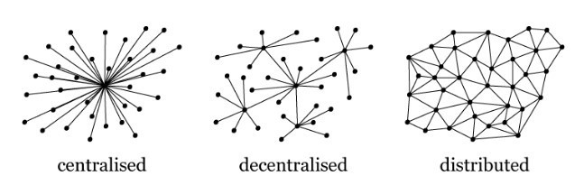

# 从“云”到“雾”：云计算将死亡，取而代之的是分布式的点对点网络？

在云计算发展一片火热的时候，英国数字咨询公司Red Badger的技术主管Viktor Charypar却在VentureBeat上发文表示，云服务将会迎来末日。并指出点对点网络将会是将来的发展方向。

云将会走向终结。我知道，这是一个大胆的结论，也许听起来有点疯狂。但请容忍我，让我说下去。

一直以来，都有这样的一个传统观点：运行服务器的应用程序，无论是Web应用还是移动应用的后台，未来都会在云端。亚马逊、谷歌和微软在他们的云服务中添加了多种工具，让在其中运行的软件服务变得越来越简单方便，因此，在AWS、GCP或Azure上托管代码是你能到的最好的事情——它方便、便宜、容易实现自动化，你可以灵活地控制规模……

那么，为什么我要预测这一切都会结束呢？有这么几个原因：

**第一，它无法满足长期的扩展要求。**

构建一个可扩展、可靠、高可用性的web应用程序，即使是在云中，也是相当困难的。如果你做得不错，让你的应用获得了巨大成功，那么庞大的规模将会耗尽你的金钱和精力。即使你的业务非常成功，你最终也会达到云计算的极限：计算机的计算速度和存储容量的增长速度超过了网络的带宽。

忽略网络中立的争论，这对大多数人来说可能不是问题（除了Netflix和亚马逊），但很快就会出现这个状况。随着我们的视频质量从HD到4K到8K，我们正在所需要的数据量正在大幅增长，而且，很快就会出现VR数据集。

这之所以是一个问题，主要是因为我们组织网络的方式。有许多用户想要获得内容和使用程序，而只有相对较少的服务器拥有这些程序和内容。比如，当我在Slack上看到一张搞笑的照片时，想向坐在我身边的20个人分享，但他们都必须从托管服务的服务器上下载，服务器需要发送20次这个照片。

随着服务器转移到云端，比如亚马逊或谷歌的数据中心的亚马逊或谷歌的计算机，靠近这些地方的网络需要有令人难以置信的吞吐量来处理所有这些数据。此外，还必须有大量的硬盘来存储每个人和CPU数据，然后通过网络将数据传输给每一个想要的人。随着流媒体服务的兴起，情况变得更糟。

所有这些活动都需要大量的能量和冷却，使整个系统效率低下、价格昂贵，对环境也不利。

**第二，它是集中而脆弱的。**

集中存储我们的数据和程序的另一个问题是可用性和持久性。如果亚马逊的数据中心被一颗小行星撞了，或者被龙卷风摧毁了怎么办？或者，如果它在一段时间内停电了，那又会怎样呢？存储在其机器上的数据现在不能暂停访问，甚至不能永久丢失。

我们通常通过将数据存储在多个位置来缓解这个问题，但这只意味着更多的数据中心。这可能会大大降低意外损失的风险，但你非常非常关心的数据又该怎么办呢？你的婚礼视频，你孩子成长的照片，或者重要的公共信息来源，比如维基百科。所有这些信息现在都存储在云端——在Facebook、Google Drive、iCloud或Dropbox等网站上。当这些服务停止运营或失去资金时，数据会发生什么变化？即使它们不会发展到这一步，但也限制了你访问自己数据的方式，你必须去使用它们的服务，当你和朋友们分享的时候，他们也必须通过这项服务。

**第三，它需要信任，但没法提供保障。**

使用云服务，你要让朋友相信，他们得到的数据是你发送的，而且这个数据是通过值得信任的中间人传递过来的。在大多数情况下，这都能够良性运转，也可以接受，但我们使用的网站和网络必须要注册才能合法运营，监管部门有权力强迫它们做很多事情。在大多数情况下，这是一件好事，可以用来帮助解决犯罪或从网络上删除非法内容，但也有很多情况下，这种权力被滥用。

就在几周前，西班牙政府竭尽所能阻止加泰罗尼亚地区的独立公投，其中采取的措施就包括封锁信息网站，告诉人们该去哪里投票。

**第四，它让我们的数据更容易遭受攻击。**

高度集中的互联网真正可怕的一面是个人数据的集中化。那些为我们提供服务的大公司都有大量的数据——这些数据包含了足够的信息，可以预测你将要购买什么，你会投票给谁，你可能会买房子，甚至你可能会有多少孩子。这些信息足以用你的名义去办理一张信用卡、一笔贷款，甚至是用你的名字买一所房子。

而且，你也可能会同意。毕竟，你选择了它们的服务，你就只能信任它们。但这不是你需要担心的。你需要担心的是其他人。今年早些时候，信用报告机构Equifax丢失了1.4亿名客户的数据，这是历史上最大的数据泄露事件之一。这些数据现在已经公开。我们可以把这看作是一个十年一次的事件，如果我们更加小心的话，这种情况本可以避免，但越来越明显的是，像这样的数据泄露很难完全避免。而且一旦出现就过于危险，无法容忍。真正阻止这类事件再发生的唯一办法是，一开始就不收集这么大规模的数据。

**那么，什么将取代云呢？**

主要由客户端-服务器协议（如HTTP）支持的互联网和基于对中央机构（如TLS）的信任的安全性是有缺陷的，并且会导致一些基本上难以解决或无法解决的问题。现在是时候去寻找更好的东西了——一个没有其他人能完全存储你的个人数据、大媒体文件遍布整个网络的模型框架、整个系统完全是点对点和无服务器的（我不是指那种云托管意义上的“无服务器”，我的意思是真正的没有服务器）。

在这个领域，我已经阅读了大量的文献，并且已经非常确信点对点是我们未来不可避免的发展方向。点对点网络技术是用协议和策略来取代我们所知道的网络的构建模块，解决我上面提到的大部分问题。目标是完全分布式的，永久冗余的数据存储，每个参与网络的用户都在存储其中一些可用数据的副本。

如果你听说过BitTorrent（比特流），那么下面这些内容听起来应该会很熟悉。在BitTorrent上，网络用户不需要任何中央机构授权就可以将大数据文件分成更小的块或片段（每个块都有一个唯一的ID）。要下载一个文件，你只需要一个“神奇”数字，也就是一个哈希（hash），即内容的指纹就行了。然后，你的BitTorrent客户端将会按照“内容指纹”找到那些拥有文件片段的用户，并从他们那里把一个个文件片段下载下来，直到你拥有所有的片段。

一个有趣的点是如何去匹配用户。BitTorrent使用了一种名为Kademlia的协议。在Kademlia，网络上的每个对等点都有一个唯一的ID号，其长度与唯一的块ID相同。它会将一个带有特定ID的块存储在一个节点上，该节点的ID与该块的ID“最接近”。块和网络对等点的随机ID，在整个网络中存储的分布应该是相当一致的。不过，块ID并不需要随机选择，而是使用一种加密散列——这是块本身内容的唯一指纹，这是有好处的。保证这些块是可寻址的。这也使得验证块的内容更加容易（通过重新计算和比较指纹），并能够保证用户不可能下载原始的数据之外的其他数据。

另一个有趣的特性是，通过将一个块的ID嵌入到另一个块的内容中，你可以将二者以一种不会被篡改的方式连接在一起。如果链接块的内容发生变化，它的ID将会改变，链接也会被破坏。如果修改了嵌入式链接，那么包含块的ID也会随之改变。

这种将一个区块的ID嵌入到另一个区块的机制，使得创建这样的区块链成为可能（比如为比特币和其他加密货币驱动的区块链），甚至是更复杂的结构，通常被称为有向无环图（Directed Acyclic Graphs），简称DAG。（在Ralph Merkle发明了这种链接之后，通常被称为“Merkle链接”。所以，如果你听到有人在谈论Merkel DAGs时，你大概能知道他们在说什么。）Merkle DAG的一个常见例子就是Git存储库。Git将提交历史和所有目录和文件都保存在一个巨大的Merkle DAG中。

这就导致了基于内容寻址的分布式存储的另一个有趣特性：它是不可变的。内容无法改变。取而代之的是，新的修订被存储在现有的修订版本旁边。在两次修订之间没有变更的块会被重用，因为根据定义，它们具有相同的ID。这也意味着相同的文件不能在这样的存储系统中复制，转化为高效的存储。所以在这个新网络上，每一张独一无二的搞笑图片都只存在一次（尽管在整个群体中有多个副本）。

像Kademlia，Merkle链和Merkle DAG这样的协议，给我们提供了建模文件层次和修订时间线的工具，并在一个大型的P2P网络中分享它们。已经有一些协议使用这些技术来构建符合我们需求的分布式存储。看起来很有希望的是IPFS。

**名称和共享问题**

好了，通过以上这些技术，我们可以解决我在开始时提出的一些问题：我们在连接到网络的设备上得到分布式的、高度冗余的存储，这些设备可以记录文件的历史，并在需要的时候保留所有版本。这（几乎）解决了可用性、容量、持久性和内容验证问题。它还解决了带宽问题——因为都是使用点对点传输数据，因此不会出现服务器承受不了的情况。

我们还需要一个可扩展的计算资源，但这并不难：现在每个人的笔记本电脑和手机都比大多数应用程序所需要的功能更强大（包括相当复杂的机器学习计算），而且计算通常都是可伸缩的。因此，只要我们能让每一台设备都为用户做必要的工作，就不会出现大问题。

所以现在我在Slack上看到的搞笑图片可以来自坐在我旁边的同事，而不是来自Slack的服务器（在这个过程中没有跨越任何“海洋”）。不过，为了发布一张搞笑照片，我需要更新一个通道（channel）（也就是说，通道将不再是我发消息之前的样子了，它将会发生改变）。这个听起来相当简单的事情却是整个体系中最难的部分。

**最困难的部分：实时更新**

一个实体的概念会随着时间的推移而改变，这实际上只是人类专属的想法，让世界在我们的头脑中拥有秩序感和稳定。我们还可以把这样的实体看作是一个身份或名称，随着时间的推移，它会呈现出一系列不同的价值（这是静态的，不可改变的）。（Rich Hickey在他的演讲中解释得很好，[戳此观看](!https://www.infoq.com/presentations/Are-We-There-Yet-Rich-Hickey)）。在电脑中模拟信息是一种更自然的方式，会产生更自然的结果。如果我告诉你一件事，我就再也不能改变我对你说的话了，也没办法让你忘却。例如，美国总统是谁，不会随时间而改变;只是会被同样性质（身份和名字）的其他事实（人）所取代。在Git的示例中，一个ref（分支或标记）可以在不同的时间点指向（持有一个ID和一个值）不同的提交，并提交一个提交来替换当前所持有的值。Slack通道也代表了一种身份，随着时间的推移，它的价值也在不断增长。

真正的问题是，我们并不是唯一一个拥有通道的人。很多人试图发布消息和改变通道，有时是同时进行，需要有人来决定结果应该是什么。

在中心化的系统中，当前几乎所有的web应用程序，都有一个中央实体来决定这个结果，并对事件进行序列化。然而，在一个分布式系统中，每个人都是平等的，因此需要有一种机制来确保网络上能够达成共识。

对于一个真正的分布式网络来说，要想解决这个问题，最困难的问题就是我们今天正在使用的所有应用。它不仅会影响并发更新，还会影响其他需要“实时”更新的更新——随着时间的推移，“真相的单一来源”正在发生变化。这个问题对于数据库来说尤其困难，它也会影响到其他关键服务，比如DNS。以分散的方式为特定的块ID或一系列ID注册一个人的名字意味着每个参与者都需要同意一个现有的名称有一个特定的含义，否则两个不同的用户就可以看到两个不同的文件在同一个名称下。基于内容的寻址解决了机器的问题（记住一个名字只能指向一个特定的匹配内容），而不是人类的问题。

在处理分布式的共识方面，有一些主要的策略。其中一个问题是，选择一个相对较小的“群体”经理，他们的机制是选出一个决定真相的“领导者”（如果你感兴趣的话，看看[Paxos](!http://lamport.azurewebsites.net/pubs/lamport-paxos.pdf)和[Raft](!https://raft.github.io/)协议）。所有的变化都要经过这些经理。这实质上是一个集中式的系统，可以弥补网络中的中央决策实体或中断（“分区”）的丢失。

另一种方法是像比特币区块链这样的基于验证的系统，在这种系统中，通过让用户解决一个“难题”来编写一个更新（例如，在Merkle链中添加一个有效的区块）来达成共识。这个“难题”很难解决，但很容易就能查到，如果冲突仍然存在，还需要一些额外的规则来解决。其他几个分布式的区块链使用了基于验证的共识，同时减少了解题所需的能源需求。如果你感兴趣的话，你可以在BitFury这份白皮书中读到的相关的证据。

针对具体问题的另一种方法是围绕着CRDT——无冲突的复制数据类型，这在特定情况下根本不会遭受共识问题的困扰。最简单的例子是一个递增的计数器。如果所有更新只是“添加一条”，只要我们确保每次更新只应用一次，顺序就不重要，结果将是相同的。

这个问题似乎没有一个明确的答案，可能永远也不会只有一个答案，但有很多聪明的人正在努力解决这个问题，而且已经有很多有趣的解决方案可供选择。你只可以对其进行权衡。这种取舍通常体现在你“瞄准”的群体的规模上，并从你愿意让渡的共识中挑选出的一种特性——[可用性或一致性](!http://www.julianbrowne.com/article/viewer/brewers-cap-theorem)（或者，从技术上讲，是网络划分，但在一个高度分布的系统中，这似乎很难避免，就像我们正在讨论的系统一样）。大多数应用程序似乎都支持可用性而不是即时的一致性——只要状态在合理的时间内是一致的即可。

**公共文件网络中的隐私问题**

需要解决的一个明显问题是隐私问题。即如何在不公开的情况下将内容存储在分布式的集群中呢？如果它能够隐藏东西，那么内容地址存储是一个不错的选择，因为为了找到某样东西，你需要知道它的内容的散列。所以本质上我们有三个层次的隐私：公共的、隐藏的和私密的。对于第三个问题的答案似乎是在密码学中 - 对存储的内容进行强加密并且要有“外在”的共享密钥（比如用纸分享、NFC设备传输或者扫描二维码等）。

依赖于加密技术一开始可能听起来很冒险（毕竟，黑客总是会发现漏洞），但实际上并没有比我们今天做的更糟糕。事实上，这在实践中有可能会更好。企业和政府通常以无法与公众分享的方式存储敏感数据（包括数据所涉及的个人）。相反，只有拥有这些数据的组织所雇用的数量不多的员工才能够访问，而且至少在密码方面受到保护。通常情况下，如果你能访问存储这些数据的系统，你就可以拥有所有这些数据。

但是，如果我们转而以一种本质上是公开的方式来存储私人数据，那么我们就不得不保护它（使用强大的加密技术），这样对任何获得访问权限的人来说都是不好的。这个想法与安全相关软件的开发者开源代码的初衷是一样的，这样任何人都可以查看并发现问题。知道安全系统是如何工作的，不应该帮助你打破它。

这种对访问的控制一个有趣特性是，一旦你授予某人访问某些数据的权限，他们就会永远对数据进行修改。当然，你可以随时更改加密密钥。这也并不比我们今天的情况更糟，尽管它可能并不明显：只要获得一些数据的访问权限，任何人都可以复制它。

这一领域的有趣挑战是，在一群需要随时间推移而改变的人群中建立一个能够验证身份并共享私有数据的良好系统。例如，在一个私有的Git存储库中有一组协作者。这绝对可以通过一些私钥密码和旋转密钥的组合实现，但让用户获得流畅的体验可能是一项挑战。

**从云到雾**

尽管要解决一些难题，我们从云计算中迁移出去，将会是一个非常令人兴奋的未来。首先，在技术方面，我们应该从点对点网络中获得相当多的改进。内容可寻址存储可以在不受信任的授权情况下，提供对内容本身的加密验证，并进行永久的托管（只要有人对它感兴趣），我们应该能看到其速度的显著提升，即使是在远离数据中心的发展中世界的边缘（[甚至是在另一个星球上](!http://www.spacex.com/mars)）。

在某个时候，甚至连数据中心都可能成为历史。消费设备变得如此强大，无处不在，计算能力和存储空间几乎随处可见。

对于运行web应用程序的企业来说，这一变化将会节省巨大的成本。企业也将能够减少对宕机风险的关注，更多地关注增加客户价值，让所有人受益。我们仍然需要云托管服务器，但它们只是众多同类服务器中的一种。我们还可以看到更多样化的应用程序，在这些应用程序中，并非所有的应用程序都是一样的——在同一个应用程序中，有面向消费者的和后台的，而差别只是访问权限不同而已。

对企业和客户来说，另一个巨大的好处是对客户数据的处理。当不再需要集中存储大量的客户信息时，丢失这些数据的风险就会降低。软件工程界的领导者们（如Erlang的创始人Joe Armstrong，[他的谈话很值得关注](!https://www.youtube.com/watch?v=lKXe3HUG2l4)）长期以来一直认为，在互联网上，客户向企业的程序发送数据的设计是一种退化，企业应该向客户发送程序，以让他们能够执行私人的数据，而这些数据不会被直接共享。这样的模式似乎更安全，并且也不会以任何方式阻止企业收集他们所需的有用的用户指标。

而且，当前没有什么方式能阻止混合的服务模式，这些服务不透明，并保留了私人数据。

这种类型的应用程序架构似乎是一种更自然的方式，来提供大规模计算和软件服务，而且也更接近于开放信息交换的想法，任何人都可以方便地向他人转发内容，并控制可以发布和访问的内容，而不是由拥有服务器的私有实体来控制。

对我来说，这是非常令人兴奋的。这就是为什么我想要组建一个小团队，在几周内，用上面提到的一些技术来构建一个简单的移动应用，来证明概念，并展示可以通过点对点网络来做些什么。目前我所拥有的唯一一个足够小的想法，能够相对快速、足够有趣，足以证明这种方法的特性是一个点对点的、真正无服务器的克隆版Twitter，但这并不特别令人兴奋。