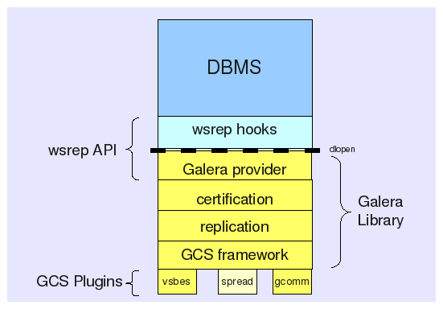

# galercluster

## 概述

Galera是一个MySQL(也支持MariaDB，Percona)的同步多主集群软件，目前只支持InnoDB引擎。

### 主要功能:

-  同步复制
-  真正的multi-master，即所有节点可以同时读写数据库
-  自动的节点成员控制，失效节点自动被清除
-  新节点加入数据自动复制
-  真正的并行复制，行级
-  用户可以直接连接集群，使用感受上与单个MySQL完全一致

### 优缺点

优势

-  因为是多主，所以不存在Slave lag(延迟)
-  各节点间是紧耦合的，每个节点的状态是一致的，单个节点的异常不会造成事务数据丢失(不考虑所有节点崩溃的情况下)
-  同时具有读和写的扩展能力
-  更小的客户端延迟
-  节点间数据是同步的,而Master/Slave模式是异步的,不同slave上的binlog可能是不同的

限制

-  集群至少3个节点（2个节点也可以运行）
-  只支持存储引擎：Innodb / XtraDB / Maria
-  不支持一些特定SQL：LOCK / UNLOCK TABLES / GET_LOCK(), RELEASE_LOCK()…
-  不支持XA Transaction

## 原理介绍

Galera replication是一种Certification based replication，保证one-copy serializability，理论基于这两篇论文：

Don’t be lazy, be consistent 和 Database State Machine Approach

### 简述

Galera replication采取的是乐观策略，即事务在一个节点提交时，被认为与其他节点上的事务没有冲突，首先在本地“执行”后再发送到所有节点做冲突检测，存在两种情况下需要回滚事务：
1. WS复制到其它节点，被加到每个节点的slave trx queue中，与queue中前面的trxs在做certification test时发现冲突
2. WS通过了certification test后被保证一定会执行，在它执行过程中，如果该节点上有与其冲突的local trxs(Local phase)，回滚local trxs

事务在commit节点广播后，节点之间不交换“是否冲突”的信息，各个节点独立异步的处理该事务，certification based replication协议保证：
1. 事务在所有节点上要么都commit，要么都rollback/abort
2. 事务在所有节点的执行顺序一致



-  Galeralibrary：Galera集群的复制和冲突验证功能基于此实现，为了让MySQL与Galera library通讯，特别针对MySQL开发了wsrep API。
-  GCS(Group Communication System)：Certification based replication所依赖的基础技术
1) Atomic delivery (事务传输要么成功传给了所有节点，要么都失败)
2) Total order (事务在所有节点中的顺序一致)
3) Group maintenance (每个节点知道所有节点的状态)


### 常用参数和配置


## Galera在OpenStack中的实践

### 基本构架

-  使用pacemaker/corosync进行HA集群管理
-  3节点部署MariaDB，或双节点Mariadb+garbd仲裁节点组成数据库集群
-  通过浮动IP控制访问单主节点，或通过LOADBALANCE同时进行多主节点访问
-  通过HA资源插件进行管理和控制数据库服务，例如进行上电，倒换，监控
-  数据目录优先使用为本地独立磁盘作为MARIADB的数据盘，也支持使用磁阵LUN


### galera资源插件介绍

HA软件中使用资源的概念来管理所属的服务，此处我们使用galer开源资源插件对mariadbgalera进行管理。
这个资源插件支持数据库服务的初始化，启动，升级，降级，监控等功能。为数据库集群的自动运行和管理提供了保证。

资源定义和配置

```
[root@host_192_0_9_25 ~]# pcs resource show mariadb
 Resource: mariadb (class=ocf provider=heartbeat type=galera)
  Attributes: enable_creation=true wsrep_cluster_address=gcomm://host_192_0_9_25,host_192_0_9_27,host_192_0_9_98 config=/etc/my.cnf datadir=/var/lib/mysql user=mysql group=mysql 
  Operations: start interval=0s timeout=120 (mariadb-start-timeout-120)
              stop interval=0s timeout=120 (mariadb-stop-timeout-120)
              monitor interval=20 timeout=30 (mariadb-monitor-interval-20)
              monitor interval=10 role=Master timeout=30 (mariadb-monitor-interval-10-role-Master)
              monitor interval=30 role=Slave timeout=30 (mariadb-monitor-interval-30-role-Slave)
              promote interval=0s timeout=300 (mariadb-promote-timeout-300)
              demote interval=0s timeout=120 (mariadb-demote-timeout-120)
[root@host_192_0_9_25 ~]# 
```

下图是该资源插件的实现流程图


我们在开源插件的基础上进行了改进，包括

1.自动和可控的上电选主

2.单节点异常后的重新初始化和数据同步

3.异常监控和简单的告警上报

### 实现效果

当三节点全部启动，实现多主服务。

当其中一个节点停止时


HA下管理的资源状态

Galera集群自身的状态

## 相关资源

[MariaDB Server and Galera Cluster Download](https://mariadb.com/my_portal/download/mariadb)

[Pacemaker Introduce and Download](http://clusterlabs.org/)

[GaleraCluster Document](http://galeracluster.com/documentation-webpages/)


