# Dell4110拆机教程

原始地址 http://tieba.baidu.com/p/3690185091

拆机常规流程回顾：

　1.首先去掉底盖（D面）的所有螺丝，包括电池盒中的螺丝，小底盖如果可以取下则取下，内存和硬盘建议也取下；
　2.然而转到键盘面（C面），取下键盘后，然后把键盘底下的螺丝下光；
　3.可以分离C面和D面了，既分离键盘面外壳和底盖，内部的主板就暴露出来了。

本次教程的步骤就是这么繁琐，请往下看、、、

先给N4110来张正面照

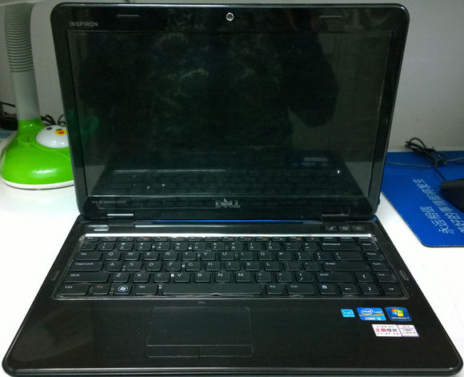

再来张背面照

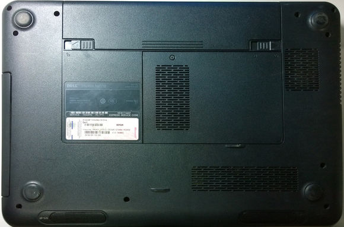

1.卸电池（首先卸电池主要为了防止意外漏电，万一不小心按到了开机键呢）
按照图中指示的方向推动电池卡扣，右边卡扣不会反弹，左边会反弹。左手抵住右边卡扣，再用右手将电池沿着箭头方向水平向上推，就是这样双手开工！！！

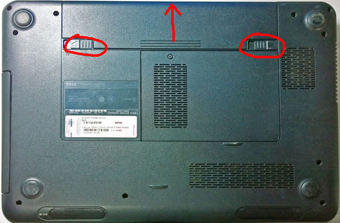

2.卸D面螺丝（下图中红圈圈出10个位置就是你要卸掉的螺丝，它们是用来固定后盖的，三角圈那个螺丝一会再动，咱们单独对待它）

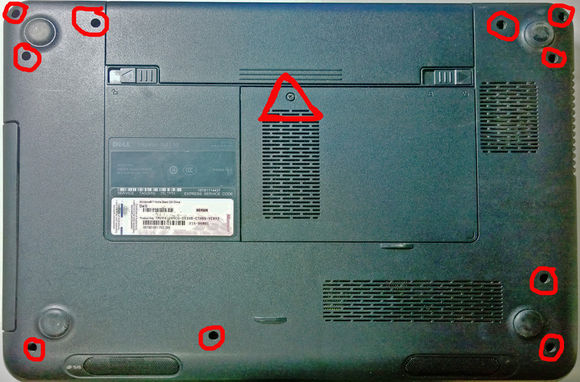

这个位置有一块壳子，里面是装的是内存，暂且管它叫内存壳（卸掉那颗螺丝，用平口起子撬动边缘，它就能起来了）

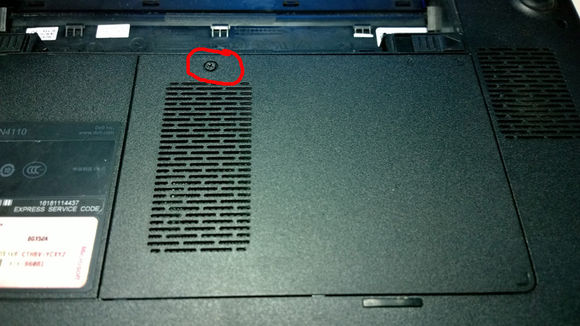

打开之后里面就是这样的了，绿色长条那个是内存条，红圈处还有一个螺丝，那个是用来固定光驱的。卸掉，没得商量！

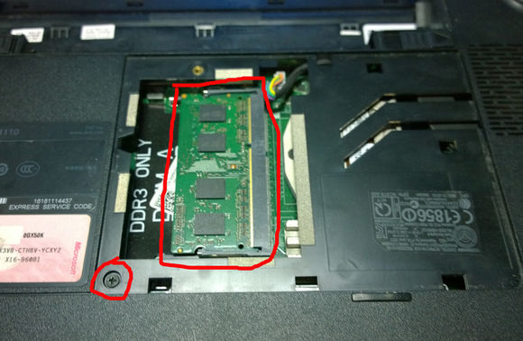

抱歉，忘了电池仓。电池拆完咱们来看看电池仓里有没有螺丝，有的话一定记得先卸下（如图红圈圈出的两个）

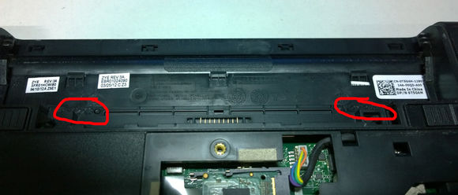

3.卸光驱（水平抽动，不要上下或左右摆动）

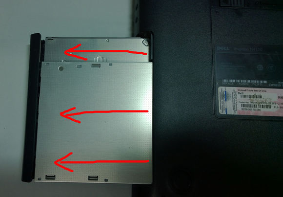

光驱卸下之后，下面边缘处还有两颗螺丝，也是要卸掉的，它们是用来连接前后壳的

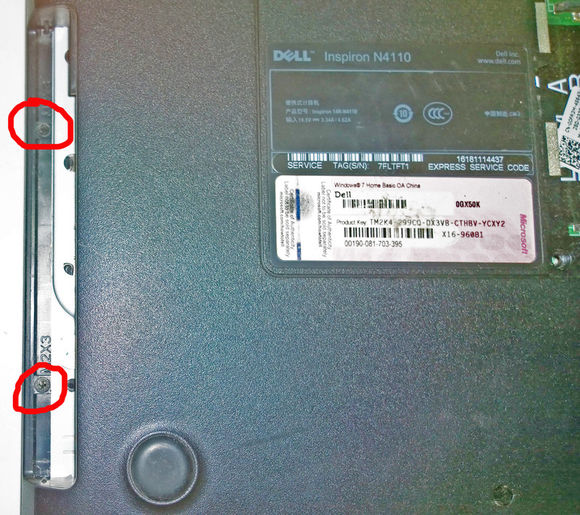

4.拆键盘（回到正面之前请务必确保D面所有上述螺丝全部卸下，听我的没错！）

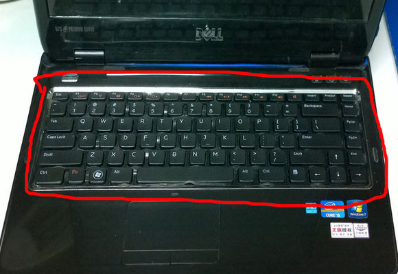

咱们从这里下手，红圈处是键盘的暗扣，怎么拆，往下看、、、

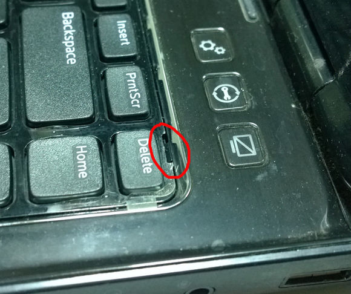

像这样，平口起子插进去，切记插到位

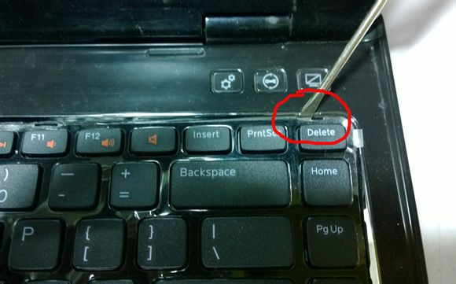

晃过来，再摇过去，反复进行。很快键盘就能起来了

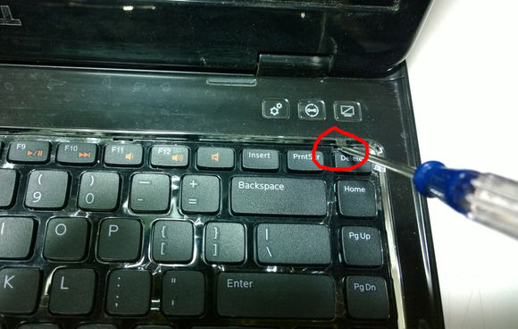

5.拆键盘下面排线（红圈处就是键盘的排线，先把它取下来，方法往下看）

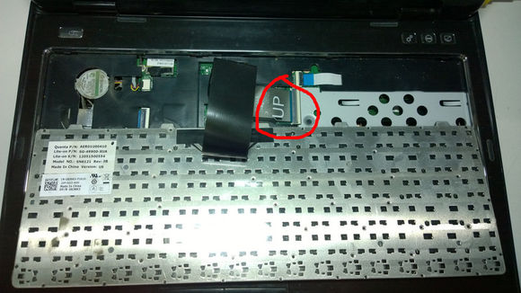

用平口起子顺着右边箭头方向去拨开卡扣，下手要轻，扣子掉了键盘也就几乎没用了。扣子撬开之后，将排线水平向左拉出，简单吧

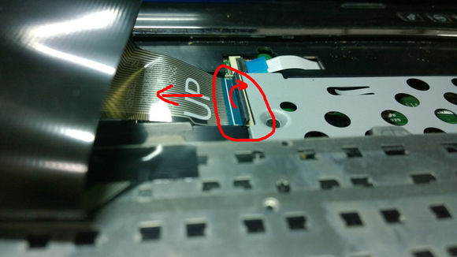

拿开键盘，剩下的就是更多的排线。红圈是和键盘一样的排线，黄圈是螺丝，先卸排线吧，个人建议！方法和刚才键盘那个一样。

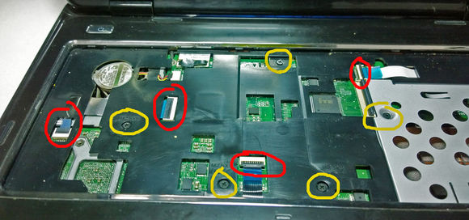

6.取下正面操作面板（这一步需要拿出你稚嫩的手，楼主的手是沧桑的，请无视。指甲沿着中间的缝隙划动，一直划到电源开关处。你会听到啪啪啪的声音，不要YY，那是卡扣的声音。）

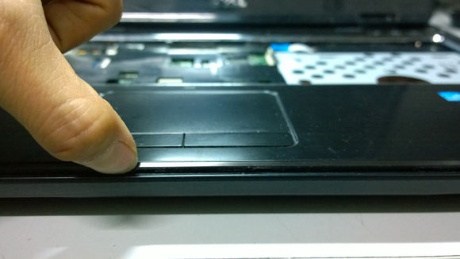

7.主板部分
（这一步最麻烦。拿开面板之后就能看见主板了，密集恐惧症的请闭眼！图中给大家圈出了五个接头，1是屏幕接头，2是风扇电源，3不知道是干嘛的，4是外放电源接头，5是无线网卡模块。你要卸掉的事前四个，无线网卡那个不用动。）

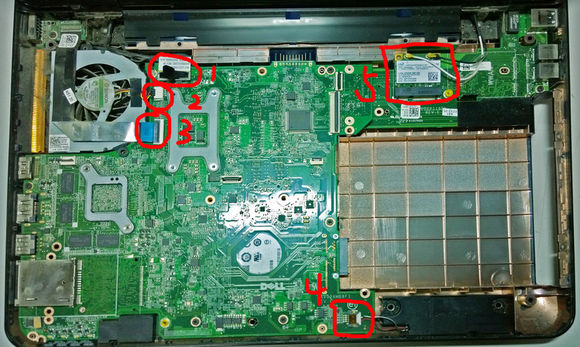

给个特写、、、

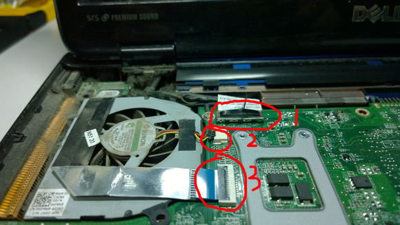

这五个圈是你要卸下的螺丝，12345对应B1 B2 B3 B4 B5

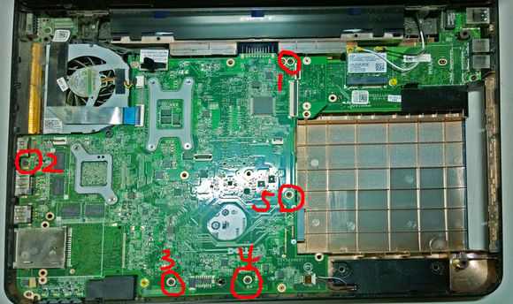

所有卸掉之后，还有一个隐藏的螺丝，在这里。这个是用来固定风扇的，也要卸掉

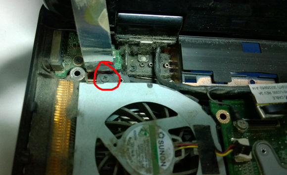

看到主板右上角，无线网卡模块附近，这里的卡扣不太好卸，好在楼主有办法。一只手托住卡扣左边，一只手向上用力，双手配合，用四两拨千斤的技巧来对付就OK了。

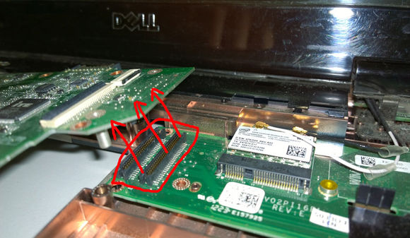

接下来就可以拉出主板了，像这样！向上用力的同时向右拉动，记住，要的是巧劲。拉出来翻转一下

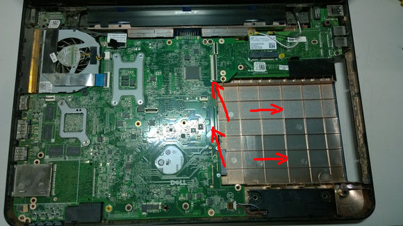

拉主板一定要小心，力气大了很容易就拉断这根接线，红圈那个。把主板翻转过来之后用平口起子撬动接口，就像拔插头一样

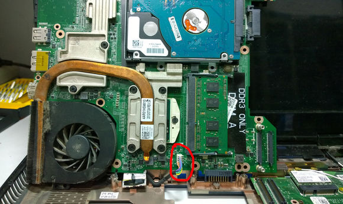

8.拆散热模块（把主板拿出来，接下来要卸的就是这七个红圈圈住的螺丝， 它们是用来连接散热铜管和主板的）

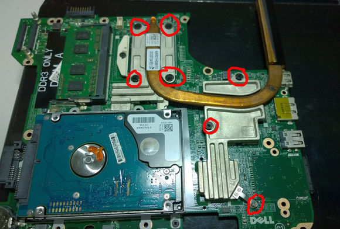

9.清灰（最重要的一步。楼主手一抖，风扇就和散热铜管分开了，只剩下铜管了。红圈处就是出风口堆积的脏物，还不算太脏，拿刷子刷一刷就可以了）

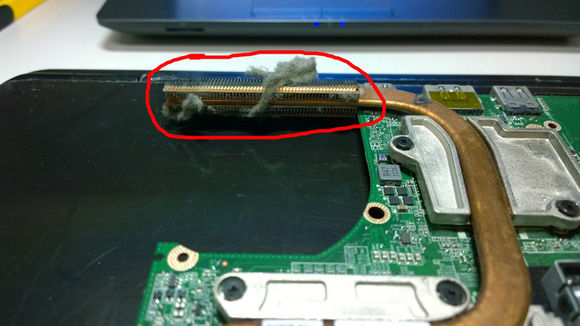

再看风扇，上面是有两颗螺丝，卸掉！

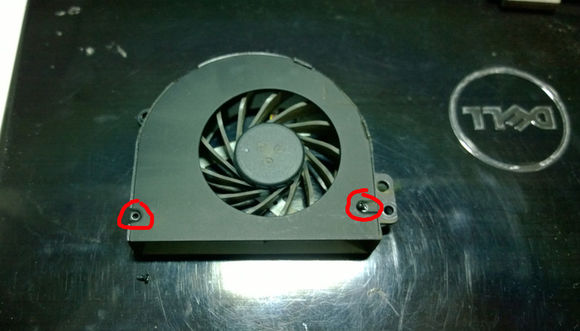

打开之后你就可以看见扇叶了，这样清扫的更干净更彻底！

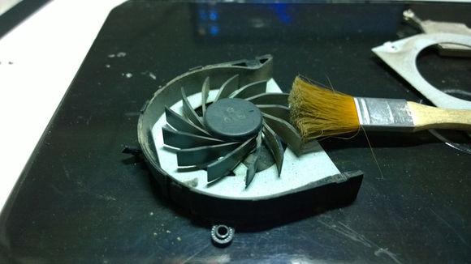

10.上硅脂（再涂抹新硅脂之前请擦掉圈1CPU和圈2GPU上的残余硅脂，为了达到更好的散热效果）

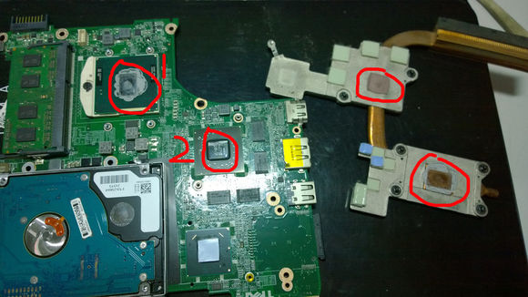

然后在这两块上面涂抹新的硅脂就OK了，注意量不要太多，薄薄一层效果最佳。铜管上无需再涂、、、

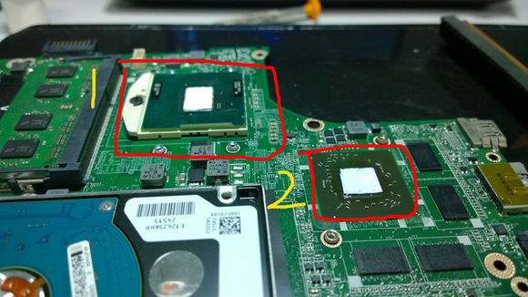

整个拆机过程就到这里，基本属于最麻烦的，所有步骤完成下来你就是legendary！完成上述所有步骤接下来就是把各个部件装回去。还是那句话，如果中途不会装，请把帖子设置成倒序查看，你一定可以的。

非专业拆客，经验极其有限，欢迎指教！！！

