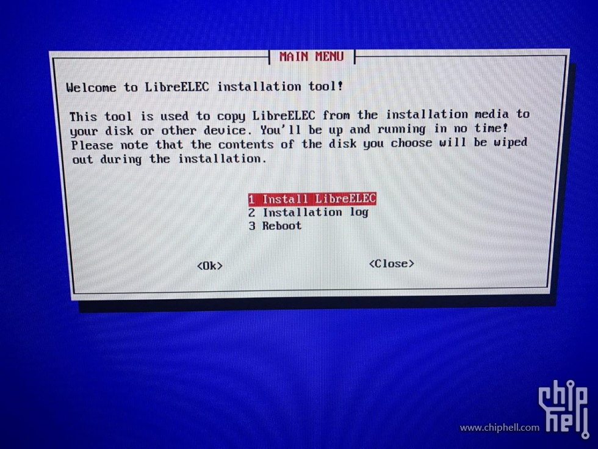
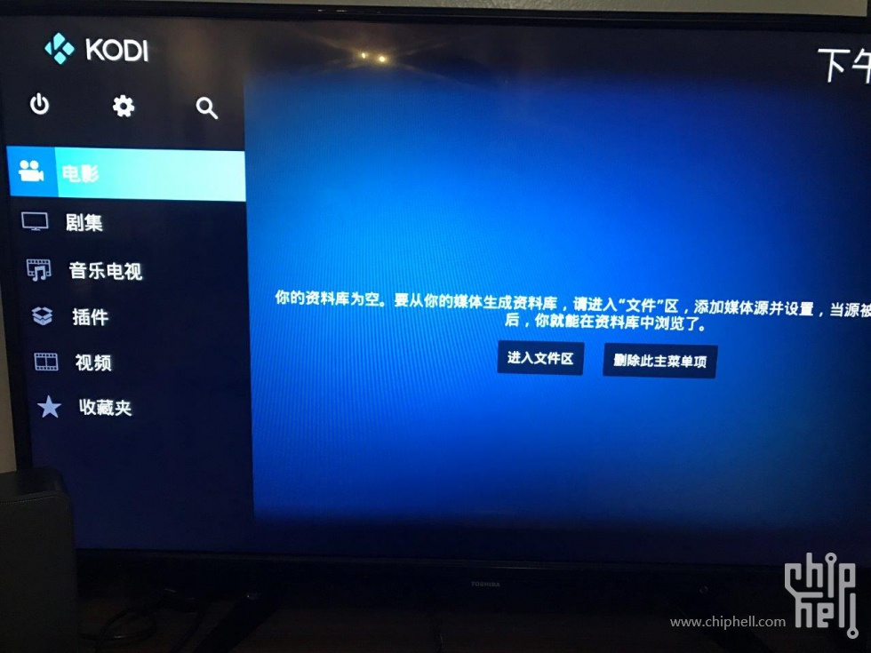
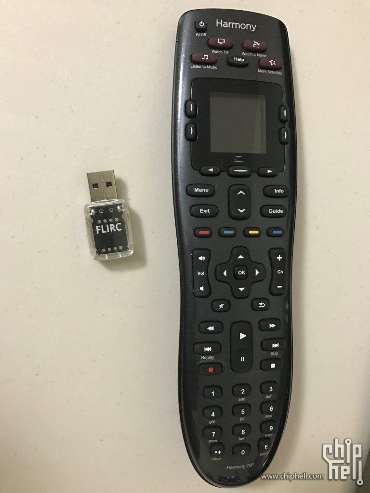
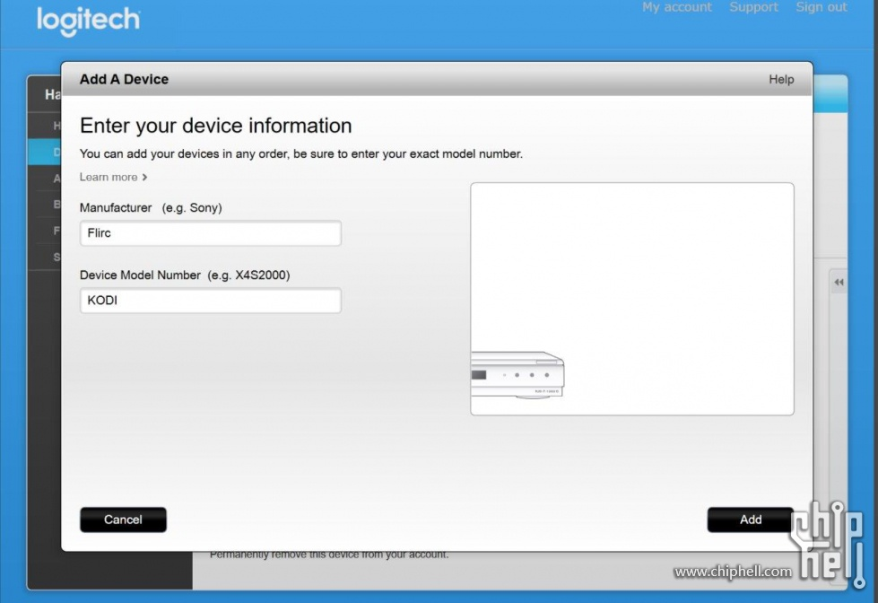

# 自制的Kodi电视盒

戴尔迷你主机升级libreELEC系统

本文转自https://www.chiphell.com/thread-1711005-1-1.html

前年打折入了一台戴尔Inpirion 迷你主机，一直闲置没有好好利用起来。最近想弄个Kodi电视盒子，正好想起了这台角落的小主机，大小合适，性能够用，于是libreELEC折腾起

1. 戴尔 inspiron micro desktop：

CPU: 赛扬J1800， 4G内存，32G 固态硬盘（可以加装一个2.5" 硬盘），千兆网口， Wi-Fi 802.11ac, 蓝牙4.0

接口：1个HDMI, 1个DP, 1个USB 3.0, 3个USB 2.0, 1个SD卡，1个3.5音频

大小约为： 5.3cm x 13.1cm x13.1cm

自带WIN10系统

2. 安装libreELEC

Libreelec简单来说就是最小限度满足KODI运行的Linux。好处是系统非常精简，开机直接进入KODI，速度快，非常适合性能有限的主机。坏处是拓展基本只能靠KODI里的插件。

安装步骤很简单：
- 去libreELEC官网（https://libreelec.tv/downloads/）下载一个Windows版的系统U盘制作器

- 准备一个空的USB，制作器下载系统镜像和制作系统U盘一步完成。

- 制作好的U盘插到准备安装的主机上，进bios选U盘启动，进入安装页面。

- 安装页面第一个选安装libreELEC，然后选择需要安装到的位置。

3. 操控KODI

既然是当电视盒子用，那么操控就很重要了，最好是遥控器。我用的是：罗技harmony 700加flirc的USB红外接收器。

具体设置是：

1. 下载罗技Myharmony，连接遥控器

2. 添加一个设备：  生产商-Flirc  设备型号-KODI

3. 增加好设备后点同步就完成了

当然还可以自定义其他的按键、组合键等工作。也可以选择用带触摸板的蓝牙键盘来控制。