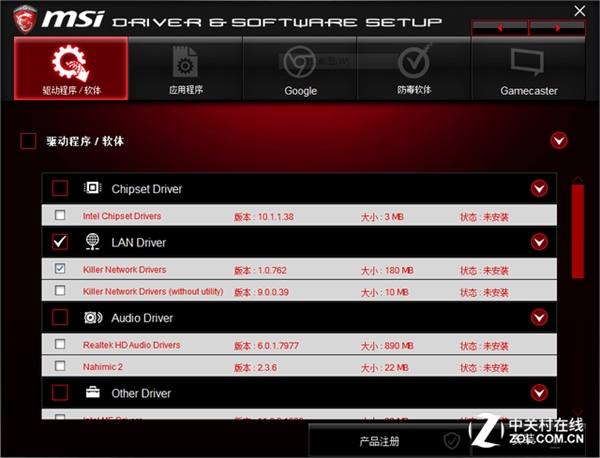

# Win10用不爽？教你在200系主板安Win7

其实从Intel第六代处理器开始，由于USB接口的主控设计上的变动，就已经无法正常安装Win7操作系统。所以我们在安装时需要对驱动进行一些修改，用来实现200系主板安装Windows7。

所需工具：UltraISO(用于制作U盘镜像)、Windows 7原版镜像文件(文件后缀为ISO)、PS/2键盘或鼠标、光驱。

## 制作Windows 7启动U盘

UltraISO软碟通是一款功能强大而又方便实用的软碟文件制作/编辑/转换工具，它可以直接编辑软碟文件和从软碟中提取文件，也可以从CD-ROM直接制作软碟或者将硬盘上的文件制作成ISO文件。同时，你也可以处理ISO文件的启动信息，从而制作可引导光盘，使用起来也比较简单。操作方法如下：

首先点击“文件”，再点击“打开”，选择之前准备好的Windows 7系统。

软件左下方红框处选择要制作的U盘

工具栏上点击“启动”，弹出窗口选择“写入硬盘映像”。

点击“写入”，等待片刻即可。需要注意的是，使用UltraISO软碟通软件制作镜像文件之前，需要将U盘中的文件拷贝出来，因为该软件在写入硬盘镜像文件时会将U盘格式化，切记切记！

## 使用光驱注入USB驱动

由于Skylake和Kaby Lake两代处理器移除了EHCI主控，改为支持XHCI主控，但Windows 7系统原生不支持XHCI主控。所以在安装Windows 7前，我们首先要在主板BIOS中打开XHCI，这一选项一般是默认关闭的。

进入微星B250 GAMING M3 BIOS后，选择“Settings”，再点击“高级”中的“USB设置”，进入下面的XHCI Hand-off选项，将选择改为“允许”或者“Enable”。(由于安装系统无法截图，所以这里使用相机拍摄)

设置好后重启电脑，到这里你会发现键盘鼠标不能使用。这时候PS/2键盘鼠标就派上用场了（只需任意一个即可），点击下一步继续安装。只有键盘的朋友可以用Tab键定位选项，用回车键确定。

到了这里会提示加载驱动程序，我们把微星B250 GAMING M3自带的驱动光盘装入驱动中。

装入光盘后，点击“浏览”，选择光盘下的USB 3.0驱动。具体文件位置为：Win7/usb3/Intel/x64(X86)，如果你安装的是64位Windows 7就选择X64，32位Windows 7就选择X86。

等待片刻驱动安装成功，你会发现USB键盘鼠标可以现在使用了。

重新启动电脑后，按照提示一步一步安装就可以正常安装Windows 7操作系统了。

装好Windows 7，使用微星自带光盘安装驱动，过程和正常Windows 7系统无异。

驱动安好后，进入设备管理器查看一下，包括此前在老版本Windows 10上出现兼容性问题的NVIDIA驱动都可以正确安装，所有设备驱动安装正常