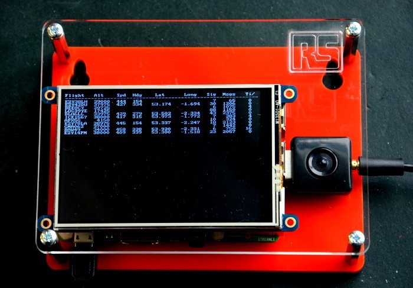
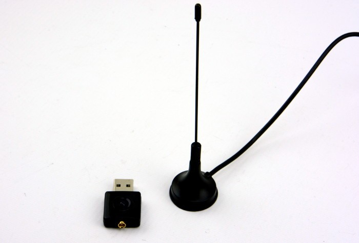
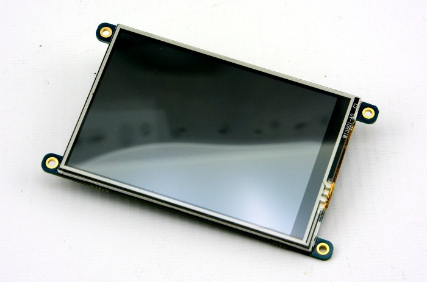
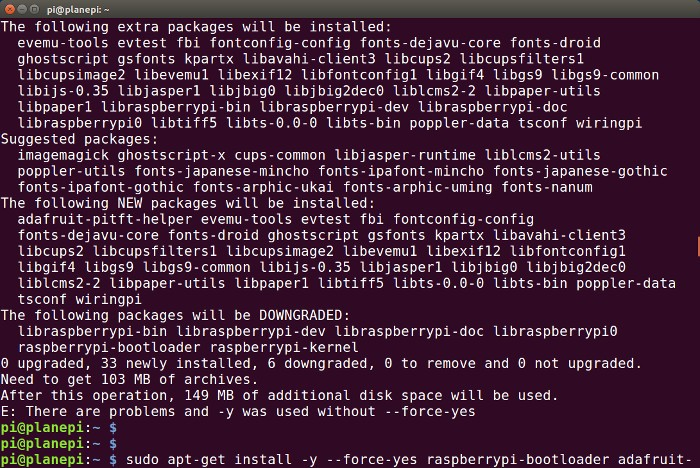
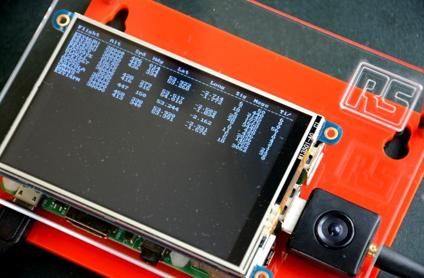
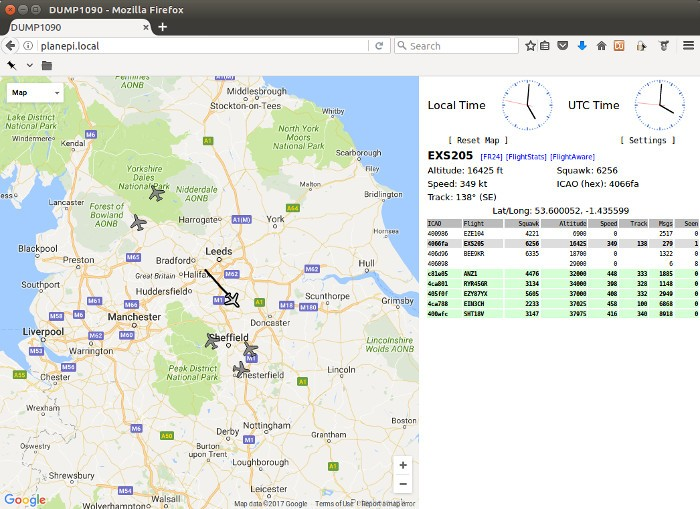
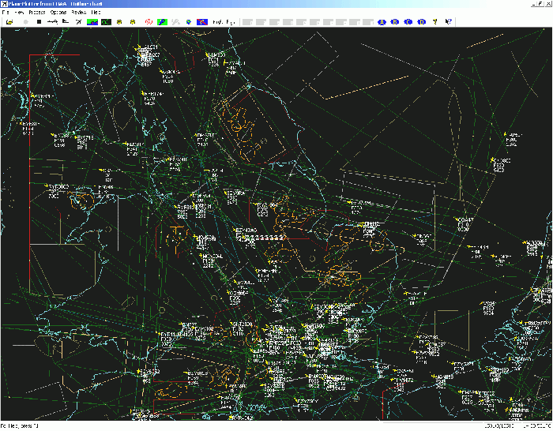

# 基于 Raspberry Pi 构建一个飞机观察器

此项目使用带超低成本软件无线电 (SDR) 硬件的 Raspberry Pi，来接收数百万里之外的机载 S 模式应答器发送的跟踪信息。Raspberry Pi 配备了灵巧的 3.5 英寸 TFT 显示屏，以提供便捷的飞机活动概览。



## 硬件

基于 RTL2832U 的微小 SDR 接收器 [(124-5461)](https://www.rs-online.com/designspark/purchase-product/1245461) 专为 DVB-T 的接收设计并第一次投放市场。然而，由于 Linux 内核黑客这几年的努力，已经可以获取设备的原始样本，而不仅仅还只是一个被解调的 DVB 信号。这意味着无线系统之后可以应用于软件，实现巨大的灵活性。



RTL2832U 芯片通常与调谐器 IC 配接。具体到 Adafruit 的 USB 接收器中，它是一个 R820T，可接收 24MHz 至 1,850MHz 的信号。应该指出的是，RTL-SDR 硬件配备 8 位 ADC 分辨率和约 7 位的有效位数 (ENOB)，在更昂贵的 SDR 平台的动态范围内无竞争优势。但是对于许多用途来说，它已经足够，并拥有极高的性价比。



用于接收和解码 S 模式信号的软件提供了一个基于 Google 地图的网站界面和一个并不特别需要的本地显示屏。然而，Adafruit PiTFT 3.5 英寸显示屏[ (124-5487)](https://www.rs-online.com/designspark/purchase-product/1245487) 的增加提供了“一目了然”的简明空中活动概览。另外，Raspberry Pi、SDR 接收器和 TFT 显示屏的结合还可配置成一个相当酷炫、[实现频谱可视化的独立扫描仪](https://learn.adafruit.com/freq-show-raspberry-pi-rtl-sdr-scanner)。

TFT 显示屏只需插入 Pi 的 P1 管座，SDR 接收器则只需插入一个 USB 端口。


## Raspbian

Raspbian 的安装有两种选项：从 Adafruit 为已配置好的 TFT 显示屏下载一个受内核支持的映像，或编写一个 Raspbian 内置映像，然后进行相应配置。我选择了后者，因为我通常倾向于使用官方 O/S 安装映像，然后执行所需自定义操作。然而，前者包含的步骤更少，更不容易出错。Adafruit 为[两种方法提供指导](https://learn.adafruit.com/adafruit-pitft-3-dot-5-touch-screen-for-raspberry-pi/easy-install)。

使用 “dd” 编写 Micro SD 卡后，我通过编辑文件将主机名从默认的 “raspberrypi” 更改为 “planepi”，以更方便地找到网络：

```
etc/hostname

etc/hosts
```

注意开始处缺失的斜线，因为您不会想在编写 SD 卡的计算机上的 /etc 下编辑文件 - 所以，不管您的电脑已经安装了什么路径，您都需要在 SD 卡下添加根文件系统。

如果您倾向于通过附带的键盘、显示器和鼠标配置系统，则不必启动 SSH。但是，如果您像我一样倾向于通过 SSH 连接进行配置，则需执行以下操作：

```
$ sudo touch boot/ssh
```

随便用什么替代 “boot”。完整路径是为了在 SD 卡上引导系统文件。

如果 Pi 连接至一个有线网络，您可以移除Micro SD 卡，插入 Pi 然后引导。但是，如果您使用无线网络连接，则还需编辑：

```
etc/wpa_supplicant/wpa_supplicant.conf
```

再次重申，这不是您编写 SD 卡的计算机上 /etc/wpa_supplicant 中的配置文件，配置文件位于 SD 卡根文件系统上的 etc/wpa_supplicant 目录中。

如需手动配置无线网络的详情，请参阅 Raspberry Pi 文档。

## PiTFT 设置



因为我使用 Raspbian 内置映像，并需为 TFT 显示屏配置此映像的内核支持，我按照 Adafruit 提供的 DIY 安装人员[脚本说明](https://learn.adafruit.com/adafruit-pitft-3-dot-5-touch-screen-for-raspberry-pi/easy-install)：轻松安装进行安装。然而，”sudo apt-get install” 行出现如上所示错误，因为内置映像出现了更新的软件版本，因此，需运行以下脚本强制进行降级：

```
$ sudo apt-get install -y --force-yes raspberrypi-bootloader adafruit-pitft-helper raspberrypi-kernel
```

随后运行辅助脚本，以便安装 3.5 英寸电阻型 PiTFT。

```
$ sudo adafruit-pitft-helper -t 35r
```

通常建议使用 Adafruit 提供的提前配置好的 Raspbian 映像。但是，以上信息只对使用 Raspbian 内置映像的新手有用，不管其出于任何原因，如向运行其他应用程序的现有系统添加这些功能。

最后，如果出现本文顶部图像所示情况，即 USB 电源引线朝 Pi 向下，则需要更新配置才可将显示屏旋转 180 度。通过编辑 /boot/config.txt 文件并将 rotate=270 更改为 rotate=90 即可完成。

## dump1090

有多种软件可用于接收和解码 S 模式传输，这在 5 年前就实现了，那时我撰文介绍过[基于 GNU Radio 的地对空模式](https://www.rs-online.com/designspark/watching-planes-with-software-defined-radio)。然而，这一次，我们打算使用名为 dump1090 的软件，其以 S 模式的使用频率 1090MHz 命名。

与 GNU Radio 相比，dump1090 的好处包括：拥有最低的外部依赖性；它还特别坚固，擅长于解码弱信号。当在交互模式下工作时，它将向控制台打印出活动概览，且在 GitHub 上共享的分支会经过细微修改，以便适应 3.5 英寸 TFT 显示屏。

要进行构建，我们需要运行以下脚本：

```
$ sudo apt-get install libusb-1.0-0-dev librtlsdr-dev rtl-sdr
$ git clone https://github.com/DesignSparkrs/dump1090
$ cd dump1090
$ make
```

随后编辑 /etc/rc.local 文件，并在 “exit 0” 前添加以下行：

```
cd ~pi/dump1090; ./dump1090 --net --net-http-port 80 --interactive &
```

## 运行



现在我们需要重新启动以便为 TFT 显示屏配置内核，如果未为 RTL-SDR 硬件加载默认的电视调谐器支持，则该配置将会受阻。如果一切进展顺利，dump1090 将通过我们刚刚添加至 /etc/rc.local 的行启动。随后 TFT 显示屏应会在接收到信号时开始显示内容。




如果浏览器连接Raspberry Pi，我们将会获得一个简单的网络应用程序。该程序基于 Google 地图，带有飞机位置标记和海拔等数据。

请注意，SDR 接收器随附的天线对于 1090MHz 来说不是最优的，但是在大部分地区，使用该天线起码可以获取某些飞机信号。请确保将其放置于窗户边或窗外。如果您运气不佳，无法接收信号，有在线的简单DIY天线的计划可以调谐到1090MHz，增益更高。


## 其他软件和服务



dump1090 还可让原始 S 模式信息在网络上可用，这些可与 [PlanePlotter](http://www.coaa.co.uk/planeplotter.htm) 等软件一起使用，以实现更复杂的显示。此外，数据还可从接收器发送到提供众包飞行数据访问权限的在线服务，如 [OpenSky Network](https://opensky-network.org/) 和 [FlightAware](https://uk.flightaware.com/)。

```
本文来自 DesignPark，作者：Andrew Back，转自http://geek.csdn.net/news/detail/200441
```
