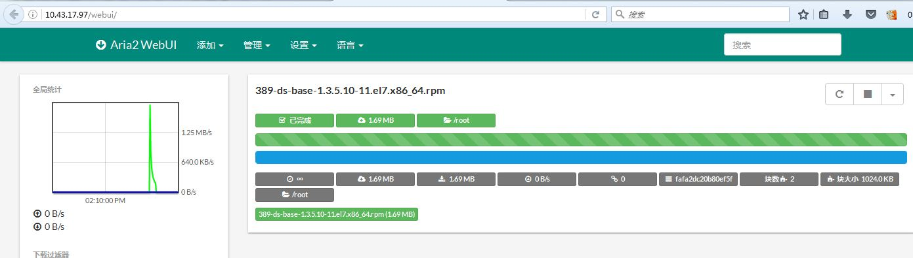

# aria2下载工具

## 简介

号称下一代通用下载工具，是一个轻量级的支持多协议，多来源的基于命令行下载工具。

基本特性

- 多源下载：能从多个来源多个协议下载同一个文件，充分利用你的最大带宽

- 轻量级：占用尽量小的内存和CPU资源，

- 全特性BT客户端：支持BT协议的所有特性，DHT,PEX, Encryption, Magnet URI, Web-Seeding, Selective Downloads, Local Peer Discovery and UDP tracker.

- 支持Metalink：支持多版本的metalink规范

- 远程控制：提供RPC接口对下载进行管理，包括 JSON-RPC (over HTTP and WebSocket) and XML-RPC

## 安装

需要C++编译器的支持
```
[root@e7e075eedc924227a0254d212df133e0 aria2-1.31.0]# ./configure
[root@e7e075eedc924227a0254d212df133e0 aria2-1.31.0]# make
[root@e7e075eedc924227a0254d212df133e0 aria2-1.31.0]# make install
[root@e7e075eedc924227a0254d212df133e0 ~]# aria2c --help
Usage: aria2c [OPTIONS] [URI | MAGNET | TORRENT_FILE | METALINK_FILE]...
Printing options tagged with '#basic'.
See 'aria2c -h#help' to know all available tags.
Options:
 -v, --version                Print the version number and exit.

                              Tags: #basic

 -h, --help[=TAG|KEYWORD]     Print usage and exit.
                              The help messages are classified with tags. A tag
                              starts with "#". For example, type "--help=#http"
                              to get the usage for the options tagged with
                              "#http". If non-tag word is given, print the usage
                              for the options whose name includes that word.

                              Possible Values: #basic, #advanced, #http, #https, #ftp, #metalink, #bittorrent, #cookie, #hook, #file, #rpc, #checksum, #experimental, #deprecated, #help, #all
                              Default: #basic
                              Tags: #basic, #help

 -l, --log=LOG                The file name of the log file. If '-' is
                              specified, log is written to stdout.

                              Possible Values: /path/to/file, -
                              Tags: #basic

 -d, --dir=DIR                The directory to store the downloaded file.

                              Possible Values: /path/to/directory
                              Default: /root
                              Tags: #basic, #file

 -o, --out=FILE               The file name of the downloaded file. It is
                              always relative to the directory given in -d
                              option. When the -Z option is used, this option
                              will be ignored.

                              Possible Values: /path/to/file
                              Tags: #basic, #http, #ftp, #file

 -s, --split=N                Download a file using N connections. If more
                              than N URIs are given, first N URIs are used and
                              remaining URLs are used for backup. If less than
                              N URIs are given, those URLs are used more than
                              once so that N connections total are made
                              simultaneously. The number of connections to the
                              same host is restricted by the 
                              --max-connection-per-server option. See also the
                              --min-split-size option.

                              Possible Values: 1-*
                              Default: 5
                              Tags: #basic, #http, #ftp

 --file-allocation=METHOD     Specify file allocation method.
                              'none' doesn't pre-allocate file space. 'prealloc'
                              pre-allocates file space before download begins.
                              This may take some time depending on the size of
                              the file.
                              If you are using newer file systems such as ext4
                              (with extents support), btrfs, xfs or NTFS
                              (MinGW build only), 'falloc' is your best
                              choice. It allocates large(few GiB) files
                              almost instantly. Don't use 'falloc' with legacy
                              file systems such as ext3 and FAT32 because it
                              takes almost same time as 'prealloc' and it
                              blocks aria2 entirely until allocation finishes.
                              'falloc' may not be available if your system
                              doesn't have posix_fallocate() function.
                              'trunc' uses ftruncate() system call or
                              platform-specific counterpart to truncate a file
                              to a specified length.

                              Possible Values: none, prealloc, trunc, falloc
                              Default: prealloc
                              Tags: #basic, #file

 -V, --check-integrity[=true|false] Check file integrity by validating piece
                              hashes or a hash of entire file. This option has
                              effect only in BitTorrent, Metalink downloads
                              with checksums or HTTP(S)/FTP downloads with
                              --checksum option. If piece hashes are provided,
                              this option can detect damaged portions of a file
                              and re-download them. If a hash of entire file is
                              provided, hash check is only done when file has
                              been already download. This is determined by file
                              length. If hash check fails, file is
                              re-downloaded from scratch. If both piece hashes
                              and a hash of entire file are provided, only
                              piece hashes are used.

                              Possible Values: true, false
                              Default: false
                              Tags: #basic, #metalink, #bittorrent, #file, #checksum

 -c, --continue[=true|false]  Continue downloading a partially downloaded
                              file. Use this option to resume a download
                              started by a web browser or another program
                              which downloads files sequentially from the
                              beginning. Currently this option is only
                              applicable to http(s)/ftp downloads.

                              Possible Values: true, false
                              Default: false
                              Tags: #basic, #http, #ftp

 -i, --input-file=FILE        Downloads URIs found in FILE. You can specify
                              multiple URIs for a single entity: separate
                              URIs on a single line using the TAB character.
                              Reads input from stdin when '-' is specified.
                              Additionally, options can be specified after each
                              line of URI. This optional line must start with
                              one or more white spaces and have one option per
                              single line. See INPUT FILE section of man page
                              for details. See also --deferred-input option.

                              Possible Values: /path/to/file, -
                              Tags: #basic

 -j, --max-concurrent-downloads=N Set maximum number of parallel downloads for
                              every static (HTTP/FTP) URL, torrent and metalink.
                              See also --split and --optimize-concurrent-downloads options.

                              Possible Values: 1-*
                              Default: 5
                              Tags: #basic

 -Z, --force-sequential[=true|false] Fetch URIs in the command-line sequentially
                              and download each URI in a separate session, like
                              the usual command-line download utilities.

                              Possible Values: true, false
                              Default: false
                              Tags: #basic

 -x, --max-connection-per-server=NUM The maximum number of connections to one
                              server for each download.

                              Possible Values: 1-16
                              Default: 1
                              Tags: #basic, #http, #ftp

 -k, --min-split-size=SIZE    aria2 does not split less than 2*SIZE byte range.
                              For example, let's consider downloading 20MiB
                              file. If SIZE is 10M, aria2 can split file into 2
                              range [0-10MiB) and [10MiB-20MiB) and download it
                              using 2 sources(if --split >= 2, of course).
                              If SIZE is 15M, since 2*15M > 20MiB, aria2 does
                              not split file and download it using 1 source.
                              You can append K or M(1K = 1024, 1M = 1024K).

                              Possible Values: 1048576-1073741824
                              Default: 20M
                              Tags: #basic, #http, #ftp

 --ftp-user=USER              Set FTP user. This affects all URLs.

                              Tags: #basic, #ftp

 --ftp-passwd=PASSWD          Set FTP password. This affects all URLs.

                              Tags: #basic, #ftp

 --http-user=USER             Set HTTP user. This affects all URLs.

                              Tags: #basic, #http

 --http-passwd=PASSWD         Set HTTP password. This affects all URLs.

                              Tags: #basic, #http

 --load-cookies=FILE          Load Cookies from FILE using the Firefox3 format
                              and Mozilla/Firefox(1.x/2.x)/Netscape format.

                              Possible Values: /path/to/file
                              Tags: #basic, #http, #cookie

 -S, --show-files[=true|false] Print file listing of .torrent, .meta4 and
                              .metalink file and exit. More detailed
                              information will be listed in case of torrent
                              file.

                              Possible Values: true, false
                              Default: false
                              Tags: #basic, #metalink, #bittorrent

 --max-overall-upload-limit=SPEED Set max overall upload speed in bytes/sec.
                              0 means unrestricted.
                              You can append K or M(1K = 1024, 1M = 1024K).
                              To limit the upload speed per torrent, use
                              --max-upload-limit option.

                              Possible Values: 0-*
                              Default: 0
                              Tags: #basic, #bittorrent

 -u, --max-upload-limit=SPEED Set max upload speed per each torrent in
                              bytes/sec. 0 means unrestricted.
                              You can append K or M(1K = 1024, 1M = 1024K).
                              To limit the overall upload speed, use
                              --max-overall-upload-limit option.

                              Possible Values: 0-*
                              Default: 0
                              Tags: #basic, #bittorrent

 -T, --torrent-file=TORRENT_FILE  The path to the .torrent file.

                              Possible Values: /path/to/file
                              Tags: #basic, #bittorrent

 --listen-port=PORT...        Set TCP port number for BitTorrent downloads.
                              Multiple ports can be specified by using ',',
                              for example: "6881,6885". You can also use '-'
                              to specify a range: "6881-6999". ',' and '-' can
                              be used together.

                              Possible Values: 1024-65535
                              Default: 6881-6999
                              Tags: #basic, #bittorrent

 --enable-dht[=true|false]    Enable IPv4 DHT functionality. It also enables
                              UDP tracker support. If a private flag is set
                              in a torrent, aria2 doesn't use DHT for that
                              download even if ``true`` is given.

                              Possible Values: true, false
                              Default: true
                              Tags: #basic, #bittorrent

 --dht-listen-port=PORT...    Set UDP listening port used by DHT(IPv4, IPv6)
                              and UDP tracker. Multiple ports can be specified
                              by using ',', for example: "6881,6885". You can
                              also use '-' to specify a range: "6881-6999".
                              ',' and '-' can be used together.

                              Possible Values: 1024-65535
                              Default: 6881-6999
                              Tags: #basic, #bittorrent

 --enable-dht6[=true|false]   Enable IPv6 DHT functionality.
                              Use --dht-listen-port option to specify port
                              number to listen on. See also --dht-listen-addr6
                              option.

                              Possible Values: true, false
                              Default: false
                              Tags: #basic, #bittorrent

 --dht-listen-addr6=ADDR      Specify address to bind socket for IPv6 DHT. 
                              It should be a global unicast IPv6 address of the
                              host.

                              Tags: #basic, #bittorrent

 -M, --metalink-file=METALINK_FILE The file path to the .meta4 and .metalink
                              file. Reads input from stdin when '-' is
                              specified.

                              Possible Values: /path/to/file, -
                              Tags: #basic, #metalink

URI, MAGNET, TORRENT_FILE, METALINK_FILE:
 You can specify multiple HTTP(S)/FTP URIs. Unless you specify -Z option, all
 URIs must point to the same file or downloading will fail.
 You can also specify arbitrary number of BitTorrent Magnet URIs, torrent/
 metalink files stored in a local drive. Please note that they are always
 treated as a separate download.

 You can specify both torrent file with -T option and URIs. By doing this,
 download a file from both torrent swarm and HTTP/FTP server at the same time,
 while the data from HTTP/FTP are uploaded to the torrent swarm. For single file
 torrents, URI can be a complete URI pointing to the resource or if URI ends
 with '/', 'name' in torrent file is added. For multi-file torrents, 'name' and
 'path' in torrent are added to form a URI for each file.

 Make sure that URI is quoted with single(') or double(") quotation if it
 contains "&" or any characters that have special meaning in shell.

About the number of connections
 Since 1.10.0 release, aria2 uses 1 connection per host by default and has 20MiB
 segment size restriction. So whatever value you specify using -s option, it
 uses 1 connection per host. To make it behave like 1.9.x, use
 --max-connection-per-server=4 --min-split-size=1M.

Refer to man page for more information.
```

## 基本命令

通过命令行下载
```
从HTTP源下载
$ aria2c http://example.org/mylinux.iso
从多个源下载
$ aria2c http://a/f.iso ftp://b/f.iso
BT下载
$ aria2c http://example.org/mylinux.torrent
BT磁力链接
$ aria2c 'magnet:?xt=urn:btih:248D0A1CD08284299DE78D5C1ED359BB46717D8C'
metalink下载
$ aria2c http://example.org/mylinux.metalink
根据配置文件中地址下载
$ aria2c -i uris.txt
```

## 相关项目

### python接口

[python3封装的jsonrpc接口](http://xyne.archlinux.ca/projects/python3-aria2jsonrpc/)

### webui

[webui项目下载](https://github.com/ziahamza/webui-aria2)

webui安装步骤
```
解压到web目录下
[root@e7e075eedc924227a0254d212df133e0 webui]# ll
total 120
-rw-r--r-- 1 root root  2524 Jan 13 20:03 configuration.js
drwxr-xr-x 2 root root  4096 Jan 13 20:03 css
-rw-r--r-- 1 root root  1437 Jan 13 20:03 directurl.md
-rw-r--r-- 1 root root   268 Jan 13 20:03 docker-compose.yml
-rw-r--r-- 1 root root  1381 Jan 13 20:03 Dockerfile
-rw-r--r-- 1 root root  5430 Jan 13 20:03 favicon.ico
drwxr-xr-x 4 root root  4096 Jan 13 20:03 flags
drwxr-xr-x 2 root root  4096 Jan 13 20:03 fonts
-rwxr-xr-x 1 root root 54320 Jan 13 20:03 index.html
drwxr-xr-x 8 root root  4096 Jan 13 20:03 js
-rw-r--r-- 1 root root  1060 Jan 13 20:03 LICENSE
-rw-r--r-- 1 root root  3867 Jan 13 20:03 README.md
-rw-r--r-- 1 root root  2545 Jan 13 20:03 rpi-Dockerfile
drwxr-xr-x 2 root root  4096 Jan 13 20:03 screenshots
-rw-r--r-- 1 root root  4549 Jan 13 20:03 webui-aria2.spec
[root@e7e075eedc924227a0254d212df133e0 webui]# pwd
/var/www/html/webui
修改权限
[root@e7e075eedc924227a0254d212df133e0 html]# chmod 755 webui
启动rpc监听
[root@e7e075eedc924227a0254d212df133e0 ~]# aria2c  --enable-rpc  --rpc-listen-all
02/07 19:48:21 [WARN] Neither --rpc-secret nor a combination of --rpc-user and --rpc-passwd is set. This is insecure. It is extremely recommended to specify --rpc-secret with the adequate secrecy or now deprecated --rpc-user and --rpc-passwd.
02/07 19:48:21 [NOTICE] IPv4 RPC: listening on TCP port 6800
02/07 19:48:21 [NOTICE] IPv6 RPC: listening on TCP port 6800
```

通过浏览器访问对应的服务


参考资源

[aria2官方网站](https://aria2.github.io/)

