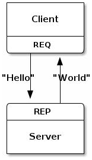
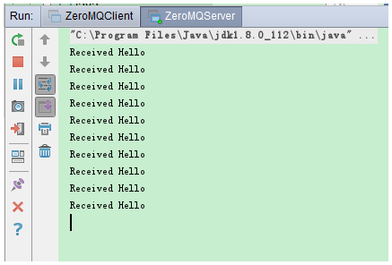
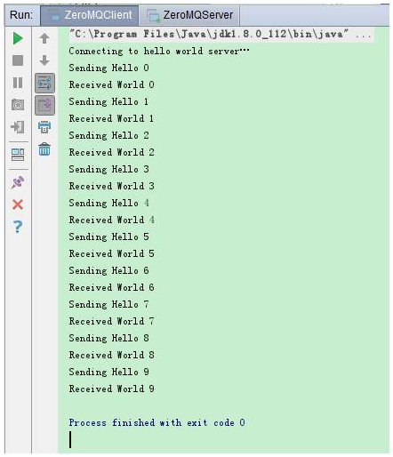
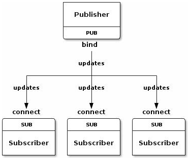
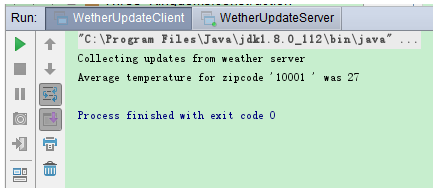
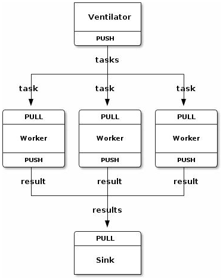
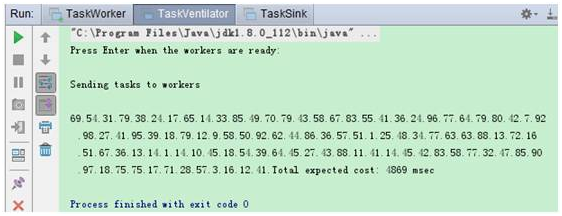
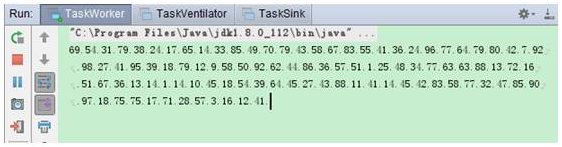
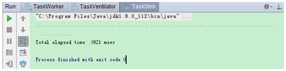

# ZeroMQ(ØMQ)的适用场景与优劣浅析(王鹏洲)

## 摘要

当前用来处理进程或服务间交互的消息中间件（MQ）真可谓琳琅满目，比较出名的有ActiveMQ、Kafka、RocketMQ、RabbitMQ、ZeroMQ(ØMQ)等，各有千秋。

ZeroMQ(ØMQ)作为族繁不及备载的MQ中略显另类的一员，是本文研究的核心。

## ØMQ诞生背景

在当今各操作系统中，对TCP/IP进行了初步封装的Socket是受到最广泛支持的API，也是这些操作系统的核心组件之一。Socket套接字(BSD)的连接是典型的点对点（1:1）连接，一个源端对应一个对端。此外，Socket的点对点连接需要显式地建立连接、销毁连接、选择协议（TCP/UDP）和处理错误等。解决了以上问题，你就可以开始应用协议层（如HTTP）的开发了，剩下需要考虑的，不过是组帧、缓存和处理逻辑等。

但对于开发者来说，解决Socket的这些问题，需要考虑的信息过多。

如果我们能对各种套接字的类型、连接处理、帧、甚至路由等底层细节进行抽象，使得开发者无需关心底层处理，只专注于应用层的开发，是不是就更加便利了呢？

这正是ØMQ（又称作ZeroMQ、ZMQ或0MQ）网络库的由来。

## ØMQ简介

ØMQ（又称作ZeroMQ、ZMQ或0MQ）是一件由社区推动并完成的自由作品，前后有数十位作者参与开发。

ØMQ是网络栈中新的一层，它是个可伸缩的、简单、易用、优雅、高效的传输层通讯库，分散在分布式系统间。

与通常意义上的Socket接口相比，ØMQ不是简单的点对点交互，相反，它定义了分布式系统的全局拓扑。ØMQ应用程序没有锁，可并行运行。此外，它可在多个线程、内核和主机盒之间弹性伸缩。

ØMQ的开发团队有着非常强烈的企图心。他们希望最终将ZMQ打造成为标准网络协议栈的一部分，之后进入 Linux 内核。尽管现在距离他们的终极目标还有一段很长的距离，但ØMQ无疑是极具前景的消息中间件。

ZMQ在非常成熟的BSD 套接字之上又做了一层封装，在确保消息处理高性能的同时，使得基于它的消息交互开发极为简单和有趣。

## ØMQ技术特点

1. ØMQ交互面向消息：它将应用程序周而复始的例行消息处理封装起来，当客户端BSD发送一条消息时，服务端BSD无需显式处理任何缓存（buffer）或组帧，即能接收到一条完整而相同的消息。

2. ØMQ套接字与传输协议无关：对于任何协议，只有单一且统一的发送消息和接收消息API。缺省情况下即支持进程内通讯、IPC、广播和TCP。此外，协议间切换非常简单，仅需更改连接字符串的前缀即可。

3. ØMQ套接字能感知路由和网络拓扑：因为我们不再需要显示地管理点对点的连接状态，所有这些都已由ØMQ库封装好，所以单个ØMQ套接字可以绑定两个独立的端口并监听他们的入站请求消息；也可使用一个API调用向两个独立的BSD发送数据。

4. 默认情况下，ØMQ中所有的交互都是异步的：这种异步处理模型好处是，ØMQ将建立连接、销毁连接、重新连接的过程也做了封装，同时又实现了消息传输延迟的最小。应用中一般的消息处理都是并行进行的，如消息的发送、传输以及（在发送端或接收端）排队。开发者可以通过设定内存范围控制ØMQ的排队行为，甚至可以为每个BSD设定交换区域。

## ØMQ使用

ØMQ支持包括C、Ruby、Go、Python、C#等在内的28种主流开发语言，并在其官网的用户手册中提供了各种语言多达750个样例，适用性非常好。本文将以Java语言为例。

目前官网上提供的ØMQ最新版本是4.1.2，用户手册的最新版本是3.2。

 

1、下载源码：由于ØMQ采用C开发，因此，java语言要用的话，需要首先将源码从官网下载下来， ØMQ代码中包含一个msvc.sln文件，使用VS2010打开，将工程编译并生成解决方案，工程目录下会生成lib目录，下面包含一些dll文件和lib目录。

2、编译：同时将对应版本的jzmq代码也下载下来，这是一个适配层代码，使用VS2010打开msvc.sln，将JDK目录下的include和ZeroMQ工程目录下的include头文件目录加入到VS工程的包含路径中，并将此前编译ZeroMQ工程生成的lib目录加入到jzmq的库文件中，编译并生成解决方案，成功的话，会生成以下三个文件：

jzmq.dll，libzmq.dll，zmq.jar

3、配置：zmq.jar文件不用说，需要配置到java工程依赖的外部包；jzmq.dll，libzmq.dll拷贝到JDK的bin文件夹下。

自此，就可以开始ØMQ的开发了。

当然，也可以到一些技术网站上直接下载这三个编译好的文件。但我们程序员最大的优点就是，自己喜欢造轮子。

从官网上将源码下载下来，一步步将之变为可供可发的库，属于优秀程序员的信仰。

## ØMQ基本类型

ØMQ提供了三个基本的通信模型：

Request-Reply

Publisher-Subscriber

ParallelPipeline

透过这三种基本模型，我们可以大致了解ZMQ的技术特色。

### Request-Reply

客户端发起请求，服务端响应请求。ØMQ通过Device组件，可以非常优秀地支持路由，从而实现客户端与服务端的多对多（N:M）交互。

在此，还是以经典的“Hello World”为例，请求端发送一个简单的 hello，服务端则回应一个 world：



Server端代码：

```
import org.zeromq.ZMQ;
public class ZeroMQServer {
    public static void main(String[] args) throws Exception {
        ZMQ.Context context = ZMQ.context(1);
        // Socket to talk to clients
        ZMQ.Socket responder = context.socket(ZMQ.REP);
        responder.bind("tcp://*:5555");
        while (!Thread.currentThread().isInterrupted()){
            // Wait for next request from the client
            byte[] request =responder.recv(0);
            System.out.println("Received Hello");
            // Do some 'work'
            Thread.sleep(1000);
            // Send reply back to client
            String reply = "World";
           responder.send(reply.getBytes(), 0);
        }
        responder.close();
        context.term();
    }
}
```

Client端代码：
```
import org.zeromq.ZMQ;
public class ZeroMQClient {
    public static void main(String[] args) {
        ZMQ.Context context = ZMQ.context(1);
        // Socket to talk to server
        System.out.println("Connecting to hello world server…");
        ZMQ.Socket requester =context.socket(ZMQ.REQ);
        requester.connect("tcp://localhost:5555");
        for (int requestNbr = 0; requestNbr != 10; requestNbr++) {
            String request = "Hello";
            System.out.println("Sending Hello " + requestNbr);
            requester.send(request.getBytes(), 0);
            byte[] reply = requester.recv(0);
            System.out.println("Received " + new String(reply) + " " +requestNbr);
        }
        requester.close();
        context.term();
    }
}
```

Server控制台打印。Server启动后，缺省情况下不会自动停止：



Client控制台打印。一次交互结束，客户端服务立即关闭：



从本例可以大致了解到ØMQ  Request-Reply类型的基本用法，需要注意的是：

- ØMQ的Request-Reply交互流程是一问一答式的：Client 与Server建立连接，发消息给 Server；Server收到消息，回复响应给 client。

- 与Socket不同，ØMQ的Server和Client无论谁先启动无所谓，但消息顺序一定是Client请求在线，Server响应在后。

- 在收到信息以前，Server程序是阻塞的，直到与Client消息上来。　

- ØMQ只关心消息大小(size)，不关心消息格式。

- 用 ØMQ可以实现 HTTP 协议，但是这不是ØMQ被设计时的核心诉求。

### Publisher-Subscriber

Publisher节点提供消息源，Subscriber节点接收消息源。

以天气预报为例，发布源公布最新的天气信息，多个用户接收天气信息。Publisher-Subscriber



服务器端生成zipcode（城市码）、temperature（温度）、relhumidity（湿度），然后不断广播；客户端通过滤条件接收指定城市的信息，收集完成以后，求出平均值。

Publisher代码：
```
import java.util.Random;
import org.zeromq.ZMQ;
public class WetherUpdateServer {
    public static void main (String[] args) throws Exception {
        // Prepare our context and publisher
        ZMQ.Context context = ZMQ.context(1);
        ZMQ.Socket publisher = context.socket(ZMQ.PUB);
        publisher.bind("tcp://*:5556");
        //publisher.bind("ipc://weather");
        // Initialize random numbergenerator
        Random srandom = new Random(System.currentTimeMillis());
        while (!Thread.currentThread ().isInterrupted()) {
            // Get values that will fool the boss
            int zipcode, temperature, relhumidity;
            zipcode = 10000 + srandom.nextInt(10000) ;
            temperature =srandom.nextInt(215) - 80 + 1;
            relhumidity =srandom.nextInt(50) + 10 + 1;
            // Send message to all subscribers
            String update = String.format("%05d %d %d", zipcode,temperature, relhumidity);
            publisher.send(update, 0);
        }
        publisher.close ();
        context.term ();
    }
} 
```

Subscriber代码：
```
import org.zeromq.ZMQ;
public class WetherUpdateClient {
    public static void main(String[] args) {
        ZMQ.Contextcontext = ZMQ.context(1);
        // Socket to talk to server
        System.out.println("Collecting updates from weatherserver");
        ZMQ.Socket subscriber =context.socket(ZMQ.SUB);
        subscriber.connect("tcp://localhost:5556");
        // Subscribe to zipcode, default is NYC, 10001
        String filter = (args.length > 0) ? args[0] : "10001 ";
        subscriber.subscribe(filter.getBytes());
        // Process 100 updates
        int update_nbr;
        long total_temp = 0;
        for (update_nbr = 0; update_nbr < 100; update_nbr++) {
            // Use trim to remove the tailing '0' character
            String string = subscriber.recvStr(0).trim();
            StringTokenizer sscanf = new StringTokenizer(string, " ");
            int zipcode = Integer.valueOf(sscanf.nextToken());
            int temperature = Integer.valueOf(sscanf.nextToken());
            int relhumidity = Integer.valueOf(sscanf.nextToken());
            total_temp += temperature;
        }
        System.out.println("Average temperature for zipcode '"
                + filter + "' was " + (int) (total_temp / update_nbr));

        subscriber.close();
        context.term();
    }
}
```

Subscriber端执行结果。Subscriber收到订阅信息后，服务终止；另一方面，Publisher服务启动后，缺省情况下不会自动停止：



从本例可以大致了解到ØMQ  Publish-Subscribe类型的基本用法，需要注意的是：

- 客户端需要设置过滤条件，或者说设定一个订阅频道，否则什么信息也收不到。

- Publisher启动后会一直广播，即使中途有的Subscriber 端退出也不受影响。当 Subscriber 再次连接，只会收到连接建立后Publisher广播的新信息，以前的信息则会丢掉。

- 如果 Publisher 中途离开，所有的 Subscriber 都会挂起，等待 Publisher 上线以后，再继续接收广播信息。

### Parallel Pipeline

Parallel Pipeline类型涉及三个核心对象。一个Ventilator生成并下发任务，多个Worker接收并处理任务，然后将结果发送给Sink进行归总或进一步处理。

例如：假设需要统计各个机器的日志，我们需要首先将统计任务分发到各个节点机器上，最后收集统计结果，做一个汇总：



Task Ventilator SOCKET_PUSH，将任务分发到 Worker 节点上。而 Worker 节点上，使用 SOCKET_PULL 从上游接收任务，处理完成后，使用SOCKET_PUSH 将结果汇集到 Sink。

Ventilator代码：
```
import org.zeromq.ZMQ;
public class TaskVentilator {
    public static void main (String[] args) throws Exception {
        ZMQ.Context context = ZMQ.context(1);
        // Socket to send messages on
        ZMQ.Socket sender = context.socket(ZMQ.PUSH);
        sender.bind("tcp://*:5557");
        // Socket to send messages on
        ZMQ.Socket sink = context.socket(ZMQ.PUSH);
        sink.connect("tcp://localhost:5558");
        System.out.println("Press Enter when the workers are ready:");
        System.in.read();
        System.out.println("Sending tasks to workers\n");
        // The first message is "0" andsignals start of batch
        sink.send("0", 0);
        // Initialize random number generator
        Random srandom = new Random(System.currentTimeMillis());
        // Send 100 tasks
        int task_nbr;
        int total_msec = 0; // Total expectedcost in msecs
        for (task_nbr = 0; task_nbr < 100; task_nbr++) {
            int workload;
            // Random workload from 1 to 100msecs
            workload = srandom.nextInt(100) + 1;
            total_msec += workload;
            System.out.print(workload + ".");
            String string = String.format("%d", workload);
            sender.send(string, 0);
        }
        System.out.println("Total expected cost: " + total_msec + " msec");
        Thread.sleep(1000); // Give 0MQ time to deliver
        sink.close();
        sender.close();
        context.term();
    }
}
```

Worker代码：
```
import org.zeromq.ZMQ;
public class TaskWorker {
    public static void main(String[] args) throws Exception {
        ZMQ.Context context = ZMQ.context(1);
        // Socket to receive messages on
        ZMQ.Socket receiver = context.socket(ZMQ.PULL);
        receiver.connect("tcp://localhost:5557");
        // Socket to send messages to
        ZMQ.Socket sender = context.socket(ZMQ.PUSH);
        sender.connect("tcp://localhost:5558");
        // Process tasks forever
        while (!Thread.currentThread().isInterrupted()){
            String string = new String(receiver.recv(0)).trim();
            long msec = Long.parseLong(string);
            // Simple progress indicator for the viewer
            System.out.flush();
            System.out.print(string + '.');
            // Do the work
            Thread.sleep(msec);
            // Send results to sink
            sender.send("".getBytes(), 0);
        }
        sender.close();
        receiver.close();
        context.term();
    }
}
```

Sink代码：
```
import org.zeromq.ZMQ;
public class TaskSink {
    public static void main(String[] args) throws Exception {
        // Prepare our context and socket
        ZMQ.Context context = ZMQ.context(1);
        ZMQ.Socket receiver =context.socket(ZMQ.PULL);
        receiver.bind("tcp://*:5558");
        // Wait for start of batch
        String string = new String(receiver.recv(0));
        // Start our clock now
        long tstart = System.currentTimeMillis();
        // Process 100 confirmations
        int task_nbr;
        int total_msec = 0; // Total calculatedcost in msecs
        for (task_nbr = 0; task_nbr < 100; task_nbr++) {
            string = new String(receiver.recv(0)).trim();
            if ((task_nbr / 10) * 10 == task_nbr) {
                System.out.print(":");
            } else {
                System.out.print(".");
            }
        }
        // Calculate and report duration of batch
        long tend = System.currentTimeMillis();
        System.out.println("\nTotal elapsed time: " + (tend - tstart) + " msec");
        receiver.close();
        context.term();
    }
}
```

Ventilator控制台打印。任务下发后自动关闭：



Worker控制台打印，一旦启动，缺省情况下不会自动关闭：



Sink控制台打印。任务汇总完成后自动关闭：



从本例可以大致了解到ØMQ Parallel Pipeline类型的基本用法，需要注意的是：

- Ventilator分发任务时有一个负载均衡的路由功能，worker 可以随时自由加入，任务可以均衡分发下去。

- ParallelPipeline模型的对象间不是客户端与服务端的关系，而是涉及三个对象，一定意义上可以理解为总-分-总关系。

## ØMQ的技术扩展

通常，网络中任意一个节点，既可以作为 Server（或Publisher），也能作为 Client（或Subscriber），通过 PipeLine 模型中的Worker，接收并处理上游分发的任务，同时向下连接着汇总结果的 Sink。

基于这一特点，开发者可以任意扩展ØMQ原有的三种模式：

1、网络间信息转发：一个Forwarder，作为内网的Subscriber，接收内网Publisher发布的消息，同时作为外网的Publisher，将信息转发给外网所有Subscriber；

2、N:1、1:M和N:M：与Socket只支持客户端与服务端1:1通信不同，ØMQ支持N:1、1:M和N:M通信，每条通信线路彼此独立，互不影响。通过ØMQ的Socket或一个中间节点（Broker），无论是1个客户端对应多个服务端，还是多个客户端对应1个服务端，任务都能均衡分配；

3、进程间通信：ØMQ不仅能通过 TCP 完成节点间的通信，也可以通过 Socket 文件完成进程间的通信。

## ØMQ的优劣

基于C语言开发的ØMQ号称史上最好的通讯库，位于应用层和网络层之间，对外提供经过封装的Socket接口，与应用层进行交互。

ØMQ有多个工作者线程，每个工作者线程可以创建多个Socket连接对象（由listener监听），也可以作为Socket客户端连接远程的对象。

### ØMQ的主要优点：

- 简单易用：ØMQ为提供了一套简单易用的套接字API，使得开发者不用考虑底层的协议类型；

- 消息格式灵活：ØMQ采用消息帧的机制来进行消息交互，不限制消息格式，只关注消息大小，消息的序列化与反序列化由应用层完成；

- 异步交互：ØMQ的消息交互都是异步的，无论是发送还是接收，ØMQ都会将消息先放入pipe中，当Reactor轮询到响应的读写事件时，再开始读写操作，且所有的I/O操作都在后台进行；

- 阈值管理机制：ØMQ的阈值管理机制确保进程不会因为消息的大批量涌入而导致内存溢出甚至崩溃。当队列满时，ØMQ会根据不同的消息模式，选择自动阻塞发送者，或直接丢弃部分消息；

- 无锁队列： 对于跨线程交互中的数据交换通道pipe，采用无锁的队列算法CAS；同时在pipe的两端注册有异步事件，在读或者写时，会自动触发读写事件；

- 高效的批量处理：ØMQ对批量消息的处理进行了适应性优化，使得批量接收和发送消息更加高效；

- 避免CPU切换：ØMQ充分利用多核的优势，每个核绑定运行一个工作者线程，避免多线程之间的CPU切换开销；

- 自我管理：ØMQ可以自动连接新增节点，或重连变动的节点；ØMQ在必要时自动将消息缓存起来，并在连接建立后再发送；ØMQ能够只能处理网络错误，或套接字异常。

### ØMQ的主要缺点：

- 与RabbitMQ、Kafka等MQ相比，ØMQ虽然本质上也是一种MQ，但由于其位于应用层与网络层之间，因此，ØMQ更像是一个比传统Socket更友好的网络通信库；

- ØMQ不提供分布式管理功能，需要额外编写程序去管理分布式，尽管它实现了MQ的核心功能：消息、先进先出；

- ØMQ的套接字不是线程安全的，这是架构上的主要缺陷之一。每个对象都被隔离在自己的线程中，因此不需要信号量和互斥锁；

- ØMQ的负载均衡算法存在局限性，性能、物理位置、繁忙程度等不同的服务端，很有可能被无差别地对待；

- ØMQ的不支持消息的持久化。

## 小结

ØMQ作为一款MQ，与其它MQ的差异还是比较大的，当然，这取决于各个MQ设计的初衷存在差异。ØMQ更像是在传统的Socket之上，又做了一次封装，使得用户无需关注底层协议，能够简洁高效地完成基于Request-Reply、Publisher-Subscriber、ParallelPipeline等多种类型的消息交互，但在分布式、持久化上的先天缺陷，让ØMQ在今天的用途变得没有设计者预期的广泛。毕竟，在已经有现成轮子的情况下，自己造轮子的机会成本比较大。

总体而言，ØMQ仍然是一款非常适合应用层与网络层间通信的消息中间件。