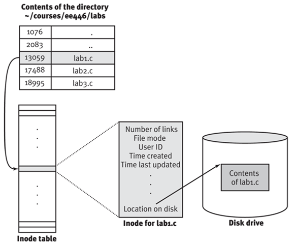

# logrotate linux系统日志管理工具

## 简介

linux系统下每时每刻产生大量的系统日志，应用日志等。这些日志对定位问题，监控状态具有重要意义。但磁盘空间是有限的不能无限被日志占用。

为了节省空间和整理方便，日志文件经常需要按时间或大小等维度分成多份，删除时间久远的日志文件。这就是通常说的日志滚动(log rotation)。

ogrotate 程序是一个日志文件管理工具。用来把旧的日志文件删除，并创建新的日志文件，我们把它叫做“转储”。

我们可以根据日志文件的大小，也可以根据其天数来转储，这个过程一般通过 cron 程序来执行。

logrotate 程序还可以用于压缩日志文件，以及发送日志到指定的E-mail 。

## 基本原理

logrotate是怎么做到滚动日志时不影响程序正常的日志输出呢？logrotate提供了两种解决方案。

介绍一下相关的Linux下的文件操作机制。

Linux文件系统里文件和文件名的关系如下图。



目录也是文件，文件里存着文件名和对应的inode编号。通过这个inode编号可以查到文件的元数据和文件内容。文件的元数据有引用计数、操作权限、拥有者ID、创建时间、最后修改时间等等。文件件名并不在元数据里而是在目录文件中。因此文件改名、移动，都不会修改文件，而是修改目录文件。

借《UNIX环境高级编程》里的图说一下进程打开文件的机制。


进程每新打开一个文件，系统会分配一个新的文件描述符给这个文件。文件描述符对应着一个文件表。表里面存着文件的状态信息（O_APPEND/O_CREAT/O_DIRECT…）、当前文件位置和文件的inode信息。系统会为每个进程创建独立的文件描述符和文件表，不同进程是不会共用同一个文件表。正因为如此，不同进程可以同时用不同的状态操作同一个文件的不同位置。文件表中存的是inode信息而不是文件路径，所以文件路径发生改变不会影响文件操作。

### create方案

默认方案没有名字，姑且叫它create吧。因为这个方案会创建一个新的日志文件给程序输出日志，而且第二个方案名copytruncate是个配置项，与create配置项是互斥的。

这个方案的思路是重命名原日志文件，创建新的日志文件。详细步骤如下：

- 重命名程序当前正在输出日志的程序。因为重命名只会修改目录文件的内容，而进程操作文件靠的是inode编号，所以并不影响程序继续输出日志。

- 创建新的日志文件，文件名和原来日志文件一样。虽然新的日志文件和原来日志文件的名字一样，但是inode编号不一样，所以程序输出的日志还是往原日志文件输出。

- 通过某些方式通知程序，重新打开日志文件。程序重新打开日志文件，靠的是文件路径而不是inode编号，所以打开的是新的日志文件。

什么方式通知程序我重新打开日志呢，简单粗暴的方法是杀死进程重新打开。很多场景这种作法会影响在线的服务，于是有些程序提供了重新打开日志的接口，比如可以通过信号通知nginx。各种IPC方式都可以，前提是程序自身要支持这个功能。

有个地方值得一提，一个程序可能输出了多个需要滚动的日志文件。每滚动一个就通知程序重新打开所有日志文件不太划得来。有个sharedscripts的参数，让程序把所有日志都重命名了以后，只通知一次。

### copytruncate方案

如果程序不支持重新打开日志的功能，又不能粗暴地重启程序，怎么滚动日志呢？copytruncate的方案出场了。

这个方案的思路是把正在输出的日志拷(copy)一份出来，再清空(trucate)原来的日志。详细步骤如下：

- 拷贝程序当前正在输出的日志文件，保存文件名为滚动结果文件名。这期间程序照常输出日志到原来的文件中，原来的文件名也没有变。

- 清空程序正在输出的日志文件。清空后程序输出的日志还是输出到这个日志文件中，因为清空文件只是把文件的内容删除了，文件的inode编号并没有发生变化，变化的是元信息中文件内容的信息。

结果上看，旧的日志内容存在滚动的文件里，新的日志输出到空的文件里。实现了日志的滚动。

这个方案有两个有趣的地方。

- 文件清空并不影响到输出日志的程序的文件表里的文件位置信息，因为各进程的文件表是独立的。那么文件清空后，程序输出的日志应该接着之前日志的偏移位置输出，这个位置之前会被\0填充才对。但实际上logroate清空日志文件后，程序输出的日志都是从文件开始处开始写的。这是怎么做到的？这个问题让我纠结了很久，直到某天灵光一闪，这不是logrotate做的，而是成熟的写日志的方式，都是用O_APPEND的方式写的。如果程序没有用O_APPEND方式打开日志文件，变会出现copytruncate后日志文件前面会被一堆\0填充的情况。

- 日志在拷贝完到清空文件这段时间内，程序输出的日志没有备份就清空了，这些日志不是丢了吗？是的，copytruncate有丢失部分日志内容的风险。所以能用create的方案就别用copytruncate。所以很多程序提供了通知我更新打开日志文件的功能来支持create方案，或者自己做了日志滚动，不依赖logrotate。

### 运行步骤

1.cron定时任务启动
```
# 可以看到cron的日定时任务下执行了logrotate程序
[root@zxdb98 ~]# cat /etc/cron.daily/logrotate 
#!/bin/sh

/usr/sbin/logrotate /etc/logrotate.conf
EXITVALUE=$?
if [ $EXITVALUE != 0 ]; then
    /usr/bin/logger -t logrotate "ALERT exited abnormally with [$EXITVALUE]"
fi
exit 0
```

2.logrotate的默认配置
```
# 指定了缺省配置，如果用户配置没有覆盖则使用此处的配置条件
[root@zxdb98 ~]# cat /etc/logrotate.conf
# see "man logrotate" for details
# rotate log files weekly
weekly

# keep 4 weeks worth of backlogs
rotate 4

# create new (empty) log files after rotating old ones
create

# use date as a suffix of the rotated file
dateext

# uncomment this if you want your log files compressed
#compress

# RPM packages drop log rotation information into this directory
# 用户在此目录下定义详细的配置信息
include /etc/logrotate.d

# no packages own wtmp and btmp -- we'll rotate them here
/var/log/wtmp {
    monthly
    create 0664 root utmp
        minsize 1M
    rotate 1
}

/var/log/btmp {
    missingok
    monthly
    create 0600 root utmp
    rotate 1
}

# system-specific logs may be also be configured here.
maxsize 100M
```

## 使用

### 配置项说明

这里列出了最常用的配置项，完整配置项参考man

| 配置项 | 说明 |
|--------|--------|
|copytruncate|拷贝日志内容后截断旧日志文件|
|create  |创建新日志文件，通知应用重新刷新日志到新文件|
|dateext |转储的文件命名格式，可以用dateformat,dateyesterday定义详细格式|
|compress|旧日志文件是否压缩，默认使用gzip|
|delaycompress|最新转储的文件不压缩|
|ifempty |如果日志文件为空也转储|
|notifempty|如果日志文件为空不转储|
|mail    |转储成功，发生邮件|
|maxage  |转储的文件最大保留天数|
|missingok|如果日志文件不存在，不产生异常|
|size    |如果日志文件大于这个则转储，单位为k,M,G|
|maxsize ||
|minsize |如果时间没到但大小到则转储|
|hourly  |以小时为单位转储，注意默认cron是每天运行|
|daily   |以天为单位转储|
|weekly  |以周为单位转储|
|monthly |以月为单位转储|
|yearly  |以年为单位转储|
|rotate  |转储保留的份数，如果是0表示删除掉|
|postrotate/endscript|转储后执行的命令|
|prerotate/endscript|转储前执行的命令|
|sharedscripts|当匹配多个日志时，如果需要脚本只执行一次|

### 简单示例

syslog的日志配置文件
```
[root@zxdb98 ~]# cat /etc/logrotate.d/syslog 
/var/log/cron  //需要处理的文件名，使用绝对路径
/var/log/maillog
/var/log/secure
/var/log/spooler
/var/log/fsck.log
{
    compress
    create
    missingok
    size 200M
    rotate 1
    sharedscripts //postrotate到endscripts之间定义了一段附加动作，可以指定多段
    postrotate
        /bin/kill -HUP `cat /var/run/syslogd.pid 2> /dev/null` 2> /dev/null || true
    endscript
}
/var/log/messages
/var/log/127.0.0.1.log
{
    compress
    create
    missingok
    size 200M
    rotate 20
    sharedscripts
    postrotate
        /bin/kill -HUP `cat /var/run/syslogd.pid 2> /dev/null` 2> /dev/null || true
    endscript
}//这个必须单独一行
```

mongodb的日志配置文件
```
[root@zxdb98 ~]# cat /etc/logrotate.d/mongodb 
/var/log/mongodb/*.log {
       weekly
       rotate 10
       copytruncate
       delaycompress
       compress
       notifempty
       missingok
       postrotate
          /bin/kill -USR1 `cat /var/run/mongodb/mongod.pid 2>/dev/null` 2> /dev/null|| true
       endscript
}
```

### 修改后测试

一般修改配置文件后需要手动测试下配置是否正确，运行是否正常。

```
# 带vf参数表示详细和强制执行
[root@zxdb98 mysql]# logrotate -vf /etc/logrotate.d/mariadb 
reading config file /etc/logrotate.d/mariadb

Handling 1 logs

rotating pattern: /var/lib/mysql/zxdb98.log  forced from command line (3 rotations)
empty log files are rotated, old logs are removed
considering log /var/lib/mysql/zxdb98.log
  log needs rotating
rotating log /var/lib/mysql/zxdb98.log, log->rotateCount is 3
dateext suffix '-20170216'
glob pattern '-[0-9][0-9][0-9][0-9][0-9][0-9][0-9][0-9]'
renaming /var/lib/mysql/zxdb98.log.3.gz to /var/lib/mysql/zxdb98.log.4.gz (rotatecount 3, logstart 1, i 3), 
old log /var/lib/mysql/zxdb98.log.3.gz does not exist
renaming /var/lib/mysql/zxdb98.log.2.gz to /var/lib/mysql/zxdb98.log.3.gz (rotatecount 3, logstart 1, i 2), 
old log /var/lib/mysql/zxdb98.log.2.gz does not exist
renaming /var/lib/mysql/zxdb98.log.1.gz to /var/lib/mysql/zxdb98.log.2.gz (rotatecount 3, logstart 1, i 1), 
renaming /var/lib/mysql/zxdb98.log.0.gz to /var/lib/mysql/zxdb98.log.1.gz (rotatecount 3, logstart 1, i 0), 
old log /var/lib/mysql/zxdb98.log.0.gz does not exist
log /var/lib/mysql/zxdb98.log.4.gz doesn't exist -- won't try to dispose of it
renaming /var/lib/mysql/zxdb98.log to /var/lib/mysql/zxdb98.log.1
creating new /var/lib/mysql/zxdb98.log mode = 0640 uid = 27 gid = 27
compressing log with: /bin/gzip
```

## 参考资源

[logrotate使用](https://linux.cn/article-4126-1.html)

[一些logrotate示例](http://www.thegeekstuff.com/2010/07/logrotate-examples/)