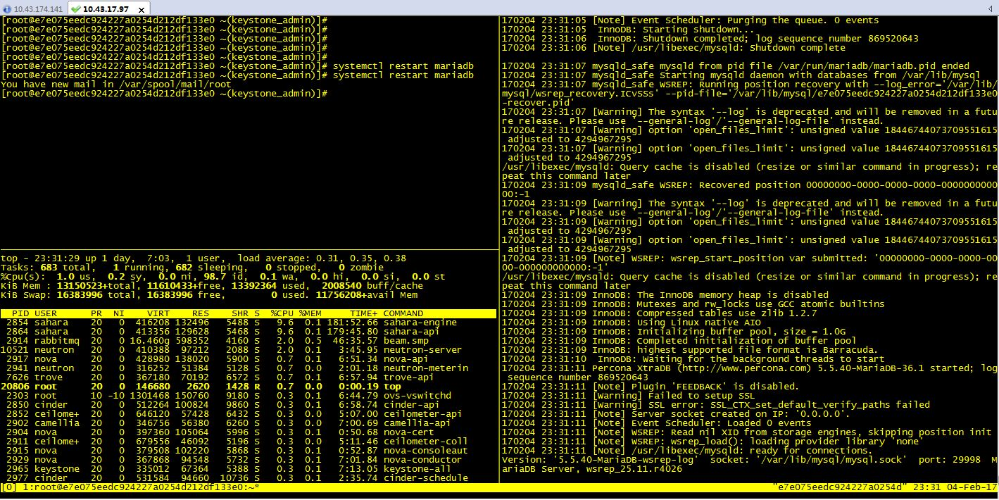

## 简介

Tmux（"Terminal Multiplexer"的简称）可以让我们在单个屏幕的灵活布局下开出很多终端，我们就可以协作地使用它们。

Tmux是日常工作必要的工具之一。可以借助Tmux构建出复杂的开发环境，同时还可以在一旁进行SSH远程连接。可以开出很多窗口，将其拆分成很多面板，接管和分离会话等等。掌握了Tmux之后，你就可以扔掉鼠标了。

我的一个示例：打开了三个小窗口。进行命令的操作并同时观察日志的输出


## 基本命令

| 命令 | 说明 |
|--------|--------|
|会话级命令||
|tmux |开启tmux会话|
|tmux new -s newsession| 创建一个会话，指定会话名称|
|tmux kill-session -t session-name
|tmux ls |显示已有tmux会话|
|ctrl+b s|显示已有的会话|
|tmux a -t 数字 |选择连接某个会话 |
|Ctrl+b d| 退出当前会话|
| 大窗口操作||
|Ctrl+b ? | 帮助命令|
|Ctrl+b c | (c)reate 生成一个新的窗口|
|Ctrl+b n | (n)ext 移动到下一个窗口|
|Ctrl+b p | (p)revious 移动到前一个窗口.|
|Ctrl+b w| 通过上下键选择大窗口
|Ctrl+b & | 确认后退出 tmux |
|Ctrl+b 数字| 直接跳到你按的数字所在的大窗口|
|小窗口操作||
| Ctrl+b  "    |    将当前窗口水平划分     |
| Ctrl+b %   |    将当前窗格垂直划分     |
|Ctrl+b 方向键 | 在各窗格间切换          |
|Ctrl+b，并且不要松开Ctrl，方向键 | 调整窗格大小|
|Ctrl+b pageup/pagedown| 上下滚动窗口|
|Ctrl+b 空格键 | 采用下一个内置布局 |
|Ctrl+b q |  显示分隔窗口的编号 |
|Ctrl+b o | 跳到下一个分隔窗口 |
|Ctrl+b ! | 关闭所有小窗口 |
|Ctrl+b x | 关闭当前小窗口 |
|Ctrl+b o | 跳到下一个分隔窗口 |

## 进阶配置

生成默认布局

首先写一个脚本，来创建各个窗格

```
~/.tmux/mylayout
selectp -t 0    #选中第0个窗格
splitw -h -p 50  #将其分成左右两个
selectp -t 1     #选中第一个，也就是右边那个
splitw -v -p 50  #将其分成上下两个，这样就变成了图中的布局了
selectp -t 0     #选回第一个

在.tmux.conf 后面加上一句
bind D source-file ~/.tmux/mylayout
```

结束，这样每次进入tmux后，键入 Ctrl + b D (D是大写，要按shrift，你也可以按成其他字符，只要跟tmux已经用的不冲突即可)，即会自动执行mylayout脚本，生成图示布局。如果 .tmux.conf 文件不存在的话，请自己生成。注意前面有个.(点)

## 参考资源

[Tmux 入门介绍](http://blog.jobbole.com/87278/)

