# 数字签名和数字证书

 到底什么是“数字签名”（digital signature）和“数字证书”digital certificate）？对这些问题的理解，一直模模糊糊，很多细节搞不清楚。
 
今天，读完一篇[ 通俗易懂的文章](http://www.youdzone.com/signature.html)后，思路豁然开朗。为了加深记忆， 这篇文章的[翻译版](http://www.ruanyifeng.com/blog/2011/08/what_is_a_digital_signature.html)记录如下。

## 原理

1. 鲍勃有两把钥匙，一把是公钥，另一把是私钥。

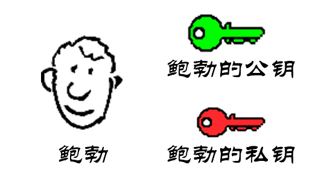
 
2. 鲍勃把公钥送给他的朋友们----帕蒂、道格、苏珊----每人一把。

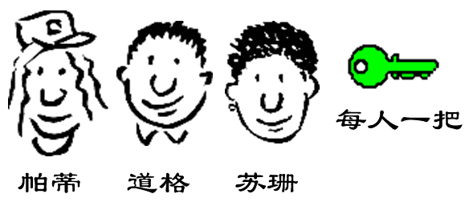 
 
3. 苏珊要给鲍勃写一封保密的信。她写完后用鲍勃的公钥加密，就可以达到保密的效果。

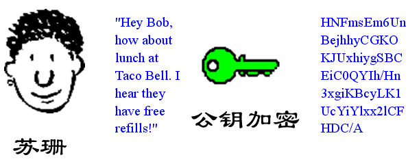
 
4. 鲍勃收信后，用私钥解密，就看到了信件内容。这里要强调的是，只要鲍勃的私钥不泄露，这封信就是安全的，即使落在别人手里，也无法解密。

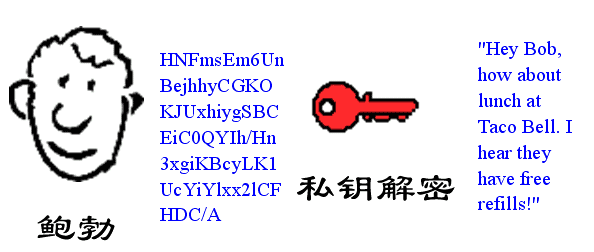
 
5. 鲍勃给苏珊回信，决定采用“数字签名”。他写完后先用Hash函数，生成信件的**摘要（digest）**。

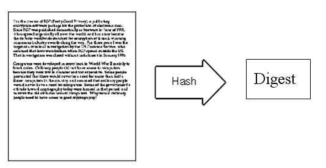
 
6. 然后，鲍勃使用私钥，对这个摘要加密，生成**“ 数字签名”（signature）。**

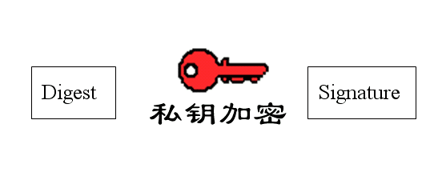
 
7. 鲍勃将这个签名，附在信件下面，一起发给苏珊。

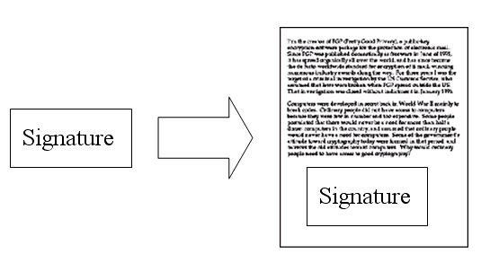
 
8. 苏珊收信后，取下数字签名，用鲍勃的公钥解密，得到信件的摘要。由此证明，这封信确实是鲍勃发出的。

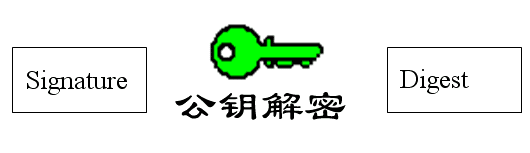

9. 苏珊再对信件本身使用Hash函数，将得到的结果，与上一步得到的摘要进行对比。如果两者一致，就证明这封信未被修改过。

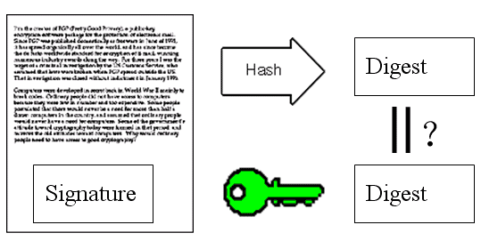 

10. 复杂的情况出现了。道格想欺骗苏珊，他偷偷使用了苏珊的电脑，用自己的公钥换走了鲍勃的公钥。此时，苏珊实际拥有的是道格的公钥，但是还以为这是鲍勃的公钥。因此，道格就可以冒充鲍勃，用自己的私钥做成“数字签名”，写信给苏珊，让苏珊用假的鲍勃公钥进行解密。

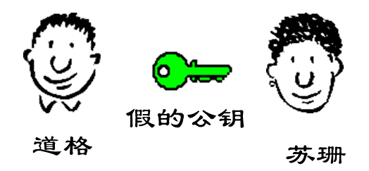 

11. 后来，苏珊感觉不对劲，发现自己无法确定公钥是否真的属于鲍勃。她想到了一个办法，要求鲍勃去找**“证书中心”（certificate authority，简称CA）**，为公钥做认证。证书中心用自己的私钥，对鲍勃的公钥和一些相关信息一起加密，生成**“ 数字证书”（Digital Certificate）**。

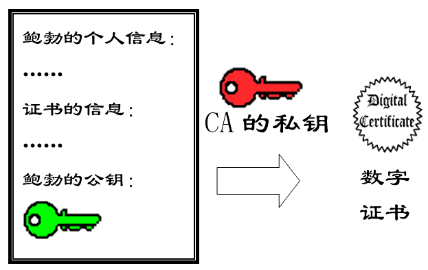

12. 鲍勃拿到数字证书以后，就可以放心了。以后再给苏珊写信，只要在签名的同时，再附上数字证书就行了。

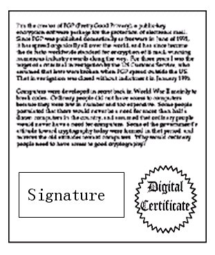

13. 苏珊收信后，用CA的公钥解开数字证书，就可以拿到鲍勃真实的公钥了，然后就能证明“数字签名”是否真的是鲍勃签的。

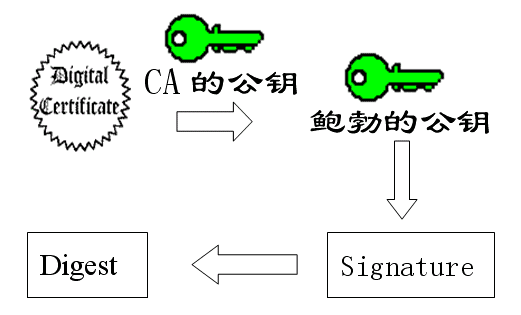 

## 应用

下面，我们看一个应用"数字证书"的实例：https协议。这个协议主要用于网页加密。

1. 首先，客户端向服务器发出加密请求。

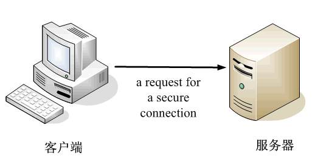

2. 服务器用自己的私钥加密网页以后，连同本身的数字证书，一起发送给客户端。

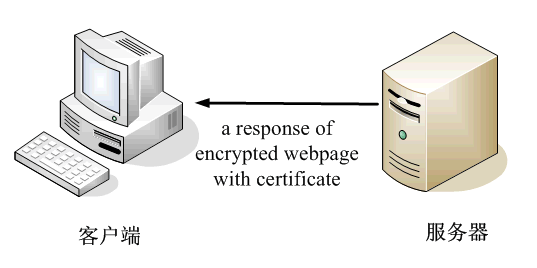

3. 客户端（浏览器）的“证书管理器”，有“受信任的根证书颁发机构”列表。客户端会根据这张列表，查看解开数字证书的公钥是否在列表之内。

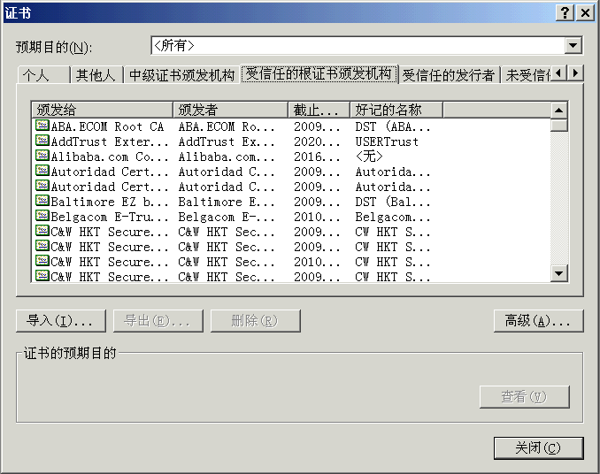

4. 如果数字证书记载的网址，与你正在浏览的网址不一致，就说明这张证书可能被冒用，浏览器会发出警告。

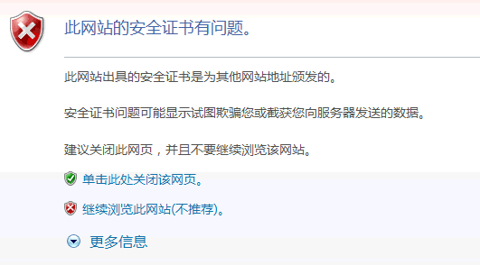

5. 如果这张数字证书不是由受信任的机构颁发的，浏览器会发出另一种警告。

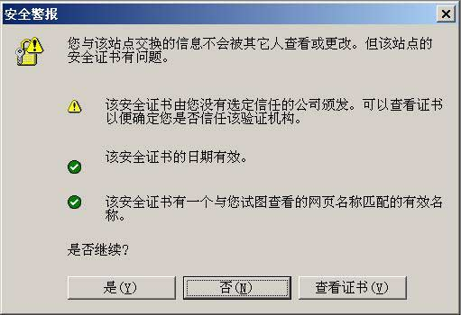

6. 如果数字证书是可靠的，客户端就可以使用证书中的服务器公钥，对信息进行加密，然后与服务器交换加密信息。

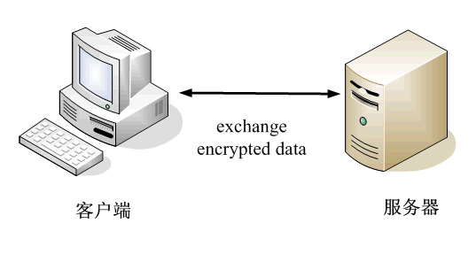
