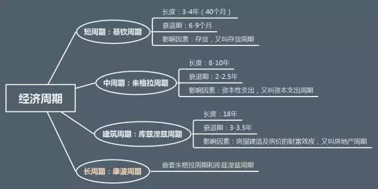
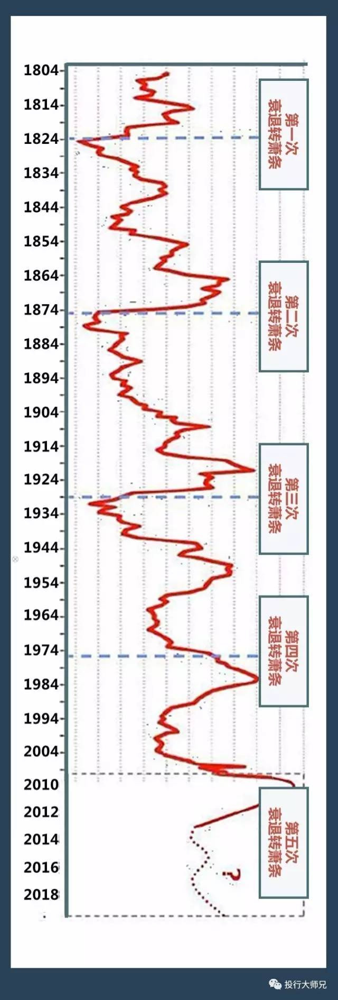
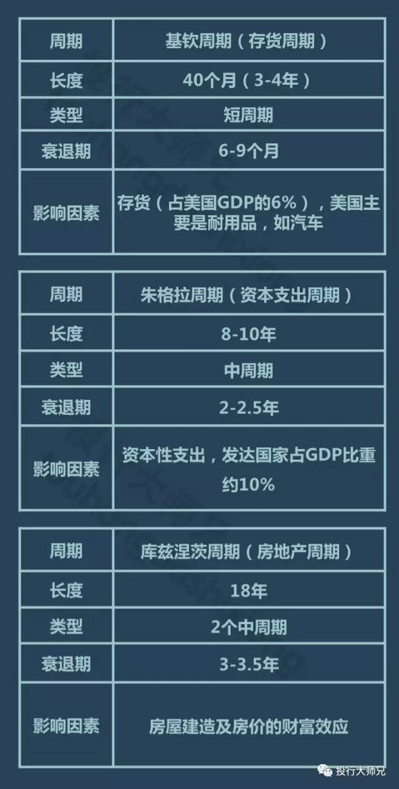
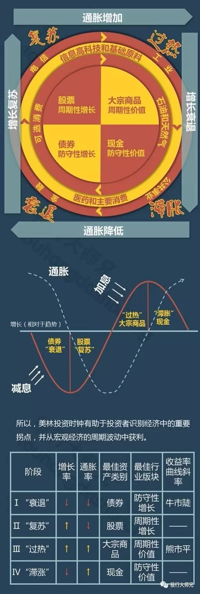
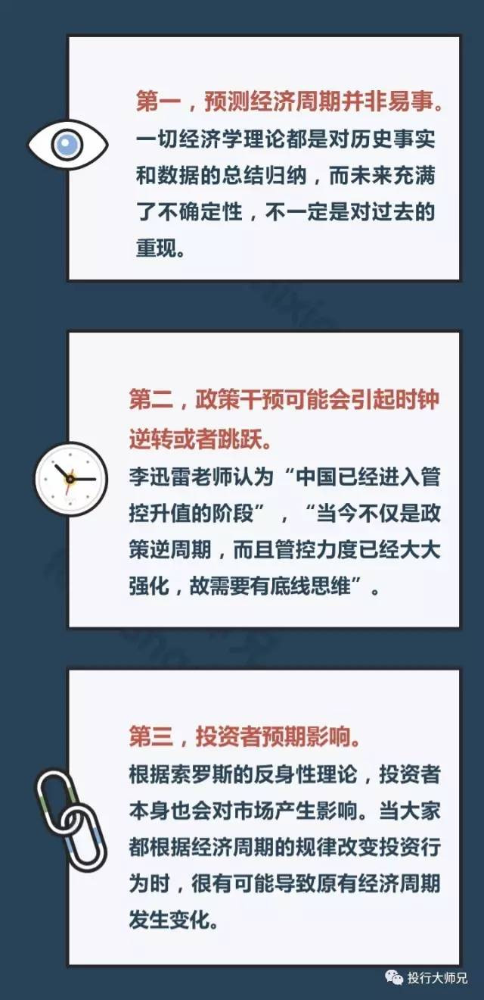

# 85后一生有3次发财的机会: 第一次已经错过, 第二次即将到来

近期，股市个股乏力、债市毫无起色、商品跌跌不休。一行三会大力推进金融去杠杆，再叠加地产调控持续加码与信贷收缩，市场风险偏好显著下降，股、债、商“三杀”频现。

无论是美联储3月暂缓加息的佳音，还是法国大选暂无黑天鹅的捷报，都无法振奋我们的市场丝毫。外盘一片欢腾，国内冷眼旁观，而投资者已经焦心如焚...

市场究竟怎么了？底在哪里，路又在何方？

此刻，不知道你是否和我一样，想起了那位已经与世长辞的“周期天王”以及他神奇的“康波”？

周金涛是中国康德拉季耶夫周期理论研究的开拓者，令他声名鹊起的是他几次成功的预测：

除上述经典预测，他还阐述了几大资产筑底时期及反弹时刻，及我们的一生有三个成为中产阶级的机会！

## 我们处于第5次康波

周金涛认为，“周期好比一台精密的定位仪，可以精准定位经济的任何高点和低点。周期是经济、技术、社会系统及其社会制度的综合产物，在周期大系统面前，几个宏观指标的微小变化根本不值一提。”

根据周金涛的观点，目前我们正处于自1982年开启的第5次康波之中。

康波是什么？

康波由前苏联经济学家康德拉季耶夫于1926年正式提出，他在研究英、法、美、德以及世界经济发展史后认为，发达商品经济处于50年到60年为一个周期的循环波段之中。

同时，一个康波周期嵌套着多个库兹涅茨周期和朱格拉周期：

经济周期划分（点击小图可放大）

另外，康波还可以分为四个小波：

- 繁荣期（10年）：新技术不断采用，经济快速发展；

- 衰退期（10年）：经历商品的牛市以及对经济的救赎；

- 萧条期（10年）：经济发展进入严重低迷期；

- 回升期（20年）：孕育着新技术的创新。

目前康波处于什么阶段？ 

1991年，经济进入繁荣期，若将美国繁荣的高点视作顶点，那么2000年或2004年是康波繁荣的顶点。2004年后，康波已确认了从繁荣向衰退的转换。

目前，资本主义世界经历了4个完整的康波周期，现在处于第5波康波，这恰好位于衰退期。衰退期，是康波周期中最复杂的阶段，表现为滞胀和通缩的反复出现。

周金涛认为，2014年下半年开始，世界经济进入康波二次冲击阶段，世界经济波动增加。

除了康波，与经济周期相关的波还有：

熊彼特的三周期嵌套理论认为，每个康波周期分为六个中周期，在一个中周期里，还套着三个短周期。周金涛在此基础上，演化出四周期嵌套理论。

周金涛认为，“这些周期好比一台精密的定位仪，可以精准定位经济的任何高点和低点。搞清楚它们，基本上就可以理解一个社会是怎样进步的了。”

另外，他认为，“周期是经济、技术、社会系统及其社会制度的综合产物，在周期大系统面前，几个宏观指标的微小变化根本不值一提，”

## 周金涛留下的20个预言

周金涛在业内以研究经济周期背景下的大类资产轮动而闻名。在他看来，周期之道是自然规律，不可逆转。投资者所能做的，就是把握周期运动的趋势和拐点，顺势而为。

2016年3月16日，周金涛在上海清算所进行了一场沙龙演讲，题目为《人生就是一场康波》。他表示，“人生发财靠康波”，这句话的意思是，每个人的财富积累一定不要以为是你多有本事——财富积累完全来源于经济周期运动的时间给你的机会。

不幸的是，周金涛因胰腺癌于2016年12月27日去世，年仅44岁。天妒英才，令人惋惜。

他留下的20个预言：

1、每个人的财富积累一定不要以为是你多有本事，财富积累完全来源于经济周期运动的时间给你的机会。

2、人生的财富轨迹就是康德拉季耶夫周期。康德拉季耶夫周期一个循环是60年，一个人的自然寿命是60年。

3、人的一生中所能获得的机会，理论来讲只有三次，如果每一个机会都没抓到，一生的财富就没有了。如果抓住其中一个机会，至少是个中产阶级。

4、一个康德拉季耶夫周期分为回升、繁荣、衰退、箫条。现在这次经历的康德拉季耶夫周期，是从衰退向箫条的转换点，未来十年注定在箫条中度过。

5、2015年是全球经济及资产价格的重要拐点，意味着未来四到五年的总体的资产收益率不仅不赚钱，甚至可能要亏损。2016年到2017年是一次滞胀，流动性差的资产可能就没人要了。未来在2017年到2019年可能发生流动性危机。

6、2017年中期、三季度之后，将看到中国和美国的资产价格全线回落，2019年出现最终低点，那个低点可能远比大家想像的低。

7、我奉劝大家，如果想发债最好发五年的，2018年之后就能够感到我说的话的意义。

8、一直到2025年，都是第五次康波箫条阶段。

9、40岁以上的人，人生第一次机会在2008年，如果那时候买股票、房子，你的人生是很成功的。2008年之前的，上一次人生机会1999年，40岁的人抓住那次机会的人不多，所以2008年是第一次机会。

10、第二次机会在2019年，最后一次在2030年附近，能够抓住一次，你就能够成为中产阶级。

11、1985年之后出生、现在30岁以下的人，第一次人生机会只能在2019年出现。所以现在25岁到30岁的人，未来的5年，只能好好工作。因为买房什么都不行，这个就是由人生的财富命运所决定的。

12、大宗商品牛市是几十年出现一次， 2011年至少到2030年，商品的走势都是熊市，不可能在商品方面取得大的收益的。

13、房地产周期20年轮回一次，中国本轮房地产周期1999年开启， 2017年上半年附近，中国的这次反弹会结束。2019年房价会是一个低点。

14、2010年之后美国出现房子的牛市，2017年是第一波的高点，如果到美国买房，也可以再等等。

15、未来五年是资产的下降期，大家尽量持有流动性好的资产，而不要持有流动性不好的资产。高位的房子就是流动性不好的资产，一级市场的股权也是流动性不好的资产。

去年9月14日，中信建投发布周金涛的最新微路演纪要，其中谈了怎么布局2017年。预测内容如下：

16、四季度到2017年上半年，有可能是中国资产最差的时间。2016年四季度，中国的第三库存周期可能渐渐接近周期高点，从2017年初开始，中国的库存周期开始回落。而此时，美国的库存周期仍处于上升阶段，这样的组合对中国的资产是不利的。由于一线城市房地产库存下降，而开工跟不上，不能排除房价再次拉升的可能性。如果汇率先跌，房价可能就会受到抑制。如果房价先涨，房价和汇率的关系就有点复杂，应该是房价先涨后跌，随后触发一定的系统风险。

17、对2017年全年而言，目前我仍然没有找到类似于2016年商品这样的机会。全球2009以来的中周期，2017年结束是大概率事件。

18、2017年到2019年是中美房地产周期共振下行期。这个问题当然不一定在2017年表现得非常严重，但有可能能够出现趋势性特征。

19、2017年至2019年商品将二次探底。2017年之后，商品将再次下探，其二次探底的价格当在2015年的低点附近。

20、2017年很难做出绝对收益，A股依然没有机会，主要还是等待风险释放后的超跌反弹。而相对收益方面，黄金一定是首要选择，黄金的配置时点大致判断在2017年二季度。

康波理论是否靠谱？

虽然周金涛靠康波以及他的四周期嵌套理论进行过多次精准的预测，但是很多人对康波依然保持怀疑。

他们认为，康波的统计的样本太少，至少观察超过10次，观察期超过500年，也就是到2300年的时候，才能验证该理论正确与否。

无论一种理论曾经完美预测过哪些重大事件，我们都应该保持一份清醒，不可过于迷信。

举一个美林“投资时钟”的例子。

全球最大的投资银行之一美林证券（Merrill Lynch）于2004年提出了“投资时钟”理论，十多年来已成为全球流传最广、影响力最大的投资理论之一。

作为一个投资罗盘，美林“投资时钟”回答了“买什么”的问题。

方法很简单，美林时钟根据“经济增长”和“通货膨胀”两个变量将经济周期划分为四个不同的阶段，分别是衰退、复苏、过热和滞胀。

每一个阶段都有表现超过大市的一个特定的资产类别：债券、股票、大宗商品或现金。

通过对1973-2004年美国市场数据的测试发现，美林投资时钟理论完美

展示了在一轮完整经济周期中的不同阶段，债市、股市、大宗商品轮流领跑大类资产。亲测有效！

但是，08年的金融危机却狠狠地打了它的脸，不仅因为危机之后的“股债双牛”，更重要的是作为“时钟之父”的美林证券竟然在次贷危机中深陷困境，且被美国银行收购。之后在危机的继续冲击下，美林证券大幅亏损，拖累了美国银行。

这说明，康波也好，四周期嵌套也好，都一定有它的局限性。

