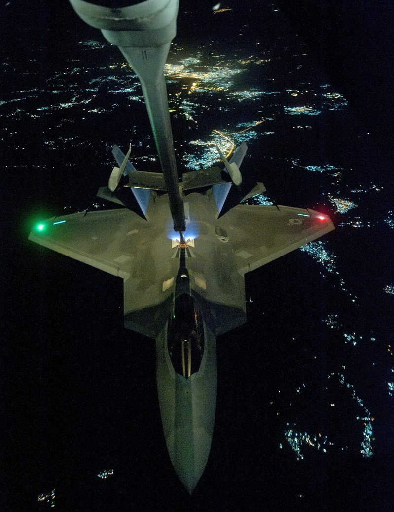

# 五代机之间的优势共享

F-22“猛禽”与F-35“闪电”，五代机之间的优势共享

译者注：本文原文发表在2018年2月刊的美国《空军》杂志（AIR FORCE Magazine）上，原作者是《空军》杂志的编辑主任约翰•提尔帕克（John A. Tirpak）。译文所配图片有改动。

“F-35和F-22正在互相把新技能传授给对方。”

在亚利桑那州的卢克空军基地（Luke AFB，Ariz.），地勤人员正在为一架F-35战机作好夜航的准备

## 总体概述

在F-35“联合打击战斗机”项目刚开始的时候，人们非常希望其能够从之前研发F-22“猛禽”战斗机获得的经验教训中受益——F-22“猛禽”战斗机也是洛克希德•马丁公司研制的。

现在，距离F-22具备作战能力已经过去十多年了，距离F-35宣称做好了战斗准备也已经过去两年了，这两款飞机借鉴经验教训的工作逐渐变成了“双向”的。这两个第五代战机项目目前正在展开合作，以降低成本，并使这两款武器系统变得更加有效。

“猛禽”一直是“闪电”的探路者：F-22的编队和运用方式是较新的F-35战斗机的模板。作为“回报”，数量较少的F-22机队也获得了“规模经济优势”——“猛禽”可以通过加入“闪电”的零部件采购活动而受益，因为F-35机队的规模远比F-22机队要大，而且还在不断增加之中。F-35身上采用的更先进、更耐用的隐身技术正在“回馈”到F-22身上，这两款飞机能够共享雷达功能，而且F-35的使用和制造经验对“猛禽”的升级也大有裨益。

“F-35和F-22在使用上总是意味着彼此并存，所以在这两款平台的编程方面应用相同的逻辑是非常有意义的”，洛克希德•马丁公司的F-35项目经理杰夫•巴比恩（Jeff A. Babione）这样说道。“我们不断采用更新、更先进的技术和流程。如果我们能够将相同的进展应用到F-35和F-22上，我们就能推动成本下降，并将这两个项目的时间表同时向前推进。”

佛罗里达州埃格林空军基地第33战斗机联队的指挥官保罗•“马克斯”•莫加上校（Col. Paul “Max” Moga）表示，F-22率先应用了第五代战斗机的战术，而且这些战术现在正被直接应用到F-35上。第33战斗机联队是训练新的F-35飞行员的，但莫加上校最初飞的是F-15，后来他成了一名教官和示范飞行员，并飞了多年的F-22，之后还成了一名中队指挥官。

一架F-15、两架F-35和两架F-22正在编队飞行，地点是内华达测试和训练靶场上空。美国空军正在探索可协助第四代和第五代战斗机之间通信联络的野战系统

在谈到关于F-22和F-35的使用技巧时，莫加上校说：“我会把它们形容为是可以‘直接转移’的。”就F-22而言，使用的要点是“管理电磁信号、传感器，以及我们称之为‘模式’（flow）的玩意儿。”他的解释是飞机和飞行员将如何感受战场、驾驶飞机躲避各种威胁，并进入最佳的位置与敌人交战。他说，这些理念同样适用于F-35。

莫加说，虽然第四代战机的飞行员就已经需要掌控视觉和红外信号，但“直到你进入五代机的世界里，你才会真正关心各种雷达信号的管理……这是任何一款第五代平台的核心能力之一，这也是从F-22直接转移到F-35上的。”无论是四代机还是五代机，其飞行员必须“在使用飞机时管理他们的各种电子信号，以提升其生存能力和杀伤力”。

莫加还指出，F-22相对于F-15和F-16等第四代战机拥有“代差”，这也意味着在“软”的方面的一种巨大转变——F-22的问世意味着抛弃了再也不会用到的旧战术。在第四代喷气式战机中，僚机飞行员必须在视距范围内提供“相互支持”，与几英里外的编队长机“焊接”在一起。但是，莫加说：“在探讨‘猛禽’战术的很早期我们就意识到，基于这款飞机的能力，我们已经不需要视觉上的相互支持了。我们需要在态势上相互支持，对我们来说，相互之间可以相距10海里、15海里甚至20海里的距离。”

在内华达州的内利斯空军基地，地勤人员正在为一架F-22战斗机作好执行“红旗军演”任务的准备

对于莫加上校这位曾长期依靠他人贴近自己并提供支援的前第四代战机飞行员来说，“需要一段时间才能习惯（新的战术）”。

## 快速成长起来

现在，在F-35和F-22中，莫加上校说：“我们训练年轻的僚机飞行员在视距（支持）范围之外操纵飞机，这意味着他们肩上的责任更大了。他们必须快速成长起来。”他接着评价说，无论是在F-22还是在F-35上，“我们那些年轻的僚机飞行员们正在根据一些以往的经验——这些经验是在我们的四代机上获得的——作出战术决定并付诸实施。我们不会对他们抱太高的期望，直到他们成为一名经验丰富的长机飞行员为止——如果不是任务指挥官或飞行教官的话。”

第五代战机的飞行员们必须“加快速度以掌握他们手中的新装备，因为如果轮到他们自己上的话，倘若他们作出不合适或不正确的战术决定，那么后果可能会变得很严重。”莫加上校指出，在他们身后并没有一张“安全网”——在以往，在他们身后约两英里的地方会有己方的战机，这些战机会把位于他们后方六点钟方位的敌机消灭掉。

在犹他州的希尔空军基地，一位技术人员正在一架F-35上工作着

这一切的实现都得益于这两款飞机（F-22和F-35）那超凡的传感器能力，这两种战斗机都可以从自身的内置和外置传感器，以及他们僚机的传感器中获取信息。莫加上校解释说：“你不再需要用四位或八位飞行员的眼球来扫描地平线、寻找威胁，并把你需要执行的战术图像在自己的头脑中融合在一起……飞机能够为你完成这一切。”事实上，新飞机提供的数据是如此之多，以至于有时候“超出了你的需求”。

这两款飞机的任务是互补的。F-22主要是一款空中优势战斗机（也具备对地攻击能力），而F-35则针对攻击进行了优化，同时还具备空战格斗能力。由于和F-22一样无法被发现和探测到，因此F-35可以使用F-22已经确立的隐身空战格斗战术——虽然可能是在不同的速度和高度下进行的。

这两款战机不共享的一项任务是近距离空中支援。莫加上校说，近距离空中支援对他而言是一项需要学习的新技能。虽然早期装备F-22的单位尝试开展过近距空中支援，但莫加上校承认，“那些年我们有点偏离正轨了。”后来，F-22的使用者们“回归了正轨，意识到还有其他的平台能够更加高效且有效地真正做好这项任务。”

莫加上校声称，F-22在“坚定决心行动”中取得了成功。虽然F-22高超的空战格斗能力从未在实战中经受过测试，但莫加认为“F-22在战场上的战术表现比大多数人所设想的要好”。当执行一些不太复杂的任务，如投放炸弹或护送其他飞机组成的机群时，F-22也通过其他方式证明了自己是非常出色的，如把“战斗的电子命令……战斗的空中秩序”融合在一起，然后把这些信息回传到“其可能更适用的平台上”。

F-22已经在叙利亚的实战中投掷了1000磅（约454千克）重的“杰达姆”制导炸弹

加上校注意到，吸取的一个教训——而且这一教训肯定会在F-35上应用——是“保持准确和最新的任务数据文件的重要性”。这是另一个同时适用于F-22和F-35这两种飞机的领域，即“有关区域威胁的详细信息”。为这两种飞机加载任务数据文件的软件设备位于埃格林空军基地。美国空军及其伙伴盟国展开了合作，将已知的每一个威胁都转化成了电子情报，并充实进了数据库之中。

“有很多工作要做，这是一场节奏很快的比赛，但我们正在取得很大的进步”，莫加上校这样说道。另外他还补充说：“我们距离我们想要实现的目标已经不远了。”

F-35飞行员佩戴的头盔几乎可以显示出所有的飞机、环境和目标数据，但这种能力是在F-22被设计出来之后才出现的。尽管改装F-22机队使其获得F-35所配备的“看穿战机”的光电系统是不切实际且昂贵的，但莫加上校断言说，大多数驾驶F-22的飞行员想要的头盔是这样的——可以显示数据，并可以充分使用更先进的武器。例如，F-22和F-35都可以携带AIM-9X近距格斗导弹，但只有F-35才能让导弹在大离轴（即与机鼻呈很大的夹角）的情况下进行瞄准，因为只要飞行员简单地注视目标并指定目标，导弹就可以被引导。缺少瞄准头盔的F-22则无法采用这种战术。

在2016年于犹他州希尔空军基地举行的“战斗弓箭手”（Combat Archer）演习期间，安东尼•奥维奇卡中士（SSgt. Anthony Ovechka）正在检查F-22上的AIM-9X导弹

莫加上校称，F-35的头盔是一个“游戏规则改变者”。除了提供离轴瞄准功能之外，“现在F-35的飞行员还可以将头盔用于其他用途，因为F-35的头盔具有合成孔径雷达空地测绘图像显示的能力。”

新式的F-35头盔为飞行员提供了丰富的信息和选择

在调用和显示信息方面，F-35的头盔和驾驶舱显示器也提供了“更多的选择”。莫加说，尽管对像他这样的“老家伙”来说，F-35显示和提供的信息的丰富性相比于以往的飞机是“压倒性的”，但年轻的飞行员们也很自然地认同了这种感受。

“当我在任务简报中观看他们的录像带时，我会看到他们迅速地将显示器画面从这个切换到那个，接着花半秒钟的时间得到他们需要的某条信息，然后再把显示器画面切换回来……这种现象是经常发生的。”莫加上校指出，这些年轻的飞行员都是在“Windows和家用电视游戏机”的年代长大的，却依然在面对信息丰富的显示器时出现了这种情况。F-22也针对要升级的项目列出了一份较短的清单，其中有一项就是新式头盔。

## 隐身涂层

莫加上校说，在F-22和F-35的相互借鉴学习中，喷气机隐身涂料之间的相互借鉴是“较大的成功事例之一”。“F-35的隐身涂层和表面处理是我们从F-22的低可探测性管理中学到的经验的直接结果。”

F-22上的隐身涂料多年来曾一直是“非常成问题”的，因为F-22的隐身表面仍然在一定程度上需要用“隐身腻子”和胶带来保持平滑。然而，在F-35上，莫加上校指出，飞机的隐身性能在“保养、维持和恢复方面的简便性获得了指数般的提高”。维护人员修理飞机变得更加容易了，速度也更快了，而且他们有了一件更准确的工具来评估隐身表面的正常磨损及其对电子信号的影响。现在，洛克希德•马丁公司正在研究如何将F-35的柔性隐身涂料应用到F-22身上。如果成功的话，其可以大大减少每个飞行小时的维护工时数，并可以使得在任何给定的时间内都有更多的飞机可用来作战。考虑到F-22机队那小小的规模——只有187架飞机（试飞和训练飞机也已经包括在内了），这是一个相当明显的好处。

隐身飞机的维护工作量很大一部分是在隐身涂料的修补上，F-35有望结束这种局面

“我们现在正在做出更加协调一致的努力，以便将我们在F-35身上学到的东西运用到‘猛禽’身上”，洛克希德•马丁公司的F-35项目经理杰夫•巴比恩这样说道。“因为我们一直在发展和升级这两款平台。”

在一次接受《空军》杂志的采访时，洛克希德•马丁公司负责F-22项目的副总裁肯•麦钱特（Ken Merchant）说，在佛罗里达州沿海那“盐雾、海洋环境、高湿度”的条件下，F-35隐身涂料的表现比F-22的隐身涂料要好得多。“我们正在考虑把F-35所用的顶级隐身涂料应用到F-22身上”，他这样说道。这会“增加一点点重量，因为F-35的涂料密度稍大一些，但涂料是平均分布在飞机上的，所以不会引发飞机重心（CG）方面的问题”。麦钱特说，无论美国空军是否会批准，隐身涂料的变更仍然是“预决定的”，而且它能够提供“大幅度降低维护成本”的潜在回报。

尽管F-22仍将需要一些“缝隙填充料”和胶带，但这款飞机已经从一种新型先进涂料中受益了。麦钱特说，旧涂料会“随着时间的推移变得非常脆弱”，但新涂料“更加富有柔性，而且更加耐用”。这种新涂料部分是在F-35项目中发展的，而且“它们有一些非常相似的东西”。洛克希德•马丁公司在其位于美国佐治亚州玛丽埃塔的工厂内开设了一条“高速生产线”，以便及时用新涂料取代旧涂料。

早期F-35所有的舱盖、口盖、接缝边缘都有一圈浅色的材料，并且略微凸出于机身表面。推测这是一种能盖住缝隙的柔性隐身材料，从而无需再用“隐身腻子”填补螺丝孔

麦钱特还说，让F-22和F-35共享技术是“自从来到这里以来我一直在努力做的事”。麦钱特已于2014年以少将军衔从美国空军中退役。他于20世纪90年代中期参与了F-22的实用研发工作，并领导了位于佛罗里达州埃格林空军基地的美国空军装备中心（Air Armament Center）。麦钱特在他的职业生涯中担任过许多项目的管理职务。在F-22项目中，麦钱特看到了实现软件通用的机会——这一点可以通过F-35和F-22的新型通用处理器的开放系统架构、新的雷达波形和零部件的规模经济而实现。

麦钱特说：“设想我是采购人员，那么当我得到这些‘猛禽’之后，如果我去找一个供应商说‘嘿，我需要187套这些部件，再加上187套那些备件’，那么我得到的报价会很高。如果负责F-35项目的经理巴比恩去找那些供应商并说‘嘿，我需要2000套这些部件’，那么报价就会下降不少。”麦钱特断言说，将F-22和F-35项目中的“辅助动力装置”“环境控制系统”和许多其他基础实用设备的零部件订单结合起来可以节省大笔资金。

每发出一个新订单，麦钱特都会问：“就这个订单而言，有什么方法可以让我们彼此（F-22和F-35）相互获益吗？”麦钱特说，这样做的机会在增加，因为制造商的种种毛病正在减少：在越来越多的情况下，随着技术的进步，原来的很多供应商退出了战机业务，转而追求其他更有利可图的东西。在这种情况下，F-22和F-35这两个项目正在寻找共同的替代品。他报告说，把F-22在零部件方面的需求加到F-35项目中获得的好处接近“10%”。

无论是F-22项目还是F-35项目都在追求开放的任务系统，并考虑零部件的共享。麦钱特说，在某种程度上，这两款飞机可以互换某些电路板，并使用相同的（电路板）驱动软件。例如，在其中一种飞机上进行的升级（软件无线电方面）可以几乎或完全不作调整就在另一种飞机上正常工作。最终，“对大部分零部件而言，都能成为‘即插即用’的。”这两款飞机也可以使用商业电路板，由于规模经济的原因，将会大大地降低成本。

前155架F-22最初安装的是32位综合计算机系统，CPU主频只有25兆赫

“雷达可能是迄今为止我们所取得的最大胜利”，麦钱特这样说道。F-22和F-35使用一套通用的波形，但除了称这两种飞机现在共享雷达的“某些软件和功能（特别是地形测绘模式）”外，麦钱特表示他不能更进一步地详细说明了。

F-22和F-35仍然有不同的电子架构，但“从那些发射/接收（T/R）模块中发出的东西是非常相似的”。这两种飞机的电子战能力是相似的，且最终可以使用相同的硬件。在自卫方面，这两种飞机可以共享通用的热焰弹和发射器、“普通电子战”或电子战系统，但主要还是共享诸如航空电子设备、子系统、液压系统和武器接口之类的设备。

F-22的通用集成处理器（CIP）模块

麦钱特还说，一款新型头盔将提升F-22的战斗力。而且他正在寻求重新设计驾驶舱，以作为F-22“中期寿命升级”项目的一部分。F-22驾驶舱内的显示器在生产时是最先进的，但与现在的平板显示器相比，它们显得又厚又笨重。麦钱特认为，现在是可以用一种足够薄的显示器（就像F-35上的那样）来取代原有的显示器的，这样新的处理器就可以直接放在显示器的后面，从而更容易处理和显示信息，此外还能释放飞机上其他地方的空间用于容纳不断增长的任务硬件。麦钱特说，新式显示器更轻，而且其运行所需要的线路长度更短。“我手下有一个团队正在研究，在升级版的‘猛禽’驾驶舱内，飞行员人机界面将会是什么样。”

## 彼此的“通话”

就F-22和F-35这两款第五代战机之间的“借鉴互补”而言，最大的一块尚未实用化的功能就在通信领域。为了保证隐身效果，F-22是通过飞行数据链（IFDL）来相互通话并共享数据的，而F-35相互之间则通过多功能高级数据链（MADL）来发送和接收数据。这两套系统被探测到和截获的概率都很低，这意味着敌人很难通过他们之间的通信电波来侦听其通话并确定其位置，但这两套系统（IFDL和MADL）之间也不能相互通话。美国空军一直在绞尽脑汁地解决这一问题。

## 不是所有的都能相互借鉴

有一样东西是F-22战斗机所无法分享的，那就是F-35的光电瞄准系统（EOTS），即F-35“下巴”上的钻石形装置，这一装置能够提供许多功能——在其他一些喷气式飞机上，这些功能必须通过挂载光学和红外传感器吊舱才能实现。虽然美国空军正在考虑为F-22配备一套红外搜索和跟踪（IRST）系统，以帮助其更好地“看到”隐身的对手，但麦钱特说：“在F-22机头下的同一位置上，我们实在是找不出空间来安装这套系统了。”“我们正在寻找其他选择。”但由于保密的原因，他无法进一步详细说明。

F-35 机头下方的光电瞄准系统（EOTS）外罩

麦钱特说，通过与空军空战司令部展开合作，洛克希德•马丁公司正在考虑在最初批次生产的F-22上试用F-35的一些新功能。“我可以更快地把东西用到飞机上”，他这样说道。“因为我不必与外国合作伙伴进行谈判，就像在已经非常强大的F-35 Block Ⅳ项目上纳入一项改进时所发生的情况那样。”巴比恩可以“借给”麦钱特一些工程师，这些工程师能够以独一无二的方式在麦钱特的团队中工作……也许有一个额外的接口或一些软件需要稍稍修改一下，但这两款战机都能够使用这些成果。

可以通过现在少量的F-35应用相关改进的方式来进行测试，如果确实有效的话，就可以先在F-22上应用，同时对F-35的生产线进行调整。“你这样会省下很多钱”，麦钱特坚持说。否则，由于同时要成立两个工程和生产团队，而且这两个团队不太可能达成共同的解决方案，那么“空军将花费两倍的钱，却只是让这两款飞机获得相同的能力。”

F-35战斗机的组装线

巴比恩说，F-22和F-35这两款第五代战机之间的“优势共享”并没有停止。“美国空军的各种项目中绝对会有更多的技术共享”，他这样说道。他还指出，第五代战机的技术正在转移到洛克希德•马丁公司的T-50A教练机上——这款飞机是美国空军未来新型教练机的候选机型之一，另外在研发“联合监视目标攻击雷达系统”（JSTARS）的替代机型时也应用了第五代战机的技术。“（第五代战机技术）也应用在了‘臭鼬工厂’的其他研发项目之中。”这里所谓的“臭鼬工厂”是指洛克希德•马丁公司高度机密的先进技术研发部门。麦钱特说，尽管洛克希德•马丁公司目前还没有被要求这样做，但美国空军有可能要求它与诺斯罗普•格鲁曼公司合作，以便在另一种第五代飞机——B-21隐身轰炸机上应用某些第五代战斗机的技术。例如，为F-35设计的某种天线被证明是一种非常适合B-2隐身轰炸机的“插入式”设备，而且很快就会被安装到F-22战机身上。

“我们将会看到更多这样的进展”，巴比恩这样说道。另外，根据他的说法，“对这里的每个人来说，我们都有一些激励措施——无论是金钱上的还是其他方面的，旨在鼓励他们积极在各个项目之间寻找‘可共享之处’。F-35和F-22之间的‘优势共享’就是一个很好的例子，当然不是唯一的例子。”

## 让整个机队没有“落伍者”

美国空军第325战斗机联队部署在佛罗里达州的廷德尔空军基地，该联队装备的F-22战机用于F-22飞行员的飞行和任务训练，但这些F-22尚未达到“猛禽”最先进的配置标准。洛克希德•马丁公司负责F-22项目的副总裁肯•麦钱特认为，有充分的理由将这些战机升级至与其他F-22同等的水平。

2017年8月8日，在结束了一次训练任务后，一架隶属于第95战斗机中队的F-22“猛禽”战斗机与一架隶属于第2战斗机训练中队的T-38“禽爪”教练机正在一起编队飞回佛罗里达州的廷德尔空军基地。第2战斗机训练中队经常向第95战斗机中队提供“复制”的“空对空威胁”，以支援F-22战机的作战和正规训练。廷德尔空军基地现在拥有世界上最庞大的F-22“猛禽”机队

麦钱特表示，要想将早期的F-22升级到普通的机队配置标准的话，那么“一架飞机的花费大约是2500万至3000万美元”。最大的开销之一就是升级雷达——“将第四代雷达配置到那34架飞机上”。麦钱特声称：“这样做可以节省很多钱”。如果一架F-22进入维修站接受了维护改造，而且所有的飞机都升级到了相同的配置标准的话，那么这架飞机就不一定要返回它原来所在的单位了。

这一点是非常重要的，因为美国空军正在非常仔细地“节约使用”其F-22机队（根据飞机的尾号，或者说生产批次），旨在平衡每架飞机进行高难度飞行和简单飞行的小时数，或者说平衡每架飞机在恶劣环境中的使用时间。麦钱特说，倘若进行了仔细的维护、平衡了机队的使用时间，并假设在21世纪20年代中期进行了升级的话，那么F-22是有可能再服役40年的。麦钱特“吹嘘”说，美国空军曾要求洛•马公司做一个分析，看是否可以将“猛禽”机队延寿到2045年，分析结果则显示“我们可以把它们全部延寿到2060年”。

“现在，在上述时间框架内，‘猛禽’会是一架前线战斗机吗？它需要在城市作战中与那些坏家伙战斗吗？也许不会。但它可能成为我们的国土防空飞机，很像今天的F-15”，麦钱特这样说道。F-22的设计寿命是6000小时，但测试表明这一数字可以达到14000至15000小时。

与部署在其他基地中的F-22相比，由于盐雾和空气潮湿等原因，廷德尔空军基地那些用于训练的“猛禽”正在加速老化。由于没有接受共同的升级，因此它们只能在那里使用，并比其他“猛禽”更快地腐蚀和老化。

麦钱特说，美国空中力量可以像控制其他机型的老化那样来控制F-22机队的老化——其可将飞机在“现役部队”“国民警卫队”和“预备役部队”之间交换使用，因为现役部队使用他们的飞机时“有点粗暴”，而国民警卫队和预备役部队使用飞机“不那么粗暴”，而且后两者非常爱惜他们的飞机，总是把飞机保养得干干净净。另外，不同的模拟器上并不一定非得安装不同的软件——也可以互相安装对方的软件。

麦钱特说，在F-22机队中，已经开始将那些参加过“坚定决心行动”的飞机和那些部署在美国国内的飞机交换使用了，因为矛盾的是，那些在战场上犹如在靶场上一样的飞机大部分时间都是在飞对机体寿命影响不大的“良性飞行里程”。

“当你身在任务责任区时，你起飞出发，你攻击了油罐车，你飞到你的监视区域，或者为第四代战斗机护航，你只不过是在很平直的方向上进行水平飞行而已”，麦钱特这样说道。这些飞行并不会给机体施加太多的应力。而在美国国内，那些F-22在训练中需要飞往目标区域并把各种机动完美地融合在一起，这样的剧烈机动会给机身施加相当大的负荷。

一架F-22正在接受空中加油，照片摄于2014年9月对叙利亚境内的ISIS目标展开空袭行动之前

保持所有的飞机“一致”将保持“机队整体较低的平均飞行小时数”，同时为空战司令部提供任务灵活性，使其能够从维修站点获得飞机——这些飞机拥有最新的配置——并将其部署在最需要的地方。

美国空军空战司令部司令詹姆斯•“迈克”•霍姆斯上将（Gen. James “Mike” Holmes）在2017年春天向《空军》杂志表示，他非常想升级这些训练型的F-22，但是到目前为止，其他项目有更高的优先级。麦钱特指出，升级训练飞机除了可使机队更便宜和更容易维护外，还可以让空战司令部把具备作战潜力的另外20%的可用飞机转化为实际的战斗力——哪怕他们明天就要开战的话。

这比重开F-22的生产线要便宜得多，因为空军方面曾被要求估算重开生产线的费用，但他们却说根本担负不起这样做。对此，麦钱特说：“我没有见过任何一位空军人士说那（升级训练飞机）是一个愚蠢的想法。”

F-22战斗机的生产组装线