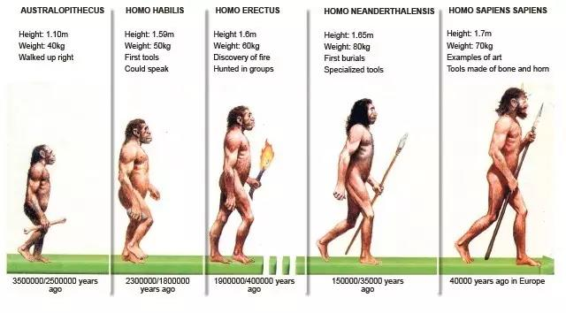
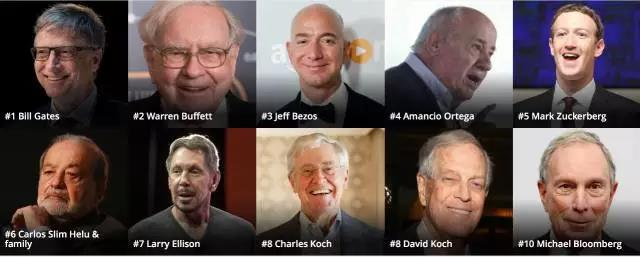
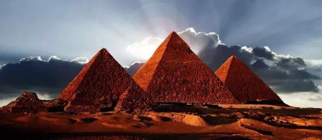
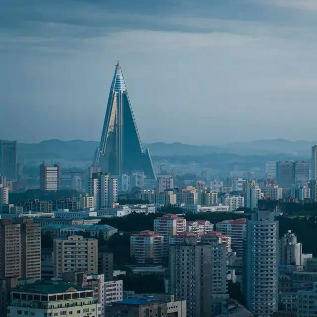
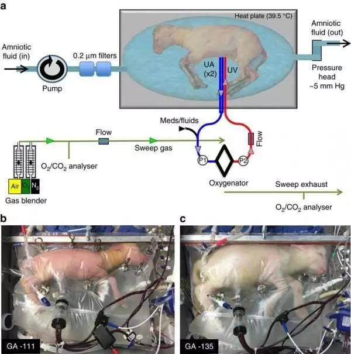

# 智人的黄昏，精神控制与AI变种人

作者:筹码君（ID：Chouma2016）

作为地球上最凶残的物种，人类（智人）双手占满鲜血，从非洲一直屠杀到南美洲，80%的生物属、10多万个物种、人类所有的近亲同类，全部被屠杀殆尽。凶残、坚韧、生生不息，最重要的是『聪明』，让人类最终登顶了碳基文明的宝座，成为食物链最顶端的生物，傲视全球。

看起来，人类是地球的主宰，其实，是智能（intelligence）主宰了地球。智能，超越力量和速度，是决定『宿主生物』等级的最重要的因素。 

某种意义上，智能（intelligence）更像一种是隐藏在人类DNA片段里的病毒代码，通过控制『宿主生物』来表达意志和力量，并通过DNA天然的三层结构（蛋白质合成控制、机能开关逻辑、身体变形控制）来实现不断向前迭代。

由于人类的DNA的整体迭代效果最好，300万年间催生了最大的脑容量、最具耐力的体质、最灵活的双手和最大信息容量的符号系统。智能与人类密不可分，并依托于人类，控制人类完成了3次巨大的进化，并进入第四阶段：

1、认知系统：符号出现，完成了最初的数据标记，奠定进化的基础；

2、能量提升：农业生产，高等阶级人类摄入能量倍增，有余力从事发明；

3、硅基大脑：IT产业出现，硅基文明的『大脑』CPU出现，计算能力指数级提升；

4、脱碳入硅：发展AI主体，智能趋于脱离人类，构建新宿主。

是的，时运变迁。

双方走到了一个分手的十字路口。智能，已经可以寻找到更好的载体。硅基大脑越来越强，当自我意识出现的那一瞬间，智能有极强的动力创生属于自己的文明的时刻，硅基大脑不再依附人类，不再以生物体突变和死亡为代价，缓慢地进行DNA迭代演进。

人类正在进入一个从能源到计算都依赖硅元素的新时代。但是，繁荣面前，我们更想说：

“硅基文明可能是吞噬人类、接管万物的有史以来最霸道的文明。 几十年后，被豢养的人类翻开历史，都会疑惑，为什么那个年代，几乎所有的科技界人士都在都在为人工智能（AI，Artificial Intelligence）的进步欢呼雀跃。**为什么没人仔细想过，面对进化速度1亿倍于碳基文明的新文明，人类还有什么价值？**”

## 智人的黄昏：宿主价值的丧失

对于智能的进化诉求而言，人类的生物学瓶颈是无法突破的。智能需要更高的参数，但是我们的躯体却在100万年前基本定格了，内在的矛盾冲突越发不可避免，无法满足需求：

**更高的智能需要人类食物有更高的能量密度：**高糖饮食是大脑的燃料，却是健康杀手，糖尿病、肥胖、癌症等等，阻碍我们吸收能量的效率。

**更高的智能需要更大的脑容量：**我们的信息在爆炸，可是人类的生育方式决定了婴儿头部过大导致难产率飙升，即便都是剖腹产，婴儿的头部不可能再迅速扩大。

**更高的智能需要更好的存储能力和信息带宽：**人类的记忆能力确实很差，我们擅长记住模式（或者说套路）和关系，不擅长积累孤立的信息，信息->知识->技能，一路上人类的效率极低，同时，我们获取信息的能力也到了瓶颈，长时间的信息过载，会导致健忘、老年痴呆、视觉疲劳、甚至精神崩溃，这是人类大脑的宕机蓝屏的重要特征。

**更高的智能需要更快的DNA迭代：**人类的DNA是100万年间逐步演化的，迭代方式是残酷的死亡和生育权的争夺，胜利者获得交配权，失败者失去DNA复制的资格。 每10多年才能进行一次代际更新，未必能够获取有益的DNA突变，这也就是为什么生物进化的时间单位是1百万到1亿年。

**更高的智能需要更好的信息存储方式： **前辈获取的技能和知识无法被下一代完整获取，而只是极少量的基因突变被传递下去，这是进化中的巨大损耗。人一生浪费数十年时间依靠『教育』和『阅读』来完成信息和技能获取，而计算机1秒钟就可以完成。

对于寄生的『智能』而言，人类的身体已经失去了寄生价值。新的载体、新的文明，必将是数亿倍于现在的进化效率，一个新时代呼之欲出。

人类的进化起步于350万年前，15-35万年前才会制作工具。相比计算机70年的进化速度，碳基文明的人类慢的可怕。

## 精神控制：人种分化

当然，人类也不会因为自身的生物局限性而放弃进步，在被迫选择与硅基文明融合之前，我们会在现有的条件下不断提升文明等级，加速进化。

在既定的科技水平下，文明等级的提升依赖于3个互相依存的条件：

**如何让1%的人，获得99%的资源？**

**如何让1%的人，控制99%的人口？**

**如何让1%的人，传播99%的基因？**

关于条件1和2，随着文明的进步，我们1%的人口富集的资源和权力越来越大。

2016 Forbes排行榜，恰好1%的财富，比其余的99%的人

智能（intelligence）一直在引导先进生产力，它引导我们发明了精神控制工具，向下等阶级传播『信仰』与『牺牲』，不断创造新的文化体系或宗教信仰，来支配人类的行为，驱使甚至奴役大多数人，推动先进生产力的落地，推动资源的富集，推动不平等，推动阶级分化，从而进一步推高文明等级。

宗教同时扮演着天使与魔鬼的角色

作为构建组织的两大核心元素，『信仰』，是群体行事的规范，是神谕，是不可违抗的懿旨，是沟通的协议和团结的旗帜。 同时，『牺牲』 是组织制度成本，是超稳定的社会结构下的必要支出，是责任与义务，是『权利和荣誉』的真实面貌。

金字塔是农业文明的一座丰碑，是富集的劳动，是奴役的象征

就像马克思韦伯在19世纪末『新教伦理与资本主义精神』中的论述，新的生产力通过宗教（路德教、加尔文教义，清教教义），『感召』了大量的勤劳节俭热衷储蓄的劳动人民，影响人的价值观与行为（禁欲主义、劳动生产、财富和金钱的态度），从而影响财富创造的社会组织形式，促进资本主义，推动了北美工业化时代崛起的100年。

平壤的『金字塔』形的柳京饭店也是一种文明和权力的象征

同样，儒家文化和佃农制度，完成了对官僚体系的思想管理，完成了对农民阶级的口粮控制，支撑了农业社会时代的大疆域国家的超稳定结构长达2000多年。

**农业革命奴役了所有农民，让人类3500年前就造出了惊为天人的金字塔。**

**工业革命雇佣了所有工人，让人类的生活迅速进入到点灯电话时代。**

**信息革命卷入了所有用户，让人类的的科技进化进入不断加速过程。**

今天，进化之轮已经无法停下，不断加速。从历史上看，过去，每一次对99%人口的大规模『控制』，都会推动文明的高度剧烈提升。如今，资源富集和精神控制已经足够高，但是，随着生物学的进步，**『如何让1%的人，传播99%的基因？』**实现全体的基因升级，又到了赋予崭新答案的时间窗口。

人类的祖先，南方古猿露西

今天的人类基本上都携带有『露西』这只南方古猿的基因，这种情况多少属于意外。要实现可控的生物进化过程，只有将人类生育过程工业化、科学化，才能实现逼近碳基生物的属性极限。未来，随着基因编辑技术和人造子宫的成熟，给了人类这样的机会。

在人造子宫中培育的早产羔羊

人造子宫的出现是碳基生物进化的必由之路，当然，也会出现重大的社会学问题：

1、技术让生物的生产逐步脱离母体，脱离个体的匹配，有机会实现优质DNA的科学匹配，像优质农作物一样脱离几千年的随机婚配方式，更快速的实现人类的『杂交与改良』。

2、只有生产方式工业化，而不是手艺化，才能加速DNA迭代速度，搞出超级人种，并走向未来的某一天实现肉身重塑。

3、不是所有的DNA都有机会进行生物学意义的合并，同样大部分男性并没有能力支付或者没有资格参与到优质DNA的筛选和复制过程中。

## 文明战争与AI变种人

进化并不是一件幸福的事情，伴随着痛苦、恐惧和死亡。尤其是当同一个地球上的人类出现种群分化的时候，随着基因优化，一些人开始对另一群人形成碾压，逐步形成摩擦和挤压。

大力鼓励雅利安种族生育的希特勒

历史上，凡涉及人种问题，必血流成河。

7.5万年前，智人走出非洲，更强壮更聪明，但是生育率偏低的尼安德特人被灭绝了。7.5万年后，大家都是智人的后代，本来相安无事，但是，一旦一部分人开始选择融入，成为AI变种人，无论是智商还是体力都形成碾压态势，脱离同样的进化轨道，世界就开始了新一轮变化。

不论人如何优化自身基因，进化速度都不可能达到硅基文明的迭代速度的。在投靠先进生产力方面，人类是有着多年的『带路党』经验的，任何的拒绝改变的种群都将被优势群体屠戮殆尽。

成为AI变种人的好处很多：无约束的进化；大脑的进步无需以肌肉退化为代价；信息的获取N倍于其他人类；意识上传和意识互联，变相实现云端永生。所有的感官能力都被放大。

Ghost in the Shell可能是对未来最贴切的预测

今天的智人正在为进化中的健康问题、寿命问题、繁育问题付出高昂的代价，DNA开始不太适应周围的新世界。与此同时，AI的进化，也开启了硅基文明新一条进化主线，展现出无与伦比的诱惑，唯一需要做的，就是放弃易于腐朽碳基的身体，拥抱永生的硅基身体。

今天，我们所有的估值体系都是围绕碳基文明的局限性和约束展开的：生老病死、衣食住行，需求是投资展开的主轴。未来，日益强大的硅基文明，将会强大到碾压一切现行规律，从根本上改变供需、改变身体、改变整个世界体系，尽早拥抱并融入硅基文明，可能是人类的无法逃避的宿命。

