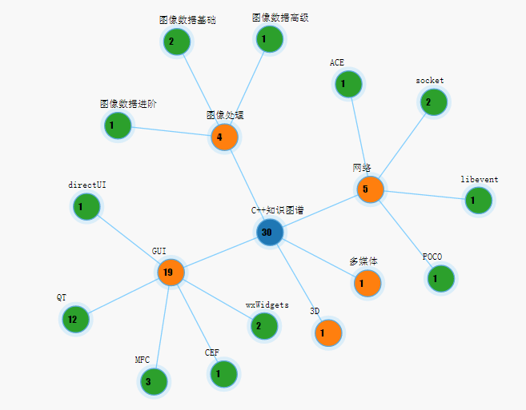
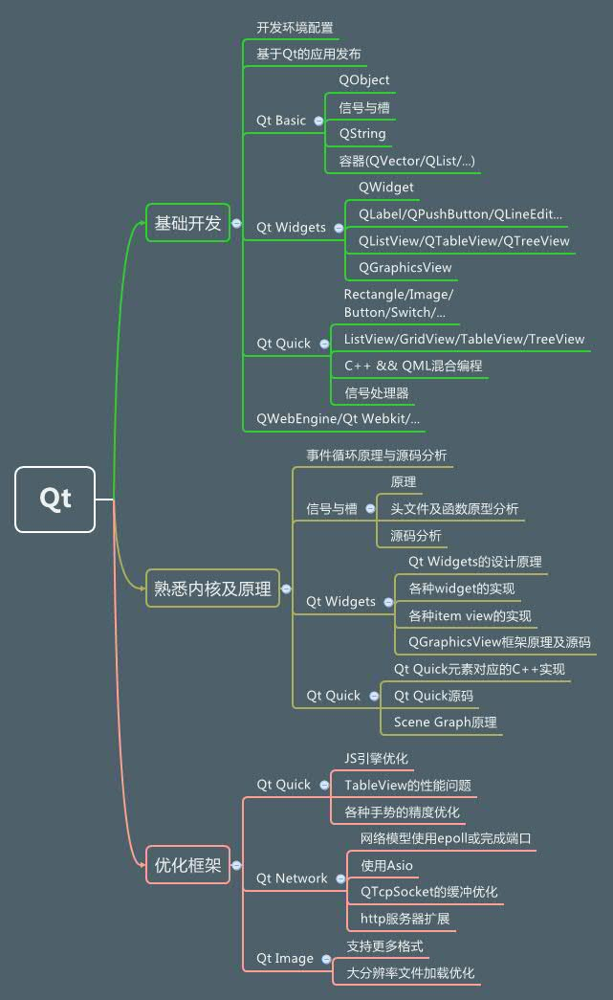

# 技术人，为什么需要构建知识图谱

作者简介：[安晓辉](http://my.csdn.net/foruok)，10多年开发经验，曾任软件开发工程师、项目经理、研发经理、技术总监等岗位，著有《Qt Quick核心编程》、《Qt on Android核心编程》、《你好哇，程序员》等书籍

这个时代，信息极大丰富，人每时每刻都被各种各样的知识、信息轰炸着。如何有效的选择对自己有价值的知识，如何构建一个**独属于自己的知识体系**并让它为自己创造价值，变得越来越重要。只有知识经过了你的选择和应用，内化为自己的隐性经验，纳入到你的知识体系中，才能真正地为你创造财富。

怎样才能建立自己的知识体系呢？

- 选择方向，设定目标
- 学习、实践、输出、内化
- 同主题扩散
- 运用工具整理记录知识图谱
- 迭代与更新知识图谱

## 有目标，才有知识体系

如果只能选择一个方向，你希望在什么方向上做到出类拔萃？

对这个问题的思考，会帮助你找到自己的方向，进而有效地去学习知识。

**构建个人知识体系的第一步是定位**

知识体系和我们的个人目标与关注点有关，你的取舍决定了你的关注点。每个人都需要根据自己的目标和关注点来建立自己的知识体系。

简单的说，比如你想成为像Linux内核创建者Linus Torvalds那样的人，在Linux操作系统方面做出卓越的贡献，那你就能迅速定位你的知识系统的大方向——Linux操作系统开发。
比如你想成为像秋叶大叔（秋叶PPT）那样的人…… 比如你想成为像马云那样的企业家……

这个探索过程可能很慢，需要几个月或者几年，也可能只要一个瞬间。无论长短，最重要的是，你必须有想象力，愿意成为自己这艘即将远航的旗舰的舵手。

推荐几本书有助于你的自我探索：

《发现你的天赋》，《持续的幸福》，《你的生命有什么可能》，《精进：如何成为一个很厉害的人》

## 知识的内化

一个人的能力分三个层次：

- 资源：比如知识、技能、经验、精力、人脉等。
- 应用流程，即使用资源解决问题的能力：做事的方法、流程、策略等，整合应用资源创造价值的能力。
- 价值取向，即你觉得什么事情重要，什么事情不重要。

知识是一种资源，是固化的，必须经过你的应用流程，才能内化为自己的经验，帮助你解决工作与生活中的问题，为你创造价值。

只有知识，没有内化，那结果不堪一击。

像神仙姐姐王语嫣，牢记每一种武林秘籍，但是一招也打不出来，与人对战只有被秒杀的份儿。
像《围城》里的方鸿渐，也学习了很多乱七八糟的知识，但赵辛楣评价他说：“你是个好人，但一无是处”，这也是因为他涉猎很多都不能落地应用创造价值。

我见过一些软件开发者，说起编程语言里的某个知识点，哪哪儿都清楚，但让他写程序，就是一团麻乱，根本想不起来要用什么，要到处问，List怎么用，StringBuilder怎么用，ListView该怎么用，问半天也还是不会用……

所以我们一定要把显性的知识内化为自己的隐性知识，变成自己的能力。

### 学习现状

很多知识都经由前人的总结显性化了，固化在书本、网络、视频等载体上，我们就从这些载体上开始学习。这是第一步，它让我们知道有这样一个知识、这个知识是什么、这个知识可以用来解决什么问题。

不要停，你到了这一步千万不要停，要接着去琢磨：

- 这个知识对我有什么用？
- 我过往的工作与生活中，哪些经历、经验可以和这个知识关联起来？
- 在将来，这个知识能怎样帮助我改善自己的工作？

很多人看书、看视频、听演讲，根本不琢磨，只是被动接收，只是“浏览”到有这么个东西，“哦”一声就过去了。所以，他们很难有进一步的收获。

很多人过度依赖搜索引擎，比如ListView不会用，Google一下，拷贝粘贴一段代码来解决自己的问题。但是解决之后往往就放下了，不再琢磨这段代码为什么能解决问题、我为什么没想到、下次我怎样才能自己来解决问题，这样做的后果就是，遇到问题永远在问搜索引擎，永远也培养不出独立思考并解决问题的能力。

### 如何内化

如果你能够把自己应用知识解决问题的过程，收获的经验，再转化出来，分享给别人，帮助别人解决问题，那你对知识的掌握将更进一步。

这也是CSDN上很多博主的做法：用输出倒逼输入。也是我的做法，我的公众号“程序视界”（id：programmer_sight）每周发布三篇原创文章，就是一种倒逼机制，我要逼着自己通过输出的方式来内化知识。现在形成习惯，基本上没什么压力了。

输出是内化知识的最有效的途径当你准备输出时，会考虑很多很多，比你自己使用知识时考虑的要多很多，比如怎样讲明白、比如怎样让结构清晰、比如怎样设计示例辅助说明、比如这个知识点与哪些关联、比如哪些关联的知识点必须讲清楚……所有这些，会让你进一步思考知识，会让你系统化你的知识，最终会加深你对知识的理解与应用。

## 同主题扩散

很少有知识是孤立的，也很少有哪个方向只需要一种知识就可以真正解决问题。

比如你做桌面客户端产品开发，选择C++语言作为主要开发语言，但C++语言本身绝对完成不了这个任务，你必须在同一个主题内寻找其他的支撑，比如Qt，比如MFC，比如wxWidgets。

这正是我们构建知识体系必须要经历的过程：在同一主题不断挖掘相关知识，完善你的知识图谱。

比如我曾画过一张学习C++的图谱

从图上就可以看出来，C++是知识的中心，围绕着它有很多相关联的知识。那么，怎么发现同一主题内还有哪些知识需要学习呢？比如学习C++，多问问下面的问题会有帮助：

- 为了解决A问题，除了这个知识，还需要哪些知识、工具？
- 这个知识是由什么知识发展来的，什么新的发展？
- 关于这个知识，有哪些书和资料？
- 在这个领域，有哪些大咖，他们在学什么？
- 关于这个知识，还有哪些是我不知道的？ 查看C++知识库

如果你能不断思考这些问题，就能不断找到需要进一步学习的知识，就能不断扩大自己的学习区，最终就能不断地丰富自己的知识体系。

好啦，到现在为止，我们介绍了构建个人知识体系的三个基本的步骤：确立方向，内化和同主题扩散。

接下来我们介绍让我们的知识库持续发展永葆青春的两个步骤：记录与迭代。

## 使用工具固化你的知识库

大脑容量有限，必须借助工具将我们的知识系统记录下来。有非常多的工具可以使用，比如：

- 笔记类软件
- 博客
- wiki
- 各种知识库系统，CMS系统
-  图书，电子书

在上面这些工具中，其实图书更多时候是你系统化自己知识的一种产出物，比如我在CSDN博客发布的文章多了，就结集出版了几本书：《Qt Quick核心编程》、《你好哇，程序员》。电子书也是类似的。

在选择工具系统时，遵循下面的原则：

- 易用，多终端同步
- 便于检索
- 能呈现知识系统的结构

每个人都可能使用不同的工具来固化自己的知识库，不必追求与别人一致，我目前使用有道云笔记、CSDN博客、CSDN知识库、脑图、图书等工具来记录知识。

脑图工具我用的是XMind的社区版，这是我学习Qt时绘制的：

脑图的好处是你可以很方便的记录、分支、补充，也能很好体现知识的关联。但它不方便的地方在于，你往往只能记录一些关键词，大量的知识或者系统化的文章不太方便体现。

那后者，可以使用CSDN博客与CSDN知识库的组合来完成。

我就在CSDN博客上发表文章，分享我对某方面知识的见解，然后使用CSDN知识库把这些文章链接起来，整合成一个系统。这种方式的好处显而易见：方便，多终端同步，系统化，利于更新迭代。

个人图谱样例

## 迭代与更新

当我们将自己某方面知识构建成库、系统化之后，记录在某个载体上，接下来面临的就是知识的更新。

每一种知识都可能会不断发展、更新，都可能随着时代的发展而变得过时，所以我们要不断更新自己的知识体系。

比如你原来在C++方便积累了一些知识，使用的是C++98的标准，但现在C++11在普及，C++17马上出来，你就需要更新。

如果我们不能定期更新自己的知识库，那我们就会慢慢落后于时代，越来越没有价值，也会失去很多机会。

举个简单的例子，学Java的朋友们，当2007年Google发布Android系统时，有多少人抓住机会，把Android开发框架纳入到了自己的知识体系中？如果你那时开始做Android，就赶上了移动开发的大潮，现在不是大神也是大咖。

## 四象共赢

前面我们讲了构建某个领域知识库的过程，那其实呢，一个人可能会在很多领域建立自己的知识体系，因为我们的生活本来就是多元中心的。

一个平衡的人生包含四个象限：事业、家庭、社区、身心与精神。

我们应当在每个象限中都确立一些关键目标，为这些关键目标配置资源（时间、精力、金钱、人脉等），在每个象限中建立自己的知识图谱。

比如你是软件开发工程师，在事业领域，你构建软件开发相关的知识图谱，你还有家庭，可能会围绕夫妻、两性、婚姻、育儿、情感管理、亲密关系等构建出面向家庭的知识体系。

再进一步，不同象限的知识，其实是可以交叉融合的。

我们以软件开发中的Scrum为例，来说明不同领域的知识体系如何相互融合。

使用Scrum模型来辅助产品开发时，先会抽象出一个Product Backlog（PB，产品需求列表），然后会从PB中挑选一部分需求，纳入到一个Sprint（冲刺，一般是为期2~4周的迭代）中来实现，每个Sprint有启动会议（主要选择要实现的需求或Story）、每日站会、任务看板、燃尽图、演示会议、回顾会议等方法来保证Sprint的顺利进行。

这里面的流程简化下来就是：确定大的目标–>拆分出阶段性小目标–>可视化进度，用站会、燃尽图等反馈促进行动–>回顾总结。

某一个具体的方法，也可以运用到别的领域。以Scrum的站会为例，就可用于每一天的生活，无论是家庭还是工作。以我为例，每天早上我都会想今天要做什么事情，每天晚上会想今天完成了什么、什么没完成、遇见了什么问题、明天做什么，这种习惯就来自Scrum的站会，能极大提高你每一天的生活质量。

当我们经常思考一个领域的知识怎样才能应用到另一个领域时，我们就开始了融合、创新的过程，进入了更高境界。

如果你不断地找到了交叉地带，融合了各个领域的知识，那最终，你就可能将你所有的知识体系打通，统合出独属于你自己的和谐完整的知识图谱，帮助你实现平衡和谐。